### SASbyODBC

#### 〇、简要

```
ODBC概念
开放数据库连接（Open Database Connectivity，ODBC）是为解决异构数据库间的数据共享而产生的，现已成为WOSA(The Windows Open System Architecture(Windows开放系统体系结构))的主要部分和基于Windows环境的一种数据库访问接口标准ODBC 为异构数据库访问提供统一接口，允许应用程序以SQL 为数据存取标准，存取不同DBMS管理的数据；使应用程序直接操纵DB中的数据，免除随DB的改变而改变。用ODBC 可以访问各类计算机上的DB文件，甚至访问如Excel 表和ASCII数据文件这类非数据库对象。
```

```SAS
/*
ODBC LIBNAME Statement Examples
In this example, USER=, PASSWORD=, and DATASRC= are connection options. 
*/
libname mydblib odbc user=myusr1 password=mypwd1 datasrc=mydatasource;

/*
In this next example, the libref MYLIB uses the ODBC engine to connect to an Oracle database. The connection options are USER=, PASSWORD=, and DATASRC=. 
*/
libname mydblib odbc datasrc=mydatasourcemydatasource user=myusr1 password=mypwd1;

proc print data=mydblib.customers;
   where state='CA';
run;

/*
In the next example, the libref MYDBLIB uses the ODBC engine to connect to a Microsoft SQL Server database. The connection option is NOPROMPT=. 
*/
libname mydblib odbc noprompt="uid=myusr1;pwd=mypwd1;dsn=sqlservr;" stringdates=yes;

proc print data=mydblib.customers;
   where state='CA';
run;
```


#### 一、数据库准备

过程略。已备：

| Type       | Host            | Port  | User     | Password     | Database |
| ---------- | --------------- | ----- | -------- | ------------ | -------- |
| Oracle 11g | 123.456.789.000 | 49161 | system   | oracle       | sid:xe   |
| Mysql      | 123.456.789.000 | 3306  | root     | 123456       | x        |
| IBM db2    | 123.456.789.000 | 50000 | db2inst1 | db2inst1-pwd | sample   |

*// Host 已加密，需注意各数据库版本*


#### 二、连接测试

（1）telnet测试

若windows，可通过控制面板-程序-打开或关闭windows功能来安装telnet。

```
# telnet 123.456.789.000 49161
Trying 123.456.789.000...
Connected to 123.456.789.000.
Escape character is '^]'.
^]
telnet> quit
Connection closed. 
```

```
# telnet 123.456.789.000 3306
Trying 123.456.789.000...
Connected to 123.456.789.000.
Escape character is '^]'.
J
8.0.12 &I~o?ji0*Wj
                  caching_sha2_password
^]
telnet> quit
Connection closed.
```

```
# telnet 123.456.789.000 50000
Trying 123.456.789.000...
Connected to 123.456.789.000.
Escape character is '^]'.
^]
telnet> quit
Connection closed. 
```

上述即可通。

若经过漫长等待后，出现以下情况，请先检查连接情况。

```
# telnet 123.456.789.000 1234
Trying 123.456.789.000...
telnet: connect to address 123.456.789.000: Operation timed out
telnet: Unable to connect to remote host
```

（2）客户端测试

各种数据库客户端都可以，以下推荐**DataGrip**,可通过jdbc连接，轻松简单。

配置并测试，如下：


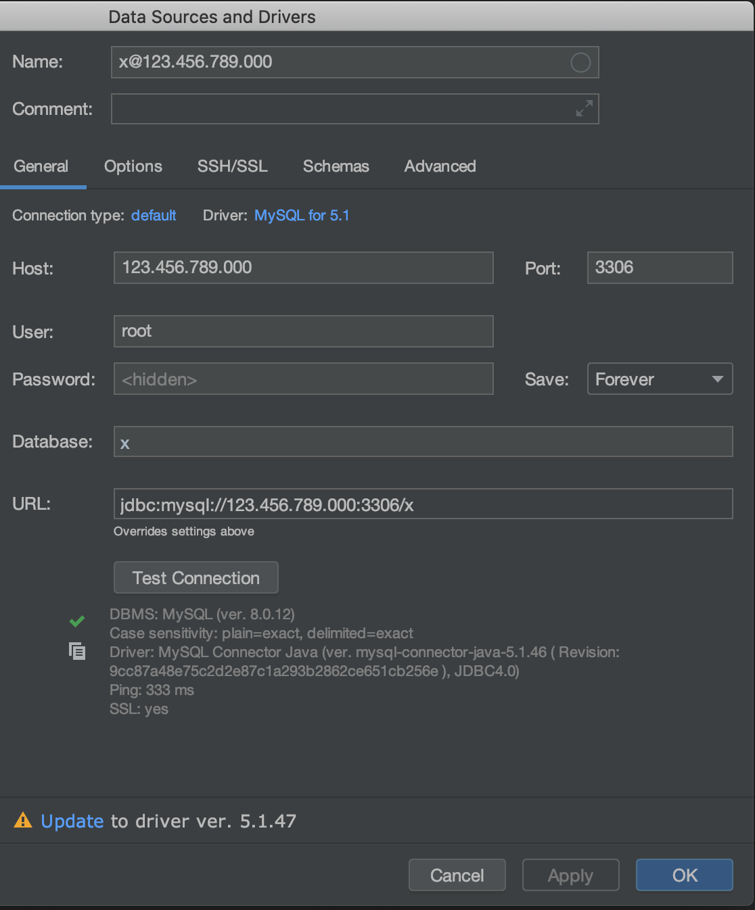

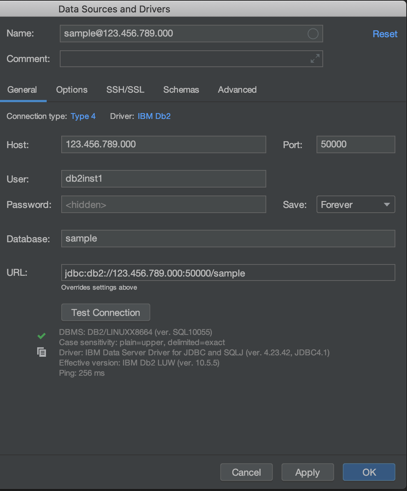

均测试通过Test Connection，并可查看存在表。

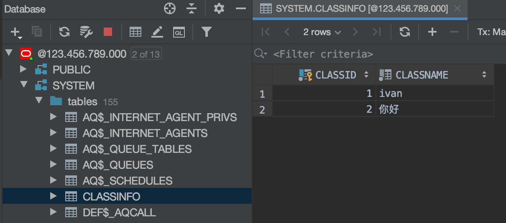


#### 三、ODBC驱动

以下测试机型：win7 64bit 2GB*

一般来说，打开ODBC 数据源管理器的用户DSN添加，如下：

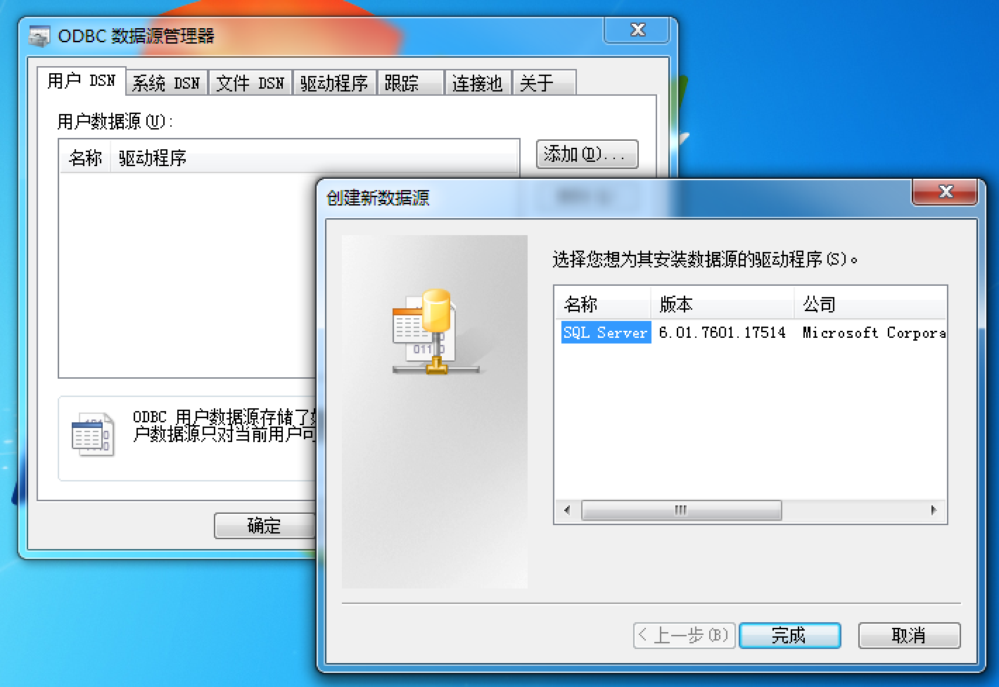

添加ODBC驱动，以实现在此出现新驱动。

（1）Oracle 11g

根据以下链接，注意版本和位数。[官方链接](https://www.oracle.com/technetwork/cn/topics/winia64soft-083954-zhs.html)

```
# 官方下载链接
https://www.oracle.com/technetwork/cn/topics/winia64soft-083954-zhs.html

# 辅助下载链接
https://ivan-bucket-out-001.oss-cn-beijing.aliyuncs.com/out/instantclient-basic-windows.x64-12.2.0.1.0.zip
https://ivan-bucket-out-001.oss-cn-beijing.aliyuncs.com/out/instantclient-odbc-windows.x64-12.2.0.1.0-2.zip
```

各自解压到对应文件，如C:\App，可以看到文件路径如下：

```
C:\App\instantclient-basic-windows.x64-12.2.0.1.0\instantclient_12_2
C:\App\instantclient-odbc-windows.x64-12.2.0.1.0-2\instantclient_12_2
```

合并到instantclient_12_2，即odbc里面的文件全部放入basic文件中，通过cmd查看路径。

```
Microsoft Windows [版本 6.1.7601]
版权所有 (c) 2009 Microsoft Corporation。保留所有权利。

# C:\Windows\system32>dir C:\App\instantclient_12_2
2019/11/13  18:33    <DIR>          .
2019/11/13  18:33    <DIR>          ..
2017/03/08  07:34            19,968 adrci.exe
2017/03/08  07:34            23,264 adrci.sym
2017/03/08  07:35               512 BASIC_README
2017/03/08  07:34            55,808 genezi.exe
2017/03/08  07:34            56,264 genezi.sym
2019/11/13  18:33    <DIR>          help
2017/03/08  07:27           778,752 oci.dll
2017/03/08  07:27           731,816 oci.sym
2016/12/15  01:56           152,576 ocijdbc12.dll
2016/12/15  01:56            44,936 ocijdbc12.sym
2017/03/08  06:58           565,248 ociw32.dll
2017/03/08  06:58            96,456 ociw32.sym
2014/05/04  22:17            21,385 ODBC_IC_Readme_Win.html
2017/09/13  18:25           102,912 odbc_install.exe
2017/09/13  18:25            98,816 odbc_uninstall.exe
2016/12/13  16:40         4,036,257 ojdbc8.jar
2017/03/08  06:47            71,680 oramysql12.dll
2017/03/08  06:47            44,368 oramysql12.sym
2016/11/23  21:52         4,709,888 orannzsbb12.dll
2016/11/23  21:53         2,344,232 orannzsbb12.sym
2017/03/08  06:19         1,026,048 oraocci12.dll
2017/03/08  07:34         1,161,816 oraocci12.sym
2017/03/08  06:41         1,064,960 oraocci12d.dll
2017/03/08  07:34         1,137,064 oraocci12d.sym
2017/03/08  07:31       195,298,304 oraociei12.dll
2017/03/08  07:32        13,912,192 oraociei12.sym
2016/07/28  18:42           252,416 oraons.dll
2017/03/08  07:23           295,424 orasql12.dll
2017/03/08  07:23            60,072 orasql12.sym
2017/09/13  18:24           758,272 sqora32.dll
2017/09/13  18:25           192,512 sqoras32.dll
2017/09/13  18:25            18,432 sqresja.dll
2017/09/13  18:25            19,456 sqresus.dll
2017/03/08  07:34            19,968 uidrvci.exe
2017/03/08  07:34            23,264 uidrvci.sym
2019/11/13  18:32    <DIR>          vc14
2017/01/26  02:36            74,230 xstreams.jar
              35 个文件    229,269,568 字节
               4 个目录 52,208,181,248 可用字节
```

开始安装，注意通过管理员模式。

```
Microsoft Windows [版本 6.1.7601]
版权所有 (c) 2009 Microsoft Corporation。保留所有权利。

# C:\Windows\system32>cd /d C:\App\instantclient_12_2

# C:\App\instantclient_12_2>odbc_install.exe
Oracle ODBC Driver is installed successfully.

# C:\App\instantclient_12_2>
```

并配置环境变量：

| 变量        | 文件路径                  |
| ----------- | ------------------------- |
| ORACLE_HOME | C:\App\instantclient_12_2 |
| Path 添加   | C:\App\instantclient_12_2 |
| TNS_ADMIN   | C:\App\instantclient_12_2 |

查看ODBC，可得：

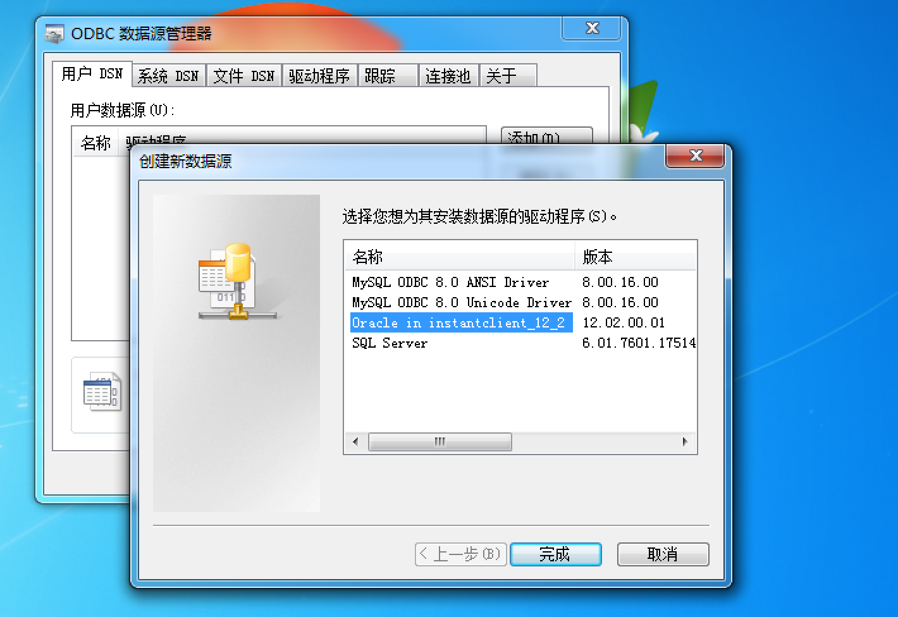

配置并测试，可得：

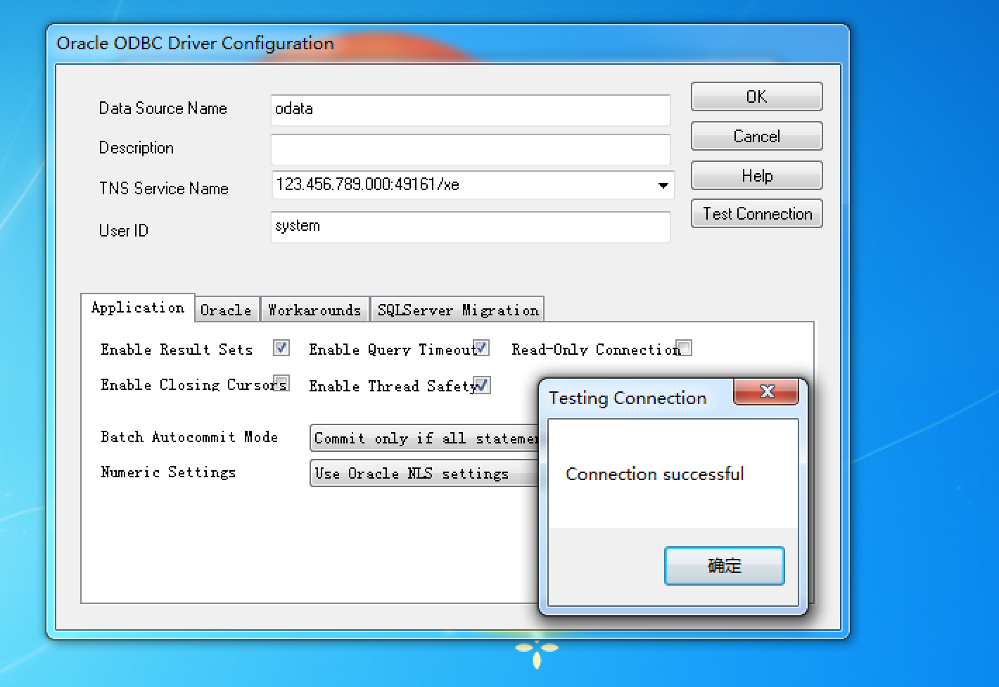

若无TNS，则配置为123.456.789.000:49161/orcl

（2）Mysql

根据以下链接，注意版本和位数。[官方链接](https://dev.mysql.com/downloads/connector/odbc/)

```
# 官方下载链接
https://dev.mysql.com/downloads/connector/odbc/

# 辅助下载链接
https://ivan-bucket-out-001.oss-cn-beijing.aliyuncs.com/out/mysql-connector-odbc-8.0.16-winx64.msi
```

点击安装后，查看ODBC，可得：

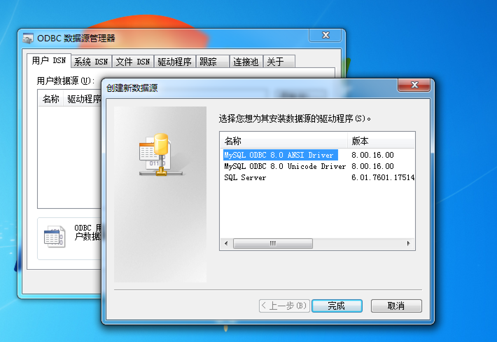

配置并测试，可得：

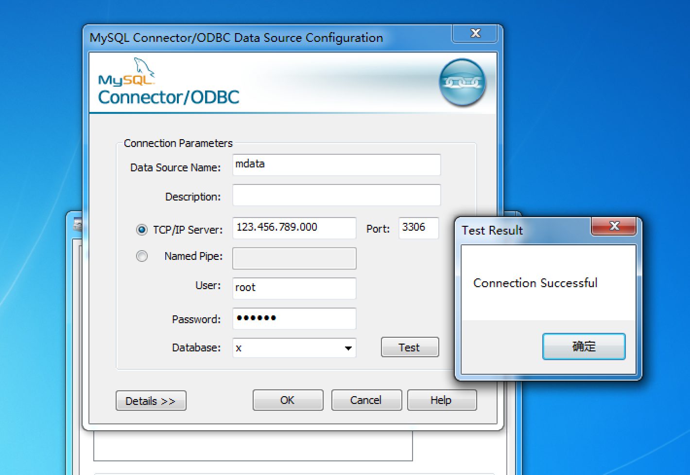


（3）IBM db2

根据以下链接，注意版本和位数。[官方链接](https://www.ibm.com/support/pages/db2-odbc-cli-driver-download-and-installation-information)

```
# 官方下载链接
https://www.ibm.com/support/pages/db2-odbc-cli-driver-download-and-installation-information

# 辅助下载链接
https://ivan-bucket-out-001.oss-cn-beijing.aliyuncs.com/out/v10.1fp6_nt32_odbc_cli.zip
https://ivan-bucket-out-001.oss-cn-beijing.aliyuncs.com/out/v10.1fp6_ntx64_odbc_cli.zip
```

解压，文件路径：

```
C:\App\v10.1fp6_ntx64_odbc_cli\clidriver
```

开始安装，注意通过管理员模式。

```
Microsoft Windows [版本 6.1.7601]
版权所有 (c) 2009 Microsoft Corporation。保留所有权利。

# C:\Windows\system32>cd /d C:\App\v10.1fp6_ntx64_odbc_cli\clidriver\bin

# C:\App\v10.1fp6_ntx64_odbc_cli\clidriver\bin>db2cli install -setup
IBM DATABASE 2 Interactive CLI Sample Program
(C) COPYRIGHT International Business Machines Corp. 1993,1996
All Rights Reserved
Licensed Materials - Property of IBM
US Government Users Restricted Rights - Use, duplication or
disclosure restricted by GSA ADP Schedule Contract with IBM Corp.

The IBM Data Server Driver for ODBC and CLI registered successfully.
The configuration folders are created successfully.


# C:\App\v10.1fp6_ntx64_odbc_cli\clidriver\bin>
```

如果版本较老或上述命令无效，

```
# db2oreg1 –i
并添加路径至Path
```

查看ODBC，可得：

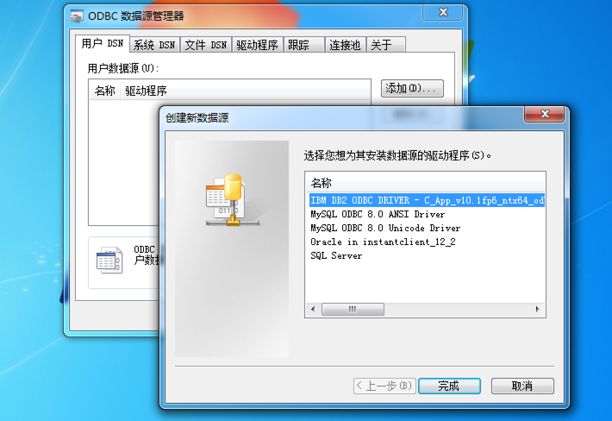

配置并测试，可得：

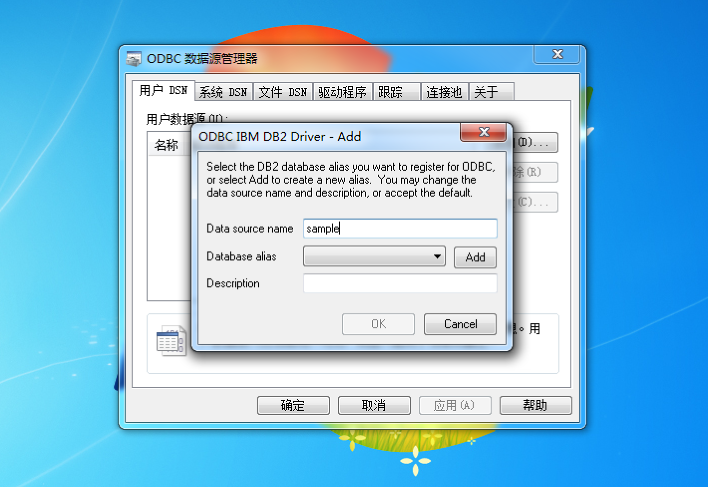


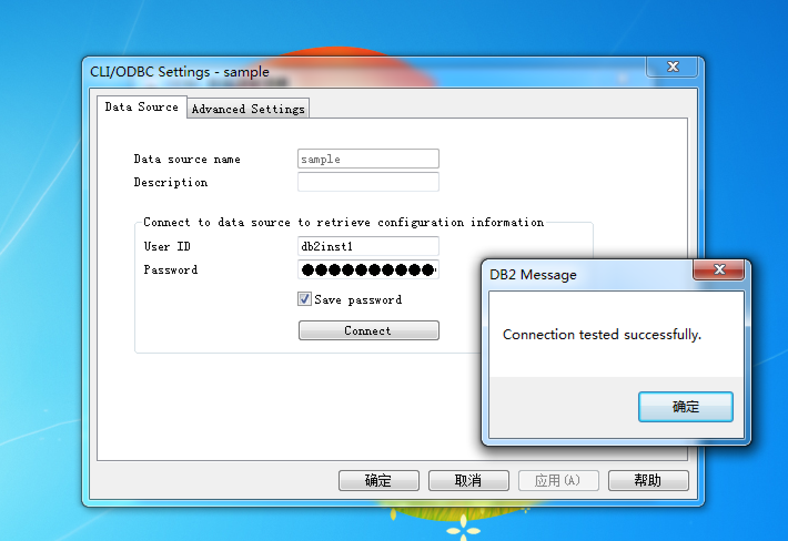


#### 四、SAS读取

（1）Oracle 11g

```SAS
/* SAS */
LIBNAME TA ODBC USER=system PASSWORD=oracle DSN=odata;

/* Log
1    LIBNAME TA ODBC USER=system PASSWORD=XXXXXX DSN=odata;
NOTE: 已成功分配逻辑库引用名“TA”，如下所示:
       引擎:        ODBC
       物理名: odata
*/
```


（2）Mysql

```SAS
/* SAS */
LIBNAME TA ODBC USER=root PASSWORD=123456 DATASRC=mdata;

/* Log
1    LIBNAME TA ODBC USER=root PASSWORD=XXXXXX DATASRC=mdata;
NOTE: 已成功分配逻辑库引用名“TA”，如下所示:
       引擎:        ODBC
       物理名: mdata
*/
```


（3）IBM db2

```SAS
/* SAS */
LIBNAME TA ODBC USER=db2inst1 PASSWORD="db2inst1-pwd" DATASRC=sample;

/* Log
1    LIBNAME TA ODBC USER=db2inst1 PASSWORD=XXXXXXXXXXXXXX DATASRC=sample;
NOTE: 已成功分配逻辑库引用名“TA”，如下所示:
       引擎:        ODBC
       物理名: sample
*/
```

