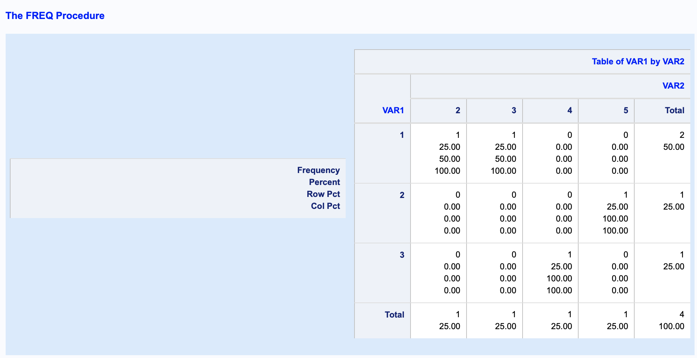

### SAS基础入门
----
#### 第一部分:基础知识
##### 一、SAS语句 

一个SAS语句是有SAS关键词、SAS名字、特殊字符和运算符组成的字符串，并以分号结尾；

注释语句的形式为:/*注释内容*/ 或 *注释内容；

##### 二、SAS程序

SAS程序中的语句可分为两类步骤:

(1) DATA步:产生SAS数据集； 

(2) PROC步:对SAS数据集内的数据进行分析处理并输出结果；

SAS程序窗口包括: 

(1) Editor窗口:采用全屏幕编辑方式输入。当程序输入完毕后，在菜单中选择Submit或按F3键都可以运行程序，也可以只􏰀交一部分语句；

(2) Log窗口:显示程序执行过程中记录的信息，它包括执行的语句，生成的数据集中变量的个数及记录的个数，每一步花费的时间及出错信息等；

(3) Output窗口:SAS过程产生的输出显示；

##### 三、SAS数据集 

SAS数据集相当于其它数据库系统的表(Table)；每一行称为一个观测，相当于其它数据库 系统的一条记录；每一列称为一个变量；

SAS的变量只有两种类型:数值型和字符型;变量的长度默认为8个字节。主要关键字有: 

(1) LENGTH:定义变量长度；

(2) INFORMAT/FORMAT:可以对变量的输入、输出格式进行定义；

(3) LABEL:给变量加标签，即一个代替变量名的标识；

SAS数据集在系统中以文件的形式存在，扩展名是.sas7bdat，每次启动SAS系统后，系统自动开辟一个库名为WORK的临时存贮区，用来存贮DATA步或其它过程生成的临时数据集。

一旦退出SAS系统，这个临时存贮区就被删除，其中所有的临时数据文件也被删除。

为了创建永久的数据集，必须给这个数据集规定存贮的地方和名字两部分，第一部分称为库 标记或逻辑库名，它总是使用LIBNAME语句把库标记和一个目录联系起来，用来指示数据集 存贮的地方。

例如:libname develop "d:\projects\develop\data" 

develop.t_tmp表明数据集t_tmp存贮在"d:\projects\develop\data"目录下，tmp 或work.tmp表明数据集tmp存贮在临时存贮区中；

----
#### 第二部分:DATA 步
##### 一、几种数据源的DATA步操作
1.自定义数据集

```SAS
DATA TMP0;
INPUT SEX $ X1-X3;
CARDS;
F 1 2 3
M 4 5 6
;
RUN;

PROC PRINT DATA = TMP0;
RUN;
```

**The SAS System**

|  Obs |  SEX |   X1 |   X2 |   X3 |
| ---: | ---: | ---: | ---: | ---: |
|    1 |    F |    1 |    2 |    3 |
|    2 |    M |    4 |    5 |    6 |

2.数据来自其他SAS数据集

```SAS
DATA TMP1;
SET TMP0;
WHERE SEX = "F";
RUN;

PROC PRINT DATA = TMP1;
RUN;
```

**The SAS System**

|  Obs |  SEX |   X1 |   X2 |   X3 |
| ---: | ---: | ---: | ---: | ---: |
|    1 |    F |    1 |    2 |    3 |

3.数据来自外部文件(导入外部数据源)

```SAS
/* TEST.CSV
1,2
3,4
1,3
2,5
*/

PROC IMPORT DATAFILE = "TEST.CSV"
OUT = TMP2 DBMS = CSV REPLACE; 
GETNAMES = NO;
RUN;

PROC PRINT DATA = TMP2;
RUN;
```

**The SAS System**

|  Obs | VAR1 | VAR2 |
| ---: | ---: | ---: |
|    1 |    1 |    2 |
|    2 |    3 |    4 |
|    3 |    1 |    3 |
|    4 |    2 |    5 |

##### 二、 用在DATA步的各种语句

1.文件操作语句 

(1) SET语句

(2) MERGE语句(合并语句)

(3) BY语句 

2.运行语句

(1) DELETE语句(删除语句) 

(2) WHERE语句(条件筛选语句) 

(3) OUTPUT语句(输出到数据集语句)

3.控制语句 

(1) DO语句(循环语句)

(2) IF语句(条件语句) 

4.信息语句

(1) LENGTH语句(长度语句) 

(2) LABEL语句(标签语句) 

(3) DROP/KEEP语句(删掉/保留变量语句) 

(4) RENAME语句(重命名语句)

----
#### 第三部分 PROC步
1.导入导出数据过程(PROC IMPORT/EXPORT)

1.1 导入数据(import)

如上述 **3.数据来自外部文件(导入外部数据源)**

1.2 导出数据(export)

```SAS
DATA TMP3;
A = 1;
RUN;

PROC PRINT DATA = TMP3;
RUN;
```

**The SAS System**

|  Obs |    A |
| ---: | ---: |
|    1 |    1 |
```SAS
PROC EXPORT DATA = TMP3
OUTFILE = "TEST1.CSV" DBMS = CSV
REPLACE;
RUN;
```

2.排序过程(PROC SORT)

2.1 单变量排序

```SAS
PROC PRINT DATA = TMP2;
RUN;
```

**The SAS System**

|  Obs | VAR1 | VAR2 |
| ---: | ---: | ---: |
|    1 |    1 |    2 |
|    2 |    3 |    4 |
|    3 |    1 |    3 |
|    4 |    2 |    5 |

```SAS
PROC SORT DATA = TMP2;
BY VAR1;
RUN;

PROC PRINT DATA = TMP2;
RUN;
```

**The SAS System**

|  Obs | VAR1 | VAR2 |
| ---: | ---: | ---: |
|    1 |    1 |    2 |
|    2 |    1 |    3 |
|    3 |    2 |    5 |
|    4 |    3 |    4 |

2.2 多变量排序

```SAS
PROC SORT DATA = TMP2;
BY VAR2 VAR1;
RUN;

PROC PRINT DATA = TMP2;
RUN;
```

**The SAS System**

|  Obs | VAR1 | VAR2 |
| ---: | ---: | ---: |
|    1 |    1 |    2 |
|    2 |    1 |    3 |
|    3 |    3 |    4 |
|    4 |    2 |    5 |

3.简单统计过程(PROC FREQ)

3.1 单变量频数统计

```SAS
PROC PRINT DATA = TMP2;
RUN;

PROC FREQ DATA = TMP2; 
TABLE VAR1;
RUN;
```

**The SAS System**

|  Obs | VAR1 | VAR2 |
| ---: | ---: | ---: |
|    1 |    1 |    2 |
|    2 |    1 |    3 |
|    3 |    3 |    4 |
|    4 |    2 |    5 |

**The SAS System**

| VAR1 | Frequency | Percent | Cumulative Frequency | Cumulative Percent |
| ---: | --------: | ------: | -------------------: | -----------------: |
|    1 |         2 |   50.00 |                    2 |              50.00 |
|    2 |         1 |   25.00 |                    3 |              75.00 |
|    3 |         1 |   25.00 |                    4 |             100.00 |

3.2 多变量频数统计

```SAS
PROC PRINT DATA = TMP2;
RUN;

PROC FREQ DATA = TMP2; 
TABLE VAR1 * VAR2;
RUN;
```

**The SAS System**

|  Obs | VAR1 | VAR2 |
| ---: | ---: | ---: |
|    1 |    1 |    2 |
|    2 |    1 |    3 |
|    3 |    3 |    4 |
|    4 |    2 |    5 |



#### 第四部分 函数介绍

**Function Categories:** 

**• Character**

SUBSTR

**• Truncation**

ROUNDZ

**• Date and Time** 

INTCK

```SAS
DATA TMP4_1;
CHAR = "123456";
SCHAR = SUBSTR(CHAR,1,3);
RUN;

PROC PRINT DATA = TMP4_1;
RUN;
```

**The SAS System**

|  Obs |   CHAR | SCHAR |
| ---: | -----: | ----: |
|    1 | 123456 |   123 |

```SAS
DATA TMP4_2;
PI = 3.1415926;
RPI1 = ROUNDZ(PI,.01);
RPI2 = ROUNDZ(PI,1);
RUN;

PROC PRINT DATA = TMP4_2;
RUN;
```

**The SAS System**

|  Obs |      PI | RPI1 | RPI2 |
| ---: | ------: | ---: | ---: |
|    1 | 3.14159 | 3.14 |    3 |

```SAS
DATA TMP4_3;
DT = INTCK("DAY", "01JAN2019"D, "02JAN2019"D);
RUN;

PROC PRINT DATA = TMP4_3;
RUN;
```

**The SAS System**

|  Obs |   DT |
| ---: | ---: |
|    1 |    1 |

----
MORE CODE

```SAS
OPTIONS COMPRESS = YES;
```

```SAS
DATA A;
SET SASHELP.CARS;
RUN;

PROC PRINT DATA = A(OBS = 10 KEEP = MAKE MSRP);
RUN;
```

**The SAS System**

|  Obs |  Make |    MSRP |
| ---: | ----: | ------: |
|    1 | Acura | $36,945 |
|    2 | Acura | $23,820 |
|    3 | Acura | $26,990 |
|    4 | Acura | $33,195 |
|    5 | Acura | $43,755 |
|    6 | Acura | $46,100 |
|    7 | Acura | $89,765 |
|    8 |  Audi | $25,940 |
|    9 |  Audi | $35,940 |
|   10 |  Audi | $31,840 |

```SAS
DATA A;
SET SASHELP.CARS;
MSRP1 = MSRP + 1;
RUN;

PROC PRINT DATA = A(OBS = 10 KEEP = MAKE MSRP MSRP1);
RUN;
```

**The SAS System**

|  Obs |  Make |    MSRP | MSRP1 |
| ---: | ----: | ------: | ----: |
|    1 | Acura | $36,945 | 36946 |
|    2 | Acura | $23,820 | 23821 |
|    3 | Acura | $26,990 | 26991 |
|    4 | Acura | $33,195 | 33196 |
|    5 | Acura | $43,755 | 43756 |
|    6 | Acura | $46,100 | 46101 |
|    7 | Acura | $89,765 | 89766 |
|    8 |  Audi | $25,940 | 25941 |
|    9 |  Audi | $35,940 | 35941 |
|   10 |  Audi | $31,840 | 31841 |

```SAS
DATA A;
KEEP MSRP1;
SET SASHELP.CARS;
MSRP1 = MSRP + 1;
RUN;

PROC PRINT DATA = A(OBS=10);
RUN;
```

**The SAS System**

|  Obs | MSRP1 |
| ---: | ----: |
|    1 | 36946 |
|    2 | 23821 |
|    3 | 26991 |
|    4 | 33196 |
|    5 | 43756 |
|    6 | 46101 |
|    7 | 89766 |
|    8 | 25941 |
|    9 | 35941 |
|   10 | 31841 |

```SAS
DATA B1;
FORMAT MSRP2 $20.;
SET A;
IF MSRP1 > 30000 THEN MSRP2 = "DAYU3W";
ELSE MSRP2 = "XIAOYU1000";
RUN;

DATA B2;
FORMAT MSRP2 $20.;
SET A;
IF MSRP1 > 30000 THEN MSRP2 = "DAYU3W";
ELSE IF MSRP1 > 1000 THEN MSRP2 = "DAYU3W<1000";
ELSE IF MSRP1 > 200 THEN MSRP2 = "DAYU3W<200";
ELSE MSRP2 = "XIAOYU1000";
RUN;

PROC PRINT DATA = B1(OBS=10);
RUN;
PROC PRINT DATA = B2(OBS=10);
RUN;
```

**The SAS System**

|  Obs |      MSRP2 | MSRP1 |
| ---: | ---------: | ----: |
|    1 |     DAYU3W | 36946 |
|    2 | XIAOYU1000 | 23821 |
|    3 | XIAOYU1000 | 26991 |
|    4 |     DAYU3W | 33196 |
|    5 |     DAYU3W | 43756 |
|    6 |     DAYU3W | 46101 |
|    7 |     DAYU3W | 89766 |
|    8 | XIAOYU1000 | 25941 |
|    9 |     DAYU3W | 35941 |
|   10 |     DAYU3W | 31841 |

**The SAS System**

|  Obs |       MSRP2 | MSRP1 |
| ---: | ----------: | ----: |
|    1 |      DAYU3W | 36946 |
|    2 | DAYU3W<1000 | 23821 |
|    3 | DAYU3W<1000 | 26991 |
|    4 |      DAYU3W | 33196 |
|    5 |      DAYU3W | 43756 |
|    6 |      DAYU3W | 46101 |
|    7 |      DAYU3W | 89766 |
|    8 | DAYU3W<1000 | 25941 |
|    9 |      DAYU3W | 35941 |
|   10 |      DAYU3W | 31841 |

```SAS
DATA C;
KEEP MSRP1;
SET SASHELP.CARS;
MSRP1 = MSRP + 1;
IF MSRP1 > 50000; 
RUN;

PROC PRINT DATA = C(OBS=10);
RUN;
```

**The SAS System**

|  Obs | MSRP1 |
| ---: | ----: |
|    1 | 89766 |
|    2 | 69191 |
|    3 | 84601 |
|    4 | 52196 |
|    5 | 54996 |
|    6 | 69196 |
|    7 | 73196 |
|    8 | 56596 |
|    9 | 52796 |
|   10 | 50596 |

```SAS
DATA D;
KEEP MSRP1;
SET SASHELP.CARS;
MSRP1 = MSRP + 1;
WHERE MSRP1 > 50000; 
RUN;

PROC PRINT DATA = D(OBS=10);
RUN;
/*
	ERROR: Variable MSRP1 is not on file SASHELP.CARS.
*/
```

```SAS
DATA E;
KEEP MSRP1 MSRP2;
SET SASHELP.CARS;
MSRP1 = MSRP + 1;
IF MSRP1 > 50000; 
IF MSRP1 > 60000 THEN MSRP2 = ">";
ELSE MSRP2 = "<";
RUN;

PROC PRINT DATA = E(OBS=10);
RUN;

/* IF SUBSTR(A,1,1) = "1" */
/* IF SUBSTR(A,1,1) = "1" OR SUBSTR(A,1,1) = "2" */
/* IF SUBSTR(A,1,1) = "1" AND MSRP1 > 60000 */
/* IF SUBSTR(A,1,1) IN ("1", "2") */
/* IF SUBSTR(A,1,1) NOT IN ("1", "2") */

```
**The SAS System**

|  Obs | MSRP1 | MSRP2 |
| ---: | ----: | ----: |
|    1 | 89766 |     > |
|    2 | 69191 |     > |
|    3 | 84601 |     > |
|    4 | 52196 |     < |
|    5 | 54996 |     < |
|    6 | 69196 |     > |
|    7 | 73196 |     > |
|    8 | 56596 |     < |
|    9 | 52796 |     < |
|   10 | 50596 |     < |

