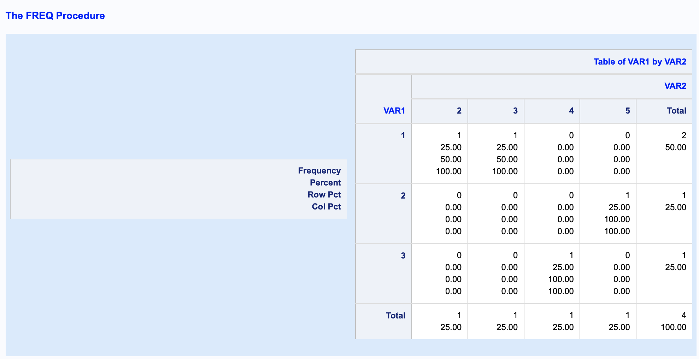
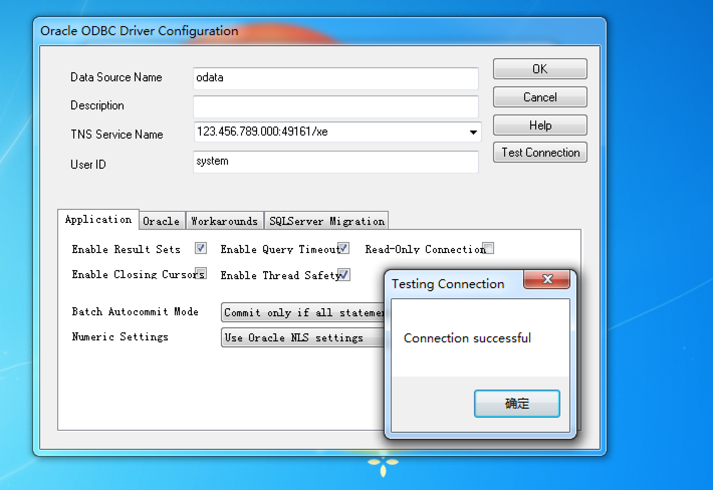
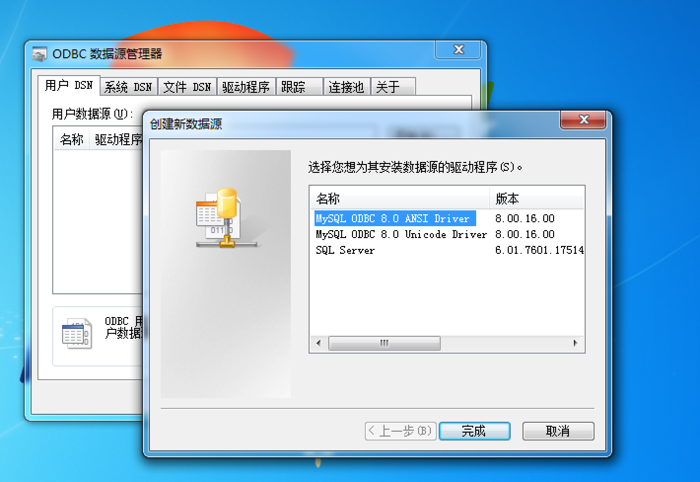

## DataSAS
----

### SAS基础入门
----
#### 第一部分:基础知识
##### 一、SAS语句 

一个SAS语句是有SAS关键词、SAS名字、特殊字符和运算符组成的字符串，并以分号结尾；

注释语句的形式为:/*注释内容*/ 或 *注释内容；

##### 二、SAS程序

SAS程序中的语句可分为两类步骤:

(1) DATA步:产生SAS数据集； 

(2) PROC步:对SAS数据集内的数据进行分析处理并输出结果；

SAS程序窗口包括: 

(1) Editor窗口:采用全屏幕编辑方式输入。当程序输入完毕后，在菜单中选择Submit或按F3键都可以运行程序，也可以只􏰀交一部分语句；

(2) Log窗口:显示程序执行过程中记录的信息，它包括执行的语句，生成的数据集中变量的个数及记录的个数，每一步花费的时间及出错信息等；

(3) Output窗口:SAS过程产生的输出显示；

##### 三、SAS数据集 

SAS数据集相当于其它数据库系统的表(Table)；每一行称为一个观测，相当于其它数据库 系统的一条记录；每一列称为一个变量；

SAS的变量只有两种类型:数值型和字符型;变量的长度默认为8个字节。主要关键字有: 

(1) LENGTH:定义变量长度；

(2) INFORMAT/FORMAT:可以对变量的输入、输出格式进行定义；

(3) LABEL:给变量加标签，即一个代替变量名的标识；

SAS数据集在系统中以文件的形式存在，扩展名是.sas7bdat，每次启动SAS系统后，系统自动开辟一个库名为WORK的临时存贮区，用来存贮DATA步或其它过程生成的临时数据集。

一旦退出SAS系统，这个临时存贮区就被删除，其中所有的临时数据文件也被删除。

为了创建永久的数据集，必须给这个数据集规定存贮的地方和名字两部分，第一部分称为库 标记或逻辑库名，它总是使用LIBNAME语句把库标记和一个目录联系起来，用来指示数据集 存贮的地方。

例如:libname develop "d:\projects\develop\data" 

develop.t_tmp表明数据集t_tmp存贮在"d:\projects\develop\data"目录下，tmp 或work.tmp表明数据集tmp存贮在临时存贮区中；

----
#### 第二部分:DATA 步
##### 一、几种数据源的DATA步操作
1.自定义数据集

```SAS
DATA TMP0;
INPUT SEX $ X1-X3;
CARDS;
F 1 2 3
M 4 5 6
;
RUN;

PROC PRINT DATA = TMP0;
RUN;
```
|  Obs |  SEX |   X1 |   X2 |   X3 |
| ---: | ---: | ---: | ---: | ---: |
|    1 |    F |    1 |    2 |    3 |
|    2 |    M |    4 |    5 |    6 |

2.数据来自其他SAS数据集

```SAS
DATA TMP1;
SET TMP0;
WHERE SEX = "F";
RUN;

PROC PRINT DATA = TMP1;
RUN;
```
|  Obs |  SEX |   X1 |   X2 |   X3 |
| ---: | ---: | ---: | ---: | ---: |
|    1 |    F |    1 |    2 |    3 |

3.数据来自外部文件(导入外部数据源)

```SAS
/* TEST.CSV
1,2
3,4
1,3
2,5
*/

PROC IMPORT DATAFILE = "TEST.CSV"
OUT = TMP2 DBMS = CSV REPLACE; 
GETNAMES = NO;
RUN;

PROC PRINT DATA = TMP2;
RUN;
```
|  Obs | VAR1 | VAR2 |
| ---: | ---: | ---: |
|    1 |    1 |    2 |
|    2 |    3 |    4 |
|    3 |    1 |    3 |
|    4 |    2 |    5 |

##### 二、 用在DATA步的各种语句

1.文件操作语句 

(1) SET语句

(2) MERGE语句(合并语句)

(3) BY语句 

2.运行语句

(1) DELETE语句(删除语句) 

(2) WHERE语句(条件筛选语句) 

(3) OUTPUT语句(输出到数据集语句)

3.控制语句 

(1) DO语句(循环语句)

(2) IF语句(条件语句) 

4.信息语句

(1) LENGTH语句(长度语句) 

(2) LABEL语句(标签语句) 

(3) DROP/KEEP语句(删掉/保留变量语句) 

(4) RENAME语句(重命名语句)

----
#### 第三部分 PROC步
1.导入导出数据过程(PROC IMPORT/EXPORT)

1.1 导入数据(import)

如上述 **3.数据来自外部文件(导入外部数据源)**

1.2 导出数据(export)

```SAS
DATA TMP3;
A = 1;
RUN;

PROC PRINT DATA = TMP3;
RUN;
```
|  Obs |    A |
| ---: | ---: |
|    1 |    1 |
```SAS
PROC EXPORT DATA = TMP3
OUTFILE = "TEST1.CSV" DBMS = CSV
REPLACE;
RUN;
```

2.排序过程(PROC SORT)

2.1 单变量排序

```SAS
PROC PRINT DATA = TMP2;
RUN;
```

|  Obs | VAR1 | VAR2 |
| ---: | ---: | ---: |
|    1 |    1 |    2 |
|    2 |    3 |    4 |
|    3 |    1 |    3 |
|    4 |    2 |    5 |

```SAS
PROC SORT DATA = TMP2;
BY VAR1;
RUN;

PROC PRINT DATA = TMP2;
RUN;
```

|  Obs | VAR1 | VAR2 |
| ---: | ---: | ---: |
|    1 |    1 |    2 |
|    2 |    1 |    3 |
|    3 |    2 |    5 |
|    4 |    3 |    4 |

2.2 多变量排序

```SAS
PROC SORT DATA = TMP2;
BY VAR2 VAR1;
RUN;

PROC PRINT DATA = TMP2;
RUN;
```

|  Obs | VAR1 | VAR2 |
| ---: | ---: | ---: |
|    1 |    1 |    2 |
|    2 |    1 |    3 |
|    3 |    3 |    4 |
|    4 |    2 |    5 |

3.简单统计过程(PROC FREQ)

3.1 单变量频数统计

```SAS
PROC PRINT DATA = TMP2;
RUN;

PROC FREQ DATA = TMP2; 
TABLE VAR1;
RUN;
```

|  Obs | VAR1 | VAR2 |
| ---: | ---: | ---: |
|    1 |    1 |    2 |
|    2 |    1 |    3 |
|    3 |    3 |    4 |
|    4 |    2 |    5 |

| VAR1 | Frequency | Percent | Cumulative Frequency | Cumulative Percent |
| ---: | --------: | ------: | -------------------: | -----------------: |
|    1 |         2 |   50.00 |                    2 |              50.00 |
|    2 |         1 |   25.00 |                    3 |              75.00 |
|    3 |         1 |   25.00 |                    4 |             100.00 |

3.2 多变量频数统计

```SAS
PROC PRINT DATA = TMP2;
RUN;

PROC FREQ DATA = TMP2; 
TABLE VAR1 * VAR2;
RUN;
```

|  Obs | VAR1 | VAR2 |
| ---: | ---: | ---: |
|    1 |    1 |    2 |
|    2 |    1 |    3 |
|    3 |    3 |    4 |
|    4 |    2 |    5 |



#### 第四部分 函数介绍

**Function Categories:** 

**• Character**

SUBSTR

**• Truncation**

ROUNDZ

**• Date and Time** 

INTCK

```SAS
DATA TMP4_1;
CHAR = "123456";
SCHAR = SUBSTR(CHAR,1,3);
RUN;

PROC PRINT DATA = TMP4_1;
RUN;
```

|  Obs |   CHAR | SCHAR |
| ---: | -----: | ----: |
|    1 | 123456 |   123 |

```SAS
DATA TMP4_2;
PI = 3.1415926;
RPI1 = ROUNDZ(PI,.01);
RPI2 = ROUNDZ(PI,1);
RUN;

PROC PRINT DATA = TMP4_2;
RUN;
```

|  Obs |      PI | RPI1 | RPI2 |
| ---: | ------: | ---: | ---: |
|    1 | 3.14159 | 3.14 |    3 |

```SAS
DATA TMP4_3;
DT = INTCK("DAY", "01JAN2019"D, "02JAN2019"D);
RUN;

PROC PRINT DATA = TMP4_3;
RUN;
```

|  Obs |   DT |
| ---: | ---: |
|    1 |    1 |

----
MORE CODE

```SAS
OPTIONS COMPRESS = YES;
```

```SAS
DATA A;
SET SASHELP.CARS;
RUN;

PROC PRINT DATA = A(OBS = 10 KEEP = MAKE MSRP);
RUN;
```

|  Obs |  Make |    MSRP |
| ---: | ----: | ------: |
|    1 | Acura | $36,945 |
|    2 | Acura | $23,820 |
|    3 | Acura | $26,990 |
|    4 | Acura | $33,195 |
|    5 | Acura | $43,755 |
|    6 | Acura | $46,100 |
|    7 | Acura | $89,765 |
|    8 |  Audi | $25,940 |
|    9 |  Audi | $35,940 |
|   10 |  Audi | $31,840 |

```SAS
DATA A;
SET SASHELP.CARS;
MSRP1 = MSRP + 1;
RUN;

PROC PRINT DATA = A(OBS = 10 KEEP = MAKE MSRP MSRP1);
RUN;
```

|  Obs |  Make |    MSRP | MSRP1 |
| ---: | ----: | ------: | ----: |
|    1 | Acura | $36,945 | 36946 |
|    2 | Acura | $23,820 | 23821 |
|    3 | Acura | $26,990 | 26991 |
|    4 | Acura | $33,195 | 33196 |
|    5 | Acura | $43,755 | 43756 |
|    6 | Acura | $46,100 | 46101 |
|    7 | Acura | $89,765 | 89766 |
|    8 |  Audi | $25,940 | 25941 |
|    9 |  Audi | $35,940 | 35941 |
|   10 |  Audi | $31,840 | 31841 |

```SAS
DATA A;
KEEP MSRP1;
SET SASHELP.CARS;
MSRP1 = MSRP + 1;
RUN;

PROC PRINT DATA = A(OBS=10);
RUN;
```

|  Obs | MSRP1 |
| ---: | ----: |
|    1 | 36946 |
|    2 | 23821 |
|    3 | 26991 |
|    4 | 33196 |
|    5 | 43756 |
|    6 | 46101 |
|    7 | 89766 |
|    8 | 25941 |
|    9 | 35941 |
|   10 | 31841 |

```SAS
DATA B1;
FORMAT MSRP2 $20.;
SET A;
IF MSRP1 > 30000 THEN MSRP2 = "DAYU3W";
ELSE MSRP2 = "XIAOYU1000";
RUN;

DATA B2;
FORMAT MSRP2 $20.;
SET A;
IF MSRP1 > 30000 THEN MSRP2 = "DAYU3W";
ELSE IF MSRP1 > 1000 THEN MSRP2 = "DAYU3W<1000";
ELSE IF MSRP1 > 200 THEN MSRP2 = "DAYU3W<200";
ELSE MSRP2 = "XIAOYU1000";
RUN;

PROC PRINT DATA = B1(OBS=10);
RUN;
PROC PRINT DATA = B2(OBS=10);
RUN;
```

|  Obs |      MSRP2 | MSRP1 |
| ---: | ---------: | ----: |
|    1 |     DAYU3W | 36946 |
|    2 | XIAOYU1000 | 23821 |
|    3 | XIAOYU1000 | 26991 |
|    4 |     DAYU3W | 33196 |
|    5 |     DAYU3W | 43756 |
|    6 |     DAYU3W | 46101 |
|    7 |     DAYU3W | 89766 |
|    8 | XIAOYU1000 | 25941 |
|    9 |     DAYU3W | 35941 |
|   10 |     DAYU3W | 31841 |

|  Obs |       MSRP2 | MSRP1 |
| ---: | ----------: | ----: |
|    1 |      DAYU3W | 36946 |
|    2 | DAYU3W<1000 | 23821 |
|    3 | DAYU3W<1000 | 26991 |
|    4 |      DAYU3W | 33196 |
|    5 |      DAYU3W | 43756 |
|    6 |      DAYU3W | 46101 |
|    7 |      DAYU3W | 89766 |
|    8 | DAYU3W<1000 | 25941 |
|    9 |      DAYU3W | 35941 |
|   10 |      DAYU3W | 31841 |

```SAS
DATA C;
KEEP MSRP1;
SET SASHELP.CARS;
MSRP1 = MSRP + 1;
IF MSRP1 > 50000; 
RUN;

PROC PRINT DATA = C(OBS=10);
RUN;
```

|  Obs | MSRP1 |
| ---: | ----: |
|    1 | 89766 |
|    2 | 69191 |
|    3 | 84601 |
|    4 | 52196 |
|    5 | 54996 |
|    6 | 69196 |
|    7 | 73196 |
|    8 | 56596 |
|    9 | 52796 |
|   10 | 50596 |

```SAS
DATA D;
KEEP MSRP1;
SET SASHELP.CARS;
MSRP1 = MSRP + 1;
WHERE MSRP1 > 50000; 
RUN;

PROC PRINT DATA = D(OBS=10);
RUN;
/*
	ERROR: Variable MSRP1 is not on file SASHELP.CARS.
*/
```

```SAS
DATA E;
KEEP MSRP1 MSRP2;
SET SASHELP.CARS;
MSRP1 = MSRP + 1;
IF MSRP1 > 50000; 
IF MSRP1 > 60000 THEN MSRP2 = ">";
ELSE MSRP2 = "<";
RUN;

PROC PRINT DATA = E(OBS=10);
RUN;

/* IF SUBSTR(A,1,1) = "1" */
/* IF SUBSTR(A,1,1) = "1" OR SUBSTR(A,1,1) = "2" */
/* IF SUBSTR(A,1,1) = "1" AND MSRP1 > 60000 */
/* IF SUBSTR(A,1,1) IN ("1", "2") */
/* IF SUBSTR(A,1,1) NOT IN ("1", "2") */

```

|  Obs | MSRP1 | MSRP2 |
| ---: | ----: | ----: |
|    1 | 89766 |     > |
|    2 | 69191 |     > |
|    3 | 84601 |     > |
|    4 | 52196 |     < |
|    5 | 54996 |     < |
|    6 | 69196 |     > |
|    7 | 73196 |     > |
|    8 | 56596 |     < |
|    9 | 52796 |     < |
|   10 | 50596 |     < |


### SASbyODBC

#### 〇、简要

> ODBC概念
> 开放数据库连接（Open Database Connectivity，ODBC）是为解决异构数据库间的数据共享而产生的，现已成为WOSA(The Windows Open System Architecture(Windows开放系统体系结构))的主要部分和基于Windows环境的一种数据库访问接口标准ODBC 为异构数据库访问提供统一接口，允许应用程序以SQL 为数据存取标准，存取不同DBMS管理的数据；使应用程序直接操纵DB中的数据，免除随DB的改变而改变。用ODBC 可以访问各类计算机上的DB文件，甚至访问如Excel 表和ASCII数据文件这类非数据库对象。

```SAS
/*
ODBC LIBNAME Statement Examples
In this example, USER=, PASSWORD=, and DATASRC= are connection options. 
*/
libname mydblib odbc user=myusr1 password=mypwd1 datasrc=mydatasource;

/*
In this next example, the libref MYLIB uses the ODBC engine to connect to an Oracle database. The connection options are USER=, PASSWORD=, and DATASRC=. 
*/
libname mydblib odbc datasrc=mydatasourcemydatasource user=myusr1 password=mypwd1;

proc print data=mydblib.customers;
   where state='CA';
run;

/*
In the next example, the libref MYDBLIB uses the ODBC engine to connect to a Microsoft SQL Server database. The connection option is NOPROMPT=. 
*/
libname mydblib odbc noprompt="uid=myusr1;pwd=mypwd1;dsn=sqlservr;" stringdates=yes;

proc print data=mydblib.customers;
   where state='CA';
run;
```


#### 一、数据库准备

过程略。已备：

| Type       | Host            | Port  | User     | Password     | Database |
| ---------- | --------------- | ----- | -------- | ------------ | -------- |
| Oracle 11g | 123.456.789.000 | 49161 | system   | oracle       | sid:xe   |
| Mysql      | 123.456.789.000 | 3306  | root     | 123456       | x        |
| IBM db2    | 123.456.789.000 | 50000 | db2inst1 | db2inst1-pwd | sample   |

*// Host 已加密，需注意各数据库版本*


#### 二、连接测试

（1）telnet测试

若windows，可通过控制面板-程序-打开或关闭windows功能来安装telnet。

```
# telnet 123.456.789.000 49161
Trying 123.456.789.000...
Connected to 123.456.789.000.
Escape character is '^]'.
^]
telnet> quit
Connection closed. 
```

```
# telnet 123.456.789.000 3306
Trying 123.456.789.000...
Connected to 123.456.789.000.
Escape character is '^]'.
J
8.0.12 &I~o?ji0*Wj
                  caching_sha2_password
^]
telnet> quit
Connection closed.
```

```
# telnet 123.456.789.000 50000
Trying 123.456.789.000...
Connected to 123.456.789.000.
Escape character is '^]'.
^]
telnet> quit
Connection closed. 
```

上述即可通。

若经过漫长等待后，出现以下情况，请先检查连接情况。

```
# telnet 123.456.789.000 1234
Trying 123.456.789.000...
telnet: connect to address 123.456.789.000: Operation timed out
telnet: Unable to connect to remote host
```

（2）客户端测试

各种数据库客户端都可以，以下推荐**DataGrip**,可通过jdbc连接，轻松简单。

配置并测试，如下：


均测试通过Test Connection，并可查看存在表。


#### 三、ODBC驱动

以下测试机型：win7 64bit 2GB*

一般来说，打开ODBC 数据源管理器的用户DSN添加，如下：


添加ODBC驱动，以实现在此出现新驱动。

（1）Oracle 11g

根据以下链接，注意版本和位数。[官方链接](https://www.oracle.com/technetwork/cn/topics/winia64soft-083954-zhs.html)

```
# 官方下载链接
https://www.oracle.com/technetwork/cn/topics/winia64soft-083954-zhs.html

# 辅助下载链接
https://ivan-bucket-out-001.oss-cn-beijing.aliyuncs.com/out/instantclient-basic-windows.x64-12.2.0.1.0.zip
https://ivan-bucket-out-001.oss-cn-beijing.aliyuncs.com/out/instantclient-odbc-windows.x64-12.2.0.1.0-2.zip
```

各自解压到对应文件，如C:\App，可以看到文件路径如下：

```
C:\App\instantclient-basic-windows.x64-12.2.0.1.0\instantclient_12_2
C:\App\instantclient-odbc-windows.x64-12.2.0.1.0-2\instantclient_12_2
```

合并到instantclient_12_2，即odbc里面的文件全部放入basic文件中，通过cmd查看路径。

```
Microsoft Windows [版本 6.1.7601]
版权所有 (c) 2009 Microsoft Corporation。保留所有权利。

# C:\Windows\system32>dir C:\App\instantclient_12_2
2019/11/13  18:33    <DIR>          .
2019/11/13  18:33    <DIR>          ..
2017/03/08  07:34            19,968 adrci.exe
2017/03/08  07:34            23,264 adrci.sym
2017/03/08  07:35               512 BASIC_README
2017/03/08  07:34            55,808 genezi.exe
2017/03/08  07:34            56,264 genezi.sym
2019/11/13  18:33    <DIR>          help
2017/03/08  07:27           778,752 oci.dll
2017/03/08  07:27           731,816 oci.sym
2016/12/15  01:56           152,576 ocijdbc12.dll
2016/12/15  01:56            44,936 ocijdbc12.sym
2017/03/08  06:58           565,248 ociw32.dll
2017/03/08  06:58            96,456 ociw32.sym
2014/05/04  22:17            21,385 ODBC_IC_Readme_Win.html
2017/09/13  18:25           102,912 odbc_install.exe
2017/09/13  18:25            98,816 odbc_uninstall.exe
2016/12/13  16:40         4,036,257 ojdbc8.jar
2017/03/08  06:47            71,680 oramysql12.dll
2017/03/08  06:47            44,368 oramysql12.sym
2016/11/23  21:52         4,709,888 orannzsbb12.dll
2016/11/23  21:53         2,344,232 orannzsbb12.sym
2017/03/08  06:19         1,026,048 oraocci12.dll
2017/03/08  07:34         1,161,816 oraocci12.sym
2017/03/08  06:41         1,064,960 oraocci12d.dll
2017/03/08  07:34         1,137,064 oraocci12d.sym
2017/03/08  07:31       195,298,304 oraociei12.dll
2017/03/08  07:32        13,912,192 oraociei12.sym
2016/07/28  18:42           252,416 oraons.dll
2017/03/08  07:23           295,424 orasql12.dll
2017/03/08  07:23            60,072 orasql12.sym
2017/09/13  18:24           758,272 sqora32.dll
2017/09/13  18:25           192,512 sqoras32.dll
2017/09/13  18:25            18,432 sqresja.dll
2017/09/13  18:25            19,456 sqresus.dll
2017/03/08  07:34            19,968 uidrvci.exe
2017/03/08  07:34            23,264 uidrvci.sym
2019/11/13  18:32    <DIR>          vc14
2017/01/26  02:36            74,230 xstreams.jar
              35 个文件    229,269,568 字节
               4 个目录 52,208,181,248 可用字节
```

开始安装，注意通过管理员模式。

```
Microsoft Windows [版本 6.1.7601]
版权所有 (c) 2009 Microsoft Corporation。保留所有权利。

# C:\Windows\system32>cd /d C:\App\instantclient_12_2

# C:\App\instantclient_12_2>odbc_install.exe
Oracle ODBC Driver is installed successfully.

# C:\App\instantclient_12_2>
```

并配置环境变量：

| 变量        | 文件路径                  |
| ----------- | ------------------------- |
| ORACLE_HOME | C:\App\instantclient_12_2 |
| Path 添加   | C:\App\instantclient_12_2 |
| TNS_ADMIN   | C:\App\instantclient_12_2 |

查看ODBC，可得：


配置并测试，可得：



若无TNS，则配置为123.456.789.000:49161/orcl

（2）Mysql

根据以下链接，注意版本和位数。[官方链接](https://dev.mysql.com/downloads/connector/odbc/)

```
# 官方下载链接
https://dev.mysql.com/downloads/connector/odbc/

# 辅助下载链接
https://ivan-bucket-out-001.oss-cn-beijing.aliyuncs.com/out/mysql-connector-odbc-8.0.16-winx64.msi
```

点击安装后，查看ODBC，可得：



配置并测试，可得：


（3）IBM db2

根据以下链接，注意版本和位数。[官方链接](https://www.ibm.com/support/pages/db2-odbc-cli-driver-download-and-installation-information)

```
# 官方下载链接
https://www.ibm.com/support/pages/db2-odbc-cli-driver-download-and-installation-information

# 辅助下载链接
https://ivan-bucket-out-001.oss-cn-beijing.aliyuncs.com/out/v10.1fp6_nt32_odbc_cli.zip
https://ivan-bucket-out-001.oss-cn-beijing.aliyuncs.com/out/v10.1fp6_ntx64_odbc_cli.zip
```

解压，文件路径：

```
C:\App\v10.1fp6_ntx64_odbc_cli\clidriver
```

开始安装，注意通过管理员模式。

```
Microsoft Windows [版本 6.1.7601]
版权所有 (c) 2009 Microsoft Corporation。保留所有权利。

# C:\Windows\system32>cd /d C:\App\v10.1fp6_ntx64_odbc_cli\clidriver\bin

# C:\App\v10.1fp6_ntx64_odbc_cli\clidriver\bin>db2cli install -setup
IBM DATABASE 2 Interactive CLI Sample Program
(C) COPYRIGHT International Business Machines Corp. 1993,1996
All Rights Reserved
Licensed Materials - Property of IBM
US Government Users Restricted Rights - Use, duplication or
disclosure restricted by GSA ADP Schedule Contract with IBM Corp.

The IBM Data Server Driver for ODBC and CLI registered successfully.
The configuration folders are created successfully.


# C:\App\v10.1fp6_ntx64_odbc_cli\clidriver\bin>
```

如果版本较老或上述命令无效，

```
# db2oreg1 –i
并添加路径至Path
```

查看ODBC，可得：


配置并测试，可得：


#### 四、SAS读取

（1）Oracle 11g

```SAS
/* SAS */
LIBNAME TA ODBC USER=system PASSWORD=oracle DSN=odata;

/* Log
1    LIBNAME TA ODBC USER=system PASSWORD=XXXXXX DSN=odata;
NOTE: 已成功分配逻辑库引用名“TA”，如下所示:
       引擎:        ODBC
       物理名: odata
*/
```


（2）Mysql

```SAS
/* SAS */
LIBNAME TA ODBC USER=root PASSWORD=123456 DATASRC=mdata;

/* Log
1    LIBNAME TA ODBC USER=root PASSWORD=XXXXXX DATASRC=mdata;
NOTE: 已成功分配逻辑库引用名“TA”，如下所示:
       引擎:        ODBC
       物理名: mdata
*/
```


（3）IBM db2

```SAS
/* SAS */
LIBNAME TA ODBC USER=db2inst1 PASSWORD="db2inst1-pwd" DATASRC=sample;

/* Log
1    LIBNAME TA ODBC USER=db2inst1 PASSWORD=XXXXXXXXXXXXXX DATASRC=sample;
NOTE: 已成功分配逻辑库引用名“TA”，如下所示:
       引擎:        ODBC
       物理名: sample
*/
```


