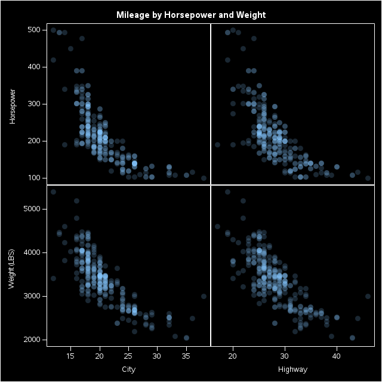
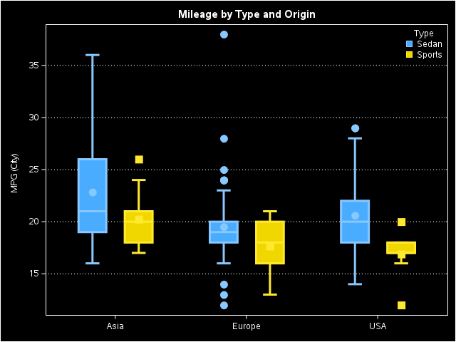
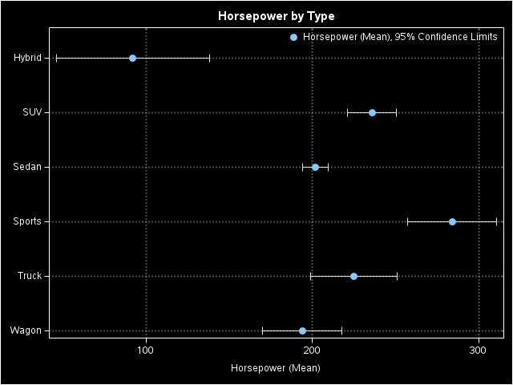
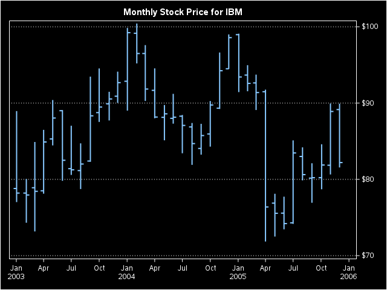
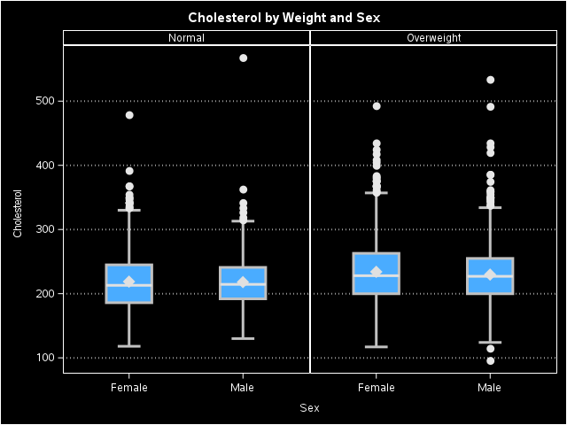
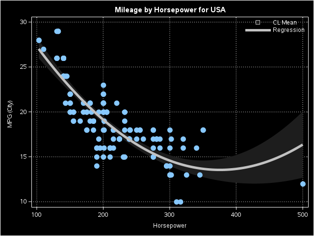
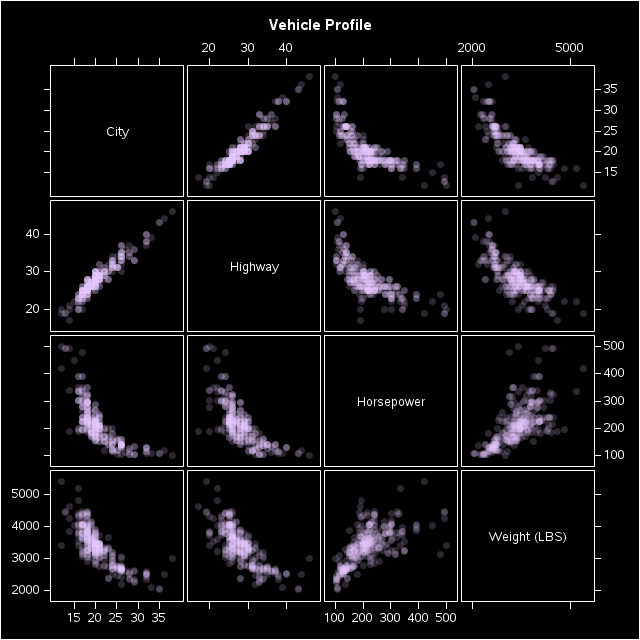
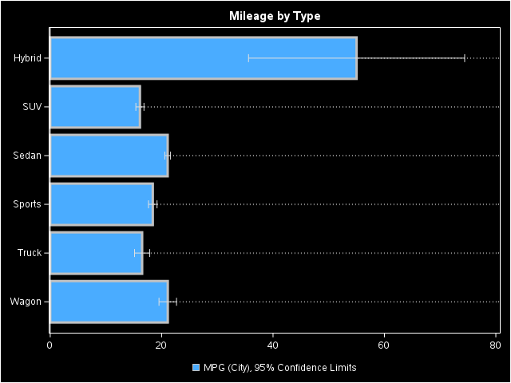
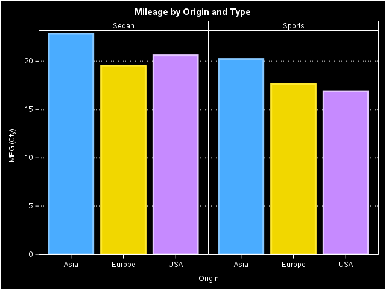
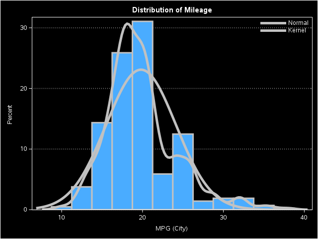

#### 1、比较散点图
```SAS
/*--Comparative Scatter Plot--*/

title 'Mileage by Horsepower and Weight';
proc sgscatter data=sashelp.cars(where=(type in ('Sedan' 'Sports')));
  label mpg_city='City';
  label mpg_highway='Highway';
  compare x=(mpg_city mpg_highway) y=(horsepower weight) /
     transparency=0.8 markerattrs=graphdata1(symbol=circlefilled);
  run;
```


#### 2、垂直盒形图
```SAS
/*--VBox Plot--*/

title 'Mileage by Type and Origin';
proc sgplot data=sashelp.cars(where=(type in ('Sedan' 'Sports'))) ;
  vbox mpg_city / category=origin group=type groupdisplay=cluster
    lineattrs=(pattern=solid) whiskerattrs=(pattern=solid);
  xaxis display=(nolabel);
  yaxis grid;
  keylegend / location=inside position=topright across=1;
  run;
```


#### 3、点图
```SAS
/*--Dot Plot--*/

title 'Horsepower by Type';
proc sgplot data=sashelp.cars;
  dot type / response=horsepower limits=both stat=mean
      markerattrs=(symbol=circlefilled size=9);
  xaxis grid;
  yaxis display=(nolabel) offsetmin=0.1;
  keylegend / location=inside position=topright across=1;
  run;
```


#### 4、高低图
```SAS
/*--HighLow Plot--*/

title 'Monthly Stock Price for IBM';
proc sgplot data=sashelp.stocks(where=(stock eq 'IBM' and date > '01Jan2003'd));
  highlow x=date high=high low=low / open=open close=close
      lineattrs=(thickness=2) y2axis;
  xaxis display=(nolabel);
  y2axis display=(nolabel) grid;
  run;
```


#### 5、盒形图面板
```SAS
/*--Box Panel--*/

title 'Cholesterol by Weight and Sex';
proc sgpanel data=sashelp.heart(where=(weight_status ne 'Underweight'));
  panelby weight_status / novarname;
  vbox cholesterol / category=sex;
  rowaxis grid;
  run;
```


#### 6、拟合图
```SAS
/*--Fit Plot--*/

title 'Mileage by Horsepower for USA';
proc sgplot data=sashelp.cars(where=(origin='USA'));
  reg x=horsepower y=mpg_city / degree=2 clm='CL Mean';
  keylegend / location=inside position=topright across=1;
  xaxis grid;
  yaxis grid;
  run;
```


#### 7、散点图矩阵
```SAS
/*--Scatter Plot Matrix--*/

title 'Vehicle Profile';
proc sgscatter data=sashelp.cars(where=(type in ('Sedan' 'Sports')));
  label mpg_city='City';
  label mpg_highway='Highway';
  matrix mpg_city mpg_highway horsepower weight /
     transparency=0.8 markerattrs=graphdata3(symbol=circlefilled);
  run;
```


#### 8、水平条形图
```SAS
/*--HBar Plot--*/

title 'Mileage by Type';
proc sgplot data=sashelp.cars ;
  hbar type / response=mpg_city  stat=mean  limits=both;
  yaxis display=(nolabel) grid;
  xaxis display=(nolabel);
  run;
```


#### 9、条形图面板
```SAS
/*--Bar Panel--*/

title 'Mileage by Origin and Type';
proc sgpanel data=sashelp.cars(where=(type in ('Sedan' 'Sports'))) noautolegend;
  panelby Type / novarname columns=2 onepanel;
  vbar origin / response=mpg_city stat=mean group=origin;
  rowaxis grid;
  run;
```


#### A、直方图
```SAS
/*--Histogram--*/

title 'Distribution of Mileage';
proc sgplot data=sashelp.cars(where=(type ne 'Hybrid'));
  histogram mpg_city;
  density mpg_city / lineattrs=(pattern=solid);
  density mpg_city / type=kernel lineattrs=(pattern=solid);
  keylegend / location=inside position=topright across=1;
  yaxis offsetmin=0 grid;
run;
```

