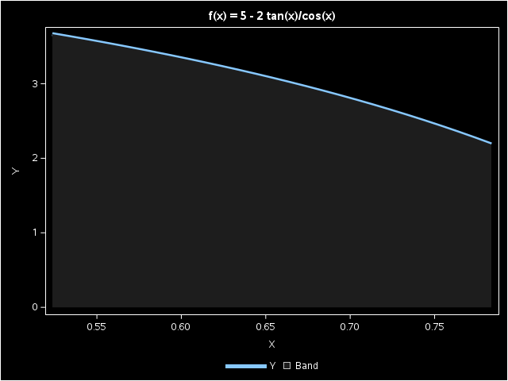
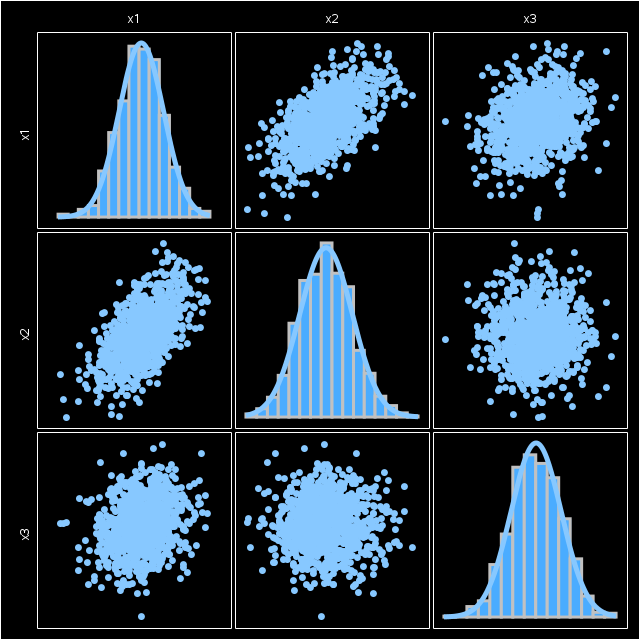
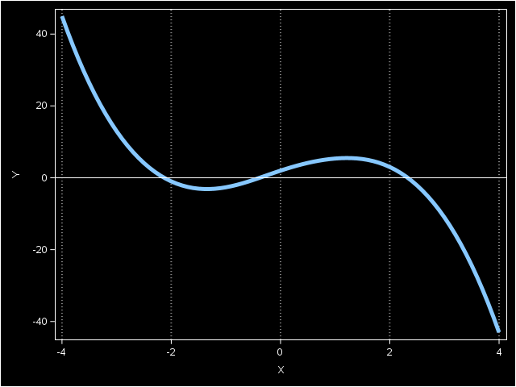
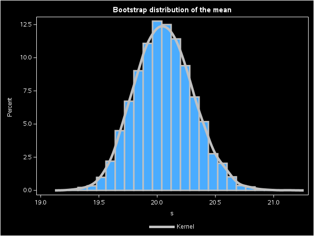
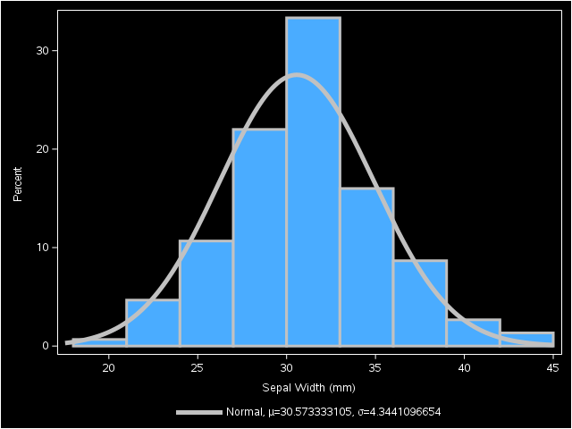

#### 1、函数求积分
```SAS
/* Numerical integration by using SAS/IML software.
   Example taken from
   R. Wicklin, "How to numerically integrate a function in SAS",
   The DO Loop blog, published May 6, 2011.
   URL: http://blogs.sas.com/content/iml/2011/05/06/how-to-numerically-integrate-a-function-in-sas/

You can use SAS/IML software to numerically integrate a function.
1. Write a SAS/IML module that evaluates the integrand.
2. Call the QUAD subroutine to integrate the function on the interval [a,b].
*/
proc iml;

start SimpleFunc(x);
   return( cos(x) );
finish;

/* integrate function on [0, pi/2] */
pi = constant("PI");
a = 0;    
b = pi / 2;
call quad(Integral1, "SimpleFunc", a||b);

/* compare with exact answer */
Answer1 = sin(b) - sin(a);
diff = Answer1 - Integral1;
print Integral1 Answer1 diff;

/*********************/
/* a harder integral */
/*********************/
start TrigFunc(x);
   return( 5 - 2*tan(x)/cos(x) );
finish;

/* integrate function on [pi/6, pi/4] */
a = pi / 6;    
b = pi / 4;  
call quad(Integral2, "TrigFunc", a||b);

/* compare with exact answer */
Answer2 = 5*pi/12 - 2*sqrt(2) + 4/sqrt(3);
diff = Answer2 - Integral2;
print Integral2 Answer2 diff;

/* optional: plot the function on [a,b] */
x = do(a,b,0.01);
title "f(x) = 5 - 2 tan(x)/cos(x)";
call Series(x, TrigFunc(x)) other="band x=x upper=y lower=0";
title;

quit;
```
```
1    %studio_hide_wrapper;
77   
78   /* Numerical integration by using SAS/IML software.
79      Example taken from
80      R. Wicklin, "How to numerically integrate a function in SAS",
81      The DO Loop blog, published May 6, 2011.
82      URL: http://blogs.sas.com/content/iml/2011/05/06/how-to-numerically-integrate-a-function-in-sas/
83   
84   You can use SAS/IML software to numerically integrate a function.
85   1. Write a SAS/IML module that evaluates the integrand.
86   2. Call the QUAD subroutine to integrate the function on the interval [a,b].
87   */
88   proc iml;
NOTE: IML Ready
89   
90   start SimpleFunc(x);
91      return( cos(x) );
92   finish;
NOTE: Module SIMPLEFUNC defined.
93   
94   /* integrate function on [0, pi/2] */
95   pi = constant("PI");
96   a = 0;
97   b = pi / 2;
98   call quad(Integral1, "SimpleFunc", a||b);
99   
100  /* compare with exact answer */
101  Answer1 = sin(b) - sin(a);
102  diff = Answer1 - Integral1;
103  print Integral1 Answer1 diff;
104  
105  /*********************/
106  /* a harder integral */
107  /*********************/
108  start TrigFunc(x);
109     return( 5 - 2*tan(x)/cos(x) );
110  finish;
NOTE: Module TRIGFUNC defined.
111  
112  /* integrate function on [pi/6, pi/4] */
113  a = pi / 6;
114  b = pi / 4;
115  call quad(Integral2, "TrigFunc", a||b);
116  
117  /* compare with exact answer */
118  Answer2 = 5*pi/12 - 2*sqrt(2) + 4/sqrt(3);
119  diff = Answer2 - Integral2;
120  print Integral2 Answer2 diff;
121  
122  /* optional: plot the function on [a,b] */
123  x = do(a,b,0.01);
124  title "f(x) = 5 - 2 tan(x)/cos(x)";
125  call Series(x, TrigFunc(x)) other="band x=x upper=y lower=0";
NOTE: Module SERIES loaded from the storage SASHELP.IMLMLIB.
NOTE: Module ISEMPTY loaded from the storage SASHELP.IMLMLIB.
NOTE: The data set WORK._SERIES has 27 observations and 2 variables.
126  title;
127  
128  quit;
NOTE: Exiting IML.
NOTE: The PROCEDURE IML printed page 3.
NOTE: PROCEDURE IML used (Total process time):
      real time           0.26 seconds
      cpu time            0.16 seconds

129  
130  %studio_hide_wrapper;
138  
139  

Integral1	Answer1	diff
1	1	9.787E-10
Integral2	Answer2	diff
0.7899709	0.7899709	5.418E-10
```


#### 2、模拟多元正态数据
```SAS
/* Simulate data from a multivariate normal distribution
   with a specified mean and covariance. Example taken from
   R. Wicklin (2013) Simulating Data with SAS, SAS Press: Cary, NC,
   pp. 133-135.
*/
proc iml;
/* specify the mean and covariance of the population */
VarNames = 'x1':'x3';
Mean = {1, 2, 3};
Cov = {3 2 1,
       2 4 0,
       1 0 5};

NumSamples = 1000;
call randseed(4321);
X = RandNormal(NumSamples, Mean, Cov);

/* X has 3 columns and 1000 rows.
   Check that the sample mean and covariance are close to
   the population values. */
SampleMean = mean(X);
SampleCov = cov(X);
print SampleMean[c=varNames],
      SampleCov[c=varNames r=varNames];

/* optional: plot the simulated data */
create _Temp from X[c=varNames];
append from X;
close _Temp;
submit;
   proc sgscatter data=_Temp;
      matrix x1-x3 / diagonal=(histogram normal);
   run;
endsubmit;
call delete(_Temp);

quit;
```
```
1    %studio_hide_wrapper;
77   
78   /* Simulate data from a multivariate normal distribution
79      with a specified mean and covariance. Example taken from
80      R. Wicklin (2013) Simulating Data with SAS, SAS Press: Cary, NC,
81      pp. 133-135.
82   */
83   proc iml;
NOTE: IML Ready
84   /* specify the mean and covariance of the population */
85   VarNames = 'x1':'x3';
86   Mean = {1, 2, 3};
87   Cov = {3 2 1,
88          2 4 0,
89          1 0 5};
90   
91   NumSamples = 1000;
92   call randseed(4321);
93   X = RandNormal(NumSamples, Mean, Cov);
NOTE: Module RANDNORMAL loaded from the storage SASHELP.IMLMLIB.
NOTE: Module ROWVEC loaded from the storage SASHELP.IMLMLIB.
94   
95   /* X has 3 columns and 1000 rows.
96      Check that the sample mean and covariance are close to
97      the population values. */
98   SampleMean = mean(X);
99   SampleCov = cov(X);
100  print SampleMean[c=varNames],
101        SampleCov[c=varNames r=varNames];
102  
103  /* optional: plot the simulated data */
104  create _Temp from X[c=varNames];
105  append from X;
106  close _Temp;
NOTE: The data set WORK._TEMP has 1000 observations and 3 variables.
107  submit;
108     proc sgscatter data=_Temp;
109        matrix x1-x3 / diagonal=(histogram normal);
110     run;
111  endsubmit;
112  call delete(_Temp);
113  
114  quit;
NOTE: Exiting IML.
NOTE: The PROCEDURE IML printed page 2.
NOTE: PROCEDURE IML used (Total process time):
      real time           0.85 seconds
      cpu time            0.24 seconds

115  
116  
117  %studio_hide_wrapper;
125  
126  

SampleMean
x1	x2	x3
0.9820782	1.9621798	3.0361992
SampleCov
 	x1	x2	x3
x1	3.0963099	2.0766315	0.9692368
x2	2.0766315	3.8598227	0.0249837
x3	0.9692368	0.0249837	4.7816493
```


#### 3、求解非线性方差的根
```SAS
/* Find the root of a function of one variable.  Example taken from
   R. Wicklin, "A simple way to find the root of a function of one variable",
   The DO Loop blog, published Feb 4, 2014.
   URL: http://blogs.sas.com/content/iml/2014/02/05/find-the-root-of-a-function/
*/

proc iml;
/* define a function that has one or more zeros */
start Func(x);
   return( exp(-x##2) - x##3 + 5#x +1 );
finish;

/* plot the function to get an idea of how many roots there
   are and approximately where they are located */
x = do(-4, 4, 0.1);
y = Func(x);
call Series(x, y)
grid="x" other="refline 0 / axis=y"; /* reference line */

/* Specify three intervals to search for roots */
intervals = {-4   -1.5,         /* 1st interval [-4, -1.5] */
             -1.5  1  ,         /* 2nd interval [-1.5 1]   */
              1    4  };        /* 3rd interval [1, 4]     */
Roots = froot("Func", intervals);
print Roots;
quit;
```
```
1    %studio_hide_wrapper;
77   
78   /* Find the root of a function of one variable.  Example taken from
79      R. Wicklin, "A simple way to find the root of a function of one variable",
80      The DO Loop blog, published Feb 4, 2014.
81      URL: http://blogs.sas.com/content/iml/2014/02/05/find-the-root-of-a-function/
82   */
83   
84   proc iml;
NOTE: IML Ready
85   /* define a function that has one or more zeros */
86   start Func(x);
87      return( exp(-x##2) - x##3 + 5#x +1 );
88   finish;
NOTE: Module FUNC defined.
89   
90   /* plot the function to get an idea of how many roots there
91      are and approximately where they are located */
92   x = do(-4, 4, 0.1);
93   y = Func(x);
94   call Series(x, y)
95   grid="x" other="refline 0 / axis=y";
NOTE: Module SERIES loaded from the storage SASHELP.IMLMLIB.
NOTE: Module ISEMPTY loaded from the storage SASHELP.IMLMLIB.
NOTE: The data set WORK._SERIES has 81 observations and 2 variables.
95 !                                      /* reference line */
96   
97   /* Specify three intervals to search for roots */
98   intervals = {-4   -1.5,         /* 1st interval [-4, -1.5] */
99                -1.5  1  ,         /* 2nd interval [-1.5 1]   */
100                1    4  };
100!                                 /* 3rd interval [1, 4]     */
101  Roots = froot("Func", intervals);
102  print Roots;
103  quit;
NOTE: Exiting IML.
NOTE: The PROCEDURE IML printed page 4.
NOTE: PROCEDURE IML used (Total process time):
      real time           0.24 seconds
      cpu time            0.16 seconds

104  
105  
106  %studio_hide_wrapper;
114  
115  

Roots
-2.127156
-0.383909
2.3304466
```


#### 4、生成Bootstrap分布
```SAS
/* Bootstrap distribution of the sample mean.  Example taken from
   R. Wicklin (2010), Statistical Programming with SAS/IML Software,
   SAS Press: Cary, NC, pp. 350-356.
*/
%let DSName = Sashelp.Cars;
%let VarName = MPG_City;
%let alpha = 0.05;  /* significance; (1-alpha)100% conf limits */

proc iml;
use &DSName;
read all var {&VarName} into x;
close &DSName;

/* Resample B times from the data (with replacement)
   to form B bootstrap samples. */
B = 5000;                          /* number of bootstrap samples */
call randseed(12345);
xBoot = Sample(x, B||nrow(x));     /* each column is a resample */

/* Compute the statistic on each bootstrap resample */   
s = T( mean(xBoot) );              /* mean of each resample     */
title "Bootstrap distribution of the mean";

call Histogram(s) density="Kernel"; /* graph bootstrap distrib  */

Mean = mean(x);                    /* sample mean of original data  */
/* Analyze the bootstrap distribution */
MeanBoot = s[:];                   /* a. mean of bootstrap dist     */
StdErrBoot = std(s);               /* b. estimate of std error      */
prob = &alpha/2 || 1-&alpha/2;     /* lower/upper percentiles       */
call qntl(CIBoot, s, prob);        /* c. quantiles of bootstrap dist*/
pct = putn(1-&alpha, "PERCENT5.");

print Mean MeanBoot StdErrBoot
      (CIBoot`)[c=("Lower "+pct+" CL" || "Upper "+pct+" CL")];
quit;
title;

/* By the Central Limit Theorem, the sampling distribution of
   the mean is approximately normally distributed.
   If desired, compare the bootstrap estimates with
   estimates of the SEM and CLM that assume normality. */
/*
proc means data=&DSName mean stderr clm alpha=&alpha;
var &VarName;
run;
*/
```
```
1    %studio_hide_wrapper;
77   
78   /* Bootstrap distribution of the sample mean.  Example taken from
79      R. Wicklin (2010), Statistical Programming with SAS/IML Software,
80      SAS Press: Cary, NC, pp. 350-356.
81   */
82   %let DSName = Sashelp.Cars;
83   %let VarName = MPG_City;
84   %let alpha = 0.05;  /* significance; (1-alpha)100% conf limits */
85   
86   proc iml;
NOTE: IML Ready
87   use &DSName;
88   read all var {&VarName} into x;
89   close &DSName;
90   
91   /* Resample B times from the data (with replacement)
92      to form B bootstrap samples. */
93   B = 5000;
93 !                                    /* number of bootstrap samples */
94   call randseed(12345);
95   xBoot = Sample(x, B||nrow(x));
95 !                                    /* each column is a resample */
96   
97   /* Compute the statistic on each bootstrap resample */
98   s = T( mean(xBoot) );
98 !                                    /* mean of each resample     */
99   title "Bootstrap distribution of the mean";
100  
101  call Histogram(s) density="Kernel";
NOTE: Module HISTOGRAM loaded from the storage SASHELP.IMLMLIB.
NOTE: The data set WORK._HIST has 5000 observations and 1 variables.
NOTE: Module ISEMPTY loaded from the storage SASHELP.IMLMLIB.
101!                                     /* graph bootstrap distrib  */
102  
103  Mean = mean(x);
103!                                    /* sample mean of original data  */
104  /* Analyze the bootstrap distribution */
105  MeanBoot = s[:];
105!                                    /* a. mean of bootstrap dist     */
106  StdErrBoot = std(s);
106!                                    /* b. estimate of std error      */
107  prob = &alpha/2 || 1-&alpha/2;
107!                                    /* lower/upper percentiles       */
108  call qntl(CIBoot, s, prob);
108!                                    /* c. quantiles of bootstrap dist*/
109  pct = putn(1-&alpha, "PERCENT5.");
110  
111  print Mean MeanBoot StdErrBoot
112        (CIBoot`)[c=("Lower "+pct+" CL" || "Upper "+pct+" CL")];
113  quit;
NOTE: Exiting IML.
NOTE: The PROCEDURE IML printed page 5.
NOTE: PROCEDURE IML used (Total process time):
      real time           0.36 seconds
      cpu time            0.22 seconds

114  title;
115  
116  /* By the Central Limit Theorem, the sampling distribution of
117     the mean is approximately normally distributed.
118     If desired, compare the bootstrap estimates with
119     estimates of the SEM and CLM that assume normality. */
120  /*
121  proc means data=&DSName mean stderr clm alpha=&alpha;
122  var &VarName;
123  run;
124  */
125  
126  
127  %studio_hide_wrapper;
135  
136  

Bootstrap distribution of the mean
Mean	MeanBoot	StdErrBoot	Lower 95% CL	Upper 95% CL
20.060748	20.060014	0.2487425	19.593458	20.563084
```


#### 5、使用最大似然拟合
```SAS
/* Use maximum likelihood estimation to estimate parameters for
   normal density estimate. Example taken from
   R. Wicklin, "Maximum likelihood estimation in SAS/IML",
   The DO Loop blog, published Oct 12, 2011.
   URL: http://blogs.sas.com/content/iml/2011/10/12/maximum-likelihood-estimation-in-sasiml/

You can use SAS/IML software to fit a parametric density to data.
1. Write a SAS/IML module that computes the log-likelihood function.
2. Specify constraints for the parameters.
3. Call a nonlinear optimization routines to maximize the log-likelihood.
*/
%let DSName = Sashelp.Iris;
%let VarName = SepalWidth;

proc iml;
/* write the log-likelihood function for Normal dist */
start LogLik(param) global (x);
   mu = param[1];
   sigma2 = param[2]##2;
   n = countn(x);         /* count nonmissing values */
   f = -n/2*log(sigma2) - 1/2/sigma2*ssq(x-mu);
   return ( f );
finish;

/* read data */
use &DSName;
read all var {&VarName} into x;
close &DSName;
/* Specify initial guess for parameters that is close to
   p = mean(x) || std(x); */
p = {35 5.5};

/*     mu-sigma constraint matrix */
con = { .   0,  /* lower bounds: -infty < mu; 0 < sigma     */
        .   .}; /* upper bounds:  mu < infty; sigma < infty */
opt = {1,       /* find maximum of function                 */
       0};      /* print iteration history? 0=no; 1=yes     */
call nlpnra(rc, MLE, "LogLik", p, opt, con);
print MLE[c={"mu" "sigma"}]; /* maximum likelihood estimates */

/* Optional: plot histogram with density overlay.
   The SUBMIT and ENDSUBMIT statements enable you to call
   SAS procedures from within a SAS/IML program.  You can
   pass parameters to the procedure. See
   R. Wicklin, "Passing values from PROC IML into SAS procedures",
   The DO Loop blog, published Jun 3, 2013.
   http://blogs.sas.com/content/iml/2013/06/03/passing-values-into-procedures/
*/
submit mu=(MLE[1]) sigma=(MLE[2]);
   proc sgplot data=&DSName;
   histogram &VarName;
   density &VarName / type=normal(mu=&mu sigma=&sigma);
   run;
endsubmit;

quit;
```
```
1    %studio_hide_wrapper;
77   
78   /* Use maximum likelihood estimation to estimate parameters for
79      normal density estimate. Example taken from
80      R. Wicklin, "Maximum likelihood estimation in SAS/IML",
81      The DO Loop blog, published Oct 12, 2011.
82      URL: http://blogs.sas.com/content/iml/2011/10/12/maximum-likelihood-estimation-in-sasiml/
83   
84   You can use SAS/IML software to fit a parametric density to data.
85   1. Write a SAS/IML module that computes the log-likelihood function.
86   2. Specify constraints for the parameters.
87   3. Call a nonlinear optimization routines to maximize the log-likelihood.
88   */
89   %let DSName = Sashelp.Iris;
90   %let VarName = SepalWidth;
91   
92   proc iml;
NOTE: IML Ready
93   /* write the log-likelihood function for Normal dist */
94   start LogLik(param) global (x);
95      mu = param[1];
96      sigma2 = param[2]##2;
97      n = countn(x);
97 !                           /* count nonmissing values */
98      f = -n/2*log(sigma2) - 1/2/sigma2*ssq(x-mu);
99      return ( f );
100  finish;
NOTE: Module LOGLIK defined.
101  
102  /* read data */
103  use &DSName;
104  read all var {&VarName} into x;
105  close &DSName;
106  /* Specify initial guess for parameters that is close to
107     p = mean(x) || std(x); */
108  p = {35 5.5};
109  
110  /*     mu-sigma constraint matrix */
111  con = { .   0,  /* lower bounds: -infty < mu; 0 < sigma     */
112          .   .};
112!                 /* upper bounds:  mu < infty; sigma < infty */
113  opt = {1,       /* find maximum of function                 */
114         0};
114!                 /* print iteration history? 0=no; 1=yes     */
115  call nlpnra(rc, MLE, "LogLik", p, opt, con);
NOTE: GCONV convergence criterion satisfied.
116  print MLE[c={"mu" "sigma"}];
116!                              /* maximum likelihood estimates */
117  
118  /* Optional: plot histogram with density overlay.
119     The SUBMIT and ENDSUBMIT statements enable you to call
120     SAS procedures from within a SAS/IML program.  You can
121     pass parameters to the procedure. See
122     R. Wicklin, "Passing values from PROC IML into SAS procedures",
123     The DO Loop blog, published Jun 3, 2013.
124     http://blogs.sas.com/content/iml/2013/06/03/passing-values-into-procedures/
125  */
126  submit mu=(MLE[1]) sigma=(MLE[2]);
127     proc sgplot data=&DSName;
128     histogram &VarName;
129     density &VarName / type=normal(mu=&mu sigma=&sigma);
130     run;
131  endsubmit;
132  
133  quit;
NOTE: Exiting IML.
NOTE: The PROCEDURE IML printed page 6.
NOTE: PROCEDURE IML used (Total process time):
      real time           0.24 seconds
      cpu time            0.14 seconds

134  
135  
136  %studio_hide_wrapper;
144  
145  

MLE
mu	sigma
30.573333	4.3441097
```

