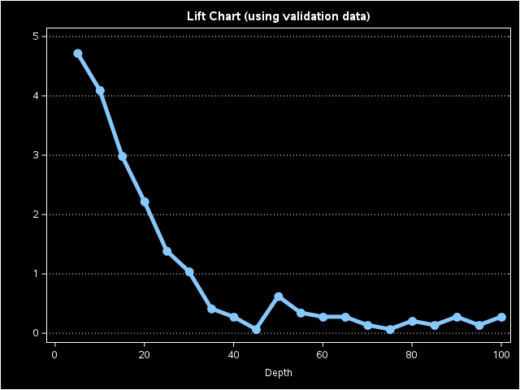

#### 1、加载数据
```SAS
/****************************************************************************/
/* This is the first in a series of examples provided to demonstrate the    */
/* use of SAS Viya Data Mining and Machine Learning procedures to compose   */
/* a program that follows a standard machine learning process of            */
/* - loading data,                                                          */
/* - preparing the data,                                                    */
/* - building models, and                                                   */
/* - assessing and comparing those models                                   */
/*                                                                          */
/* The programs are written to execute in the CAS in-memory distributed     */
/* computing engine in the SAS Viya environment.                            */
/*                                                                          */
/* This first example showcases how to load local data into CAS             */
/****************************************************************************/

/* Define a CAS engine libref for CAS in-memory data tables */
libname mycaslib cas caslib=casuser;

/****************************************************************************/
/* Load data into CAS                                                       */
/*                                                                          */
/* The data set used for this workflow is from a financial services company */
/* that offers a home equity line of credit. The company has extended       */
/* several thousand lines of credit in the past, and many of these accepted */
/* applicants have defaulted on their loans. Using demographic and          */
/* financial variables, the company wants to build a model to predict       */
/* whether an applicant will default.                                       */
/*                                                                          */
/* The target variable "BAD" indicates whether an applicant defaulted       */
/* on the home equity line of credit.                                       */
/*                                                                          */
/* For execution in the CAS engine, data must be loaded from the local      */
/* data set to a CAS table. This code first checks to see if the specified  */
/* CAS table exists and then loads data from local data sets in 2           */
/* different ways.  After executing this code, you will notice a new        */
/* "MYCASLIB" library reference under "Libraries" in the navigation panel   */
/* on the left side (note the special icon indicating it is a caslib).      */
/*                                                                          */
/****************************************************************************/
%if not %sysfunc(exist(mycaslib.hmeq)) %then %do;

  /* You can load data using a "load" statement in PROC CASUTIL */
  proc casutil;
    load data=sampsio.hmeq casout="hmeq" outcaslib=casuser;
  run;

%end;

%if not %sysfunc(exist(mycaslib.hmeq)) %then %do;

  /* You can also load data using a data step */
  data mycaslib.hmeq;
    set sampsio.hmeq;
  run;	 

%end;
```
```
1    %studio_hide_wrapper;
77   
78   /****************************************************************************/
79   /* This is the first in a series of examples provided to demonstrate the    */
80   /* use of SAS Viya Data Mining and Machine Learning procedures to compose   */
81   /* a program that follows a standard machine learning process of            */
82   /* - loading data,                                                          */
83   /* - preparing the data,                                                    */
84   /* - building models, and                                                   */
85   /* - assessing and comparing those models                                   */
86   /*                                                                          */
87   /* The programs are written to execute in the CAS in-memory distributed     */
88   /* computing engine in the SAS Viya environment.                            */
89   /*                                                                          */
90   /* This first example showcases how to load local data into CAS             */
91   /****************************************************************************/
92   
93   /* Define a CAS engine libref for CAS in-memory data tables */
94   libname mycaslib cas caslib=casuser;
NOTE: Libref MYCASLIB was successfully assigned as follows:
      Engine:        CAS
      Physical Name: c871747f-5b0b-2e45-af8f-e24f0fd568ce
95   
96   /****************************************************************************/
97   /* Load data into CAS                                                       */
98   /*                                                                          */
99   /* The data set used for this workflow is from a financial services company */
100  /* that offers a home equity line of credit. The company has extended       */
101  /* several thousand lines of credit in the past, and many of these accepted */
102  /* applicants have defaulted on their loans. Using demographic and          */
103  /* financial variables, the company wants to build a model to predict       */
104  /* whether an applicant will default.                                       */
105  /*                                                                          */
106  /* The target variable "BAD" indicates whether an applicant defaulted       */
107  /* on the home equity line of credit.                                       */
108  /*                                                                          */
109  /* For execution in the CAS engine, data must be loaded from the local      */
110  /* data set to a CAS table. This code first checks to see if the specified  */
111  /* CAS table exists and then loads data from local data sets in 2           */
112  /* different ways.  After executing this code, you will notice a new        */
113  /* "MYCASLIB" library reference under "Libraries" in the navigation panel   */
114  /* on the left side (note the special icon indicating it is a caslib).      */
115  /*                                                                          */
116  /****************************************************************************/
117  %if not %sysfunc(exist(mycaslib.hmeq)) %then %do;
118  
119    /* You can load data using a "load" statement in PROC CASUTIL */
120    proc casutil;
NOTE: The UUID 'c871747f-5b0b-2e45-af8f-e24f0fd568ce' is connected using session CASAUTO.
121      load data=sampsio.hmeq casout="hmeq" outcaslib=casuser;
NOTE: SAMPSIO.HMEQ was successfully added to the "CASUSER(1440420407@qq.com)" caslib as "HMEQ".
122    run;
123  
124  %end;
125  
126  %if not %sysfunc(exist(mycaslib.hmeq)) %then %do;
127  
128    /* You can also load data using a data step */
129    data mycaslib.hmeq;
130      set sampsio.hmeq;
131    run;
132  
133  %end;
134  
135  
136  
137  %studio_hide_wrapper;
145  
146  
```

#### 2、准备和探索数据
```SAS
/************************************************************************/
/* This example illustrates various tools for assaying, assessing,      */
/* modifying and preparing data prior to modeling. It uses HMEQ         */
/* dataset as input and produces HMEQ_PREPPED dataset. The HMEQ_PREPPED */
/* dataset is used in subsequent examples.                              */
/*                                                                      */
/* The steps include:                                                   */
/*                                                                      */
/* (1) PREPARE AND EXPLORE                                              */
/*     a) Load data set into CAS                                        */
/*     b) Explore                                                       */
/*     c) Impute                                                        */
/*     d) Identify variables that explain variance                      */
/*     e) Perform a cluster analysis to identify homogeneous            */
/*        groups in the data                                            */
/*     f) Perform principal components analysis to assess collineary    */
/*        among candidate, interval valued inputs                       */
/************************************************************************/

/************************************************************************/
/* Setup and initialize for later use in the program                    */
/************************************************************************/
/* Define a CAS engine libref for CAS in-memory data tables */
libname mycaslib cas caslib=casuser;

/* Specify the data set names */
%let sasdata          = sampsio.hmeq;                     
%let casdata          = mycaslib.hmeq;

/* Specify the data set inputs and target */
%let class_inputs    = reason job;
%let interval_inputs = clage clno debtinc loan mortdue value yoj derog delinq ninq;
%let target          = bad;

%let im_class_inputs    = reason job;
%let im_interval_inputs = im_clage clno im_debtinc loan mortdue value im_yoj im_ninq derog im_delinq;
%let cluster_inputs     = im_clage im_debtinc value;

/* Specify a folder path to write the temporary output files */
%let outdir = &_SASWORKINGDIR;


/************************************************************************/
/* Load data into CAS if needed. Data should have been loaded in        */
/* step 1, it will be loaded here after checking if it exists in CAS    */
/************************************************************************/
%if not %sysfunc(exist(&casdata)) %then %do;
  proc casutil;
    load data=&sasdata casout="hmeq" outcaslib=casuser;
  run;
%end;


/************************************************************************/
/* Explore the data and plot missing values                             */
/************************************************************************/
proc cardinality data=&casdata outcard=mycaslib.data_card;
run;

proc print data=mycaslib.data_card(where=(_nmiss_>0));
  title "Data Summary";
run;

data data_missing;
  set mycaslib.data_card (where=(_nmiss_>0) keep=_varname_ _nmiss_ _nobs_);
  _percentmiss_ = (_nmiss_/_nobs_)*100;
  label _percentmiss_ = 'Percent Missing';
run;

proc sgplot data=data_missing;
  title "Percentage of Missing Values";
  vbar _varname_ / response=_percentmiss_ datalabel categoryorder=respdesc;
run;
title;


/************************************************************************/
/* Impute missing values                                                */
/************************************************************************/
proc varimpute data=&casdata;
  input clage /ctech=mean;
  input delinq /ctech=median;
  input ninq /ctech=random;
  input debtinc yoj /ctech=value cvalues=50,100;
  output out=mycaslib.hmeq_prepped copyvars=(_ALL_);
  code file="&outdir./impute_score.sas";
run;


/************************************************************************/
/* Identify variables that explain variance in the target               */
/************************************************************************/
/* Discriminant analysis for class target */
proc varreduce data=mycaslib.hmeq_prepped technique=discriminantanalysis;  
  class &target &im_class_inputs.;
  reduce supervised &target=&im_class_inputs. &im_interval_inputs. / maxeffects=8;
  ods output selectionsummary=summary;	     
run;

data out_iter (keep=Iteration VarExp Base Increment Parameter);
  set summary;
  Increment=dif(VarExp);
  if Increment=. then Increment=0;
  Base=VarExp - Increment;
run;

proc transpose data=out_iter out=out_iter_trans;
  by Iteration VarExp Parameter;
run;

proc sort data=out_iter_trans;
  label _NAME_='Group';
  by _NAME_;
run;

/* Variance explained by Iteration plot */
proc sgplot data=out_iter_trans;
  title "Variance Explained by Iteration";
  yaxis label="Variance Explained";
  vbar Iteration / response=COL1 group=_NAME_;
run;
title;


/************************************************************************/
/* Perform a cluster analysis based on demographic inputs               */
/************************************************************************/
proc kclus data=mycaslib.hmeq_prepped standardize=std distance=euclidean maxclusters=6;
  input &cluster_inputs. / level=interval;
run;


/************************************************************************/
/* Perform a principal components analysis on the interval valued       */
/* input variables                                                      */     
/************************************************************************/
proc pca data=mycaslib.hmeq_prepped plots=(scree);
  var &im_interval_inputs;
run;
```
```
1    %studio_hide_wrapper;
77   
78   /************************************************************************/
79   /* This example illustrates various tools for assaying, assessing,      */
80   /* modifying and preparing data prior to modeling. It uses HMEQ         */
81   /* dataset as input and produces HMEQ_PREPPED dataset. The HMEQ_PREPPED */
82   /* dataset is used in subsequent examples.                              */
83   /*                                                                      */
84   /* The steps include:                                                   */
85   /*                                                                      */
86   /* (1) PREPARE AND EXPLORE                                              */
87   /*     a) Load data set into CAS                                        */
88   /*     b) Explore                                                       */
89   /*     c) Impute                                                        */
90   /*     d) Identify variables that explain variance                      */
91   /*     e) Perform a cluster analysis to identify homogeneous            */
92   /*        groups in the data                                            */
93   /*     f) Perform principal components analysis to assess collineary    */
94   /*        among candidate, interval valued inputs                       */
95   /************************************************************************/
96   
97   /************************************************************************/
98   /* Setup and initialize for later use in the program                    */
99   /************************************************************************/
100  /* Define a CAS engine libref for CAS in-memory data tables */
101  libname mycaslib cas caslib=casuser;
NOTE: Libref MYCASLIB was successfully assigned as follows:
      Engine:        CAS
      Physical Name: c871747f-5b0b-2e45-af8f-e24f0fd568ce
102  
103  /* Specify the data set names */
104  %let sasdata          = sampsio.hmeq;
105  %let casdata          = mycaslib.hmeq;
106  
107  /* Specify the data set inputs and target */
108  %let class_inputs    = reason job;
109  %let interval_inputs = clage clno debtinc loan mortdue value yoj derog delinq ninq;
110  %let target          = bad;
111  
112  %let im_class_inputs    = reason job;
113  %let im_interval_inputs = im_clage clno im_debtinc loan mortdue value im_yoj im_ninq derog im_delinq;
114  %let cluster_inputs     = im_clage im_debtinc value;
115  
116  /* Specify a folder path to write the temporary output files */
117  %let outdir = &_SASWORKINGDIR;
118  
119  
120  /************************************************************************/
121  /* Load data into CAS if needed. Data should have been loaded in        */
122  /* step 1, it will be loaded here after checking if it exists in CAS    */
123  /************************************************************************/
124  %if not %sysfunc(exist(&casdata)) %then %do;
125    proc casutil;
126      load data=&sasdata casout="hmeq" outcaslib=casuser;
127    run;
128  %end;
129  
130  
131  /************************************************************************/
132  /* Explore the data and plot missing values                             */
133  /************************************************************************/
134  proc cardinality data=&casdata outcard=mycaslib.data_card;
135  run;
NOTE: Added action set 'cardinality'.
NOTE: Writing cardinality.
NOTE: status = 0.
NOTE: The Cloud Analytic Services server processed the request in 0.935232 seconds.
NOTE: PROCEDURE CARDINALITY used (Total process time):
      real time           1.17 seconds
      cpu time            0.06 seconds

136  
137  proc print data=mycaslib.data_card(where=(_nmiss_>0));
138    title "Data Summary";
139  run;
NOTE: The PROCEDURE PRINT printed page 7.
NOTE: PROCEDURE PRINT used (Total process time):
      real time           0.07 seconds
      cpu time            0.07 seconds

140  
141  data data_missing;
142    set mycaslib.data_card (where=(_nmiss_>0) keep=_varname_ _nmiss_ _nobs_);
143    _percentmiss_ = (_nmiss_/_nobs_)*100;
144    label _percentmiss_ = 'Percent Missing';
145  run;
NOTE: There were 11 observations read from the data set MYCASLIB.DATA_CARD.
      WHERE _nmiss_>0;
NOTE: The data set WORK.DATA_MISSING has 11 observations and 4 variables.
NOTE: DATA statement used (Total process time):
      real time           0.01 seconds
      cpu time            0.01 seconds

146  
147  proc sgplot data=data_missing;
148    title "Percentage of Missing Values";
149    vbar _varname_ / response=_percentmiss_ datalabel categoryorder=respdesc;
150  run;
NOTE: PROCEDURE SGPLOT used (Total process time):
      real time           0.27 seconds
      cpu time            0.16 seconds

NOTE: Listing image output written to
      /viya/tmp/ae8ba36b-a659-4da5-bd5e-9dcb33db1425/SAS_workB445000000AE_sas-launcher-10bf8409-d203-431c-a971-7c14500a19cf-6zvff/SG
      Plot5.png.
NOTE: There were 11 observations read from the data set WORK.DATA_MISSING.
151  title;
152  
153  
154  /************************************************************************/
155  /* Impute missing values                                                */
156  /************************************************************************/
157  proc varimpute data=&casdata;
158    input clage /ctech=mean;
159    input delinq /ctech=median;
160    input ninq /ctech=random;
161    input debtinc yoj /ctech=value cvalues=50,100;
162    output out=mycaslib.hmeq_prepped copyvars=(_ALL_);
163    code file="&outdir./impute_score.sas";
164  run;
NOTE: Using SEED=1963189931 for random imputation.
NOTE: External file
      /viya/tmp/ae8ba36b-a659-4da5-bd5e-9dcb33db1425/SAS_workB445000000AE_sas-launcher-10bf8409-d203-431c-a971-7c14500a19cf-6zvff/im
      pute_score.sas opened.
NOTE: The procedure wrote the DATA step code to external file
      /viya/tmp/ae8ba36b-a659-4da5-bd5e-9dcb33db1425/SAS_workB445000000AE_sas-launcher-10bf8409-d203-431c-a971-7c14500a19cf-6zvff/im
      pute_score.sas.
NOTE: The Cloud Analytic Services server processed the request in 0.043694 seconds.
NOTE: The data set MYCASLIB.HMEQ_PREPPED has 5960 observations and 18 variables.
NOTE: The PROCEDURE VARIMPUTE printed page 8.
NOTE: PROCEDURE VARIMPUTE used (Total process time):
      real time           0.12 seconds
      cpu time            0.08 seconds

165  
166  
167  /************************************************************************/
168  /* Identify variables that explain variance in the target               */
169  /************************************************************************/
170  /* Discriminant analysis for class target */
171  proc varreduce data=mycaslib.hmeq_prepped technique=discriminantanalysis;
172    class &target &im_class_inputs.;
173    reduce supervised &target=&im_class_inputs. &im_interval_inputs. / maxeffects=8;
174    ods output selectionsummary=summary;
175  run;
NOTE: The Cloud Analytic Services server processed the request in 0.100386 seconds.
NOTE: The data set WORK.SUMMARY has 8 observations and 9 variables.
NOTE: The PROCEDURE VARREDUCE printed page 9.
NOTE: PROCEDURE VARREDUCE used (Total process time):
      real time           0.21 seconds
      cpu time            0.06 seconds

176  
177  data out_iter (keep=Iteration VarExp Base Increment Parameter);
178    set summary;
179    Increment=dif(VarExp);
180    if Increment=. then Increment=0;
181    Base=VarExp - Increment;
182  run;
NOTE: There were 8 observations read from the data set WORK.SUMMARY.
NOTE: The data set WORK.OUT_ITER has 8 observations and 5 variables.
NOTE: DATA statement used (Total process time):
      real time           0.00 seconds
      cpu time            0.00 seconds

183  
184  proc transpose data=out_iter out=out_iter_trans;
185    by Iteration VarExp Parameter;
186  run;
NOTE: There were 8 observations read from the data set WORK.OUT_ITER.
NOTE: The data set WORK.OUT_ITER_TRANS has 16 observations and 5 variables.
NOTE: PROCEDURE TRANSPOSE used (Total process time):
      real time           0.00 seconds
      cpu time            0.00 seconds

187  
188  proc sort data=out_iter_trans;
189    label _NAME_='Group';
190    by _NAME_;
191  run;
NOTE: There were 16 observations read from the data set WORK.OUT_ITER_TRANS.
NOTE: The data set WORK.OUT_ITER_TRANS has 16 observations and 5 variables.
NOTE: PROCEDURE SORT used (Total process time):
      real time           0.00 seconds
      cpu time            0.00 seconds

192  
193  /* Variance explained by Iteration plot */
194  proc sgplot data=out_iter_trans;
195    title "Variance Explained by Iteration";
196    yaxis label="Variance Explained";
197    vbar Iteration / response=COL1 group=_NAME_;
198  run;
NOTE: PROCEDURE SGPLOT used (Total process time):
      real time           0.22 seconds
      cpu time            0.12 seconds

NOTE: Listing image output written to
      /viya/tmp/ae8ba36b-a659-4da5-bd5e-9dcb33db1425/SAS_workB445000000AE_sas-launcher-10bf8409-d203-431c-a971-7c14500a19cf-6zvff/SG
      Plot6.png.
NOTE: There were 16 observations read from the data set WORK.OUT_ITER_TRANS.
199  title;
200  
201  
202  /************************************************************************/
203  /* Perform a cluster analysis based on demographic inputs               */
204  /************************************************************************/
205  proc kclus data=mycaslib.hmeq_prepped standardize=std distance=euclidean maxclusters=6;
206    input &cluster_inputs. / level=interval;
207  run;
NOTE: Using SEED=139918137.
NOTE: Running for input data for K 6.
NOTE: Clustering is finished. MAXITER is satisfied.
NOTE: The Cloud Analytic Services server processed the request in 0.022569 seconds.
NOTE: The PROCEDURE KCLUS printed pages 10-11.
NOTE: PROCEDURE KCLUS used (Total process time):
      real time           0.13 seconds
      cpu time            0.11 seconds

208  
209  
210  /************************************************************************/
211  /* Perform a principal components analysis on the interval valued       */
212  /* input variables                                                      */
213  /************************************************************************/
214  proc pca data=mycaslib.hmeq_prepped plots=(scree);
215    var &im_interval_inputs;
216  run;
WARNING: 1138 observations in table HMEQ_PREPPED omitted due to missing values.
NOTE: The Cloud Analytic Services server processed the request in 0.022168 seconds.
NOTE: The PROCEDURE PCA printed pages 12-14.
NOTE: PROCEDURE PCA used (Total process time):
      real time           0.33 seconds
      cpu time            0.17 seconds

217  
218  
219  
220  
221  
222  
223  %studio_hide_wrapper;
231  
232  
```

#### 3、比较多种ML算法
```SAS
/************************************************************************/
/* This example illustrates fitting and comparing several Machine       */
/* Learning algorithms for predicting the binary target in the          */
/* HMEQ data set. The steps include:                                    */
/*                                                                      */
/* (1) PREPARE AND EXPLORE                                              */
/*     a) Check data is loaded into CAS                                 */
/*                                                                      */
/* (2) PERFORM SUPERVISED LEARNING                                      */
/*     a) Fit a model using a Random Forest                             */
/*     b) Fit a model using Gradient Boosting                           */
/*     c) Fit a model using a Neural Network                            */
/*     d) Fit a model using a Support Vector Machine                    */   
/*                                                                      */
/* (3) EVALUATE AND IMPLEMENT                                           */
/*     a) Score the data                                                */
/*     b) Assess model performance                                      */
/*     c) Generate ROC and Lift charts                                  */
/************************************************************************/

/************************************************************************/
/* Setup and initialize for later use in the program                    */
/************************************************************************/

/* Define a CAS engine libref for CAS in-memory data tables */
libname mycaslib cas caslib=casuser;

/* Specify the data set names */
%let casdata          = mycaslib.hmeq_prepped;            
%let partitioned_data = mycaslib.hmeq_part;  

/* Specify the data set inputs and target */
%let class_inputs    = reason job;
%let interval_inputs = im_clage clno im_debtinc loan mortdue value im_yoj im_ninq derog im_delinq;
%let target          = bad;


/************************************************************************/
/* Check if HMEQ_PREPPED data created in the Prepare and Explore Data   */
/* snippet exists.  If not, print error message to run the program.     */
/************************************************************************/
%if not %sysfunc(exist(&casdata)) %then %do;
  %put ERROR: The input dataset HMEQ_PREPPED is not loaded into CAS.;
  %put ERROR: Remember to run the Prepare and Explore Data snippet to load necessary data before executing this example.;
%end;

/************************************************************************/
/* Partition the data into training and validation                      */
/************************************************************************/
proc partition data=&casdata partition samppct=70;
  by &target;
  output out=&partitioned_data copyvars=(_ALL_);
run;


/************************************************************************/
/* RANDOM FOREST predictive model                                       */
/************************************************************************/
proc forest data=&partitioned_data ntrees=50 intervalbins=20 minleafsize=5
            outmodel=mycaslib.forest_model;
  input &interval_inputs. / level = interval;
  input &class_inputs. / level = nominal;
  target &target / level=nominal;
  partition rolevar=_partind_(train='1' validate='0');
run;


/************************************************************************/
/* Score the data using the generated RF model                          */
/************************************************************************/
proc forest data=&partitioned_data inmodel=mycaslib.forest_model noprint;
  output out=mycaslib._scored_RF copyvars=(_ALL_);
run;


/************************************************************************/
/* GRADIENT BOOSTING MACHINES predictive model                          */
/************************************************************************/
proc gradboost data=&partitioned_data ntrees=10 intervalbins=20 maxdepth=5
               outmodel=mycaslib.gb_model;
  input &interval_inputs. / level = interval;
  input &class_inputs. / level = nominal;
  target &target / level=nominal;
  partition rolevar=_partind_(train='1' validate='0');
run;


/************************************************************************/
/* Score the data using the generated GBM model                         */
/************************************************************************/
proc gradboost  data=&partitioned_data inmodel=mycaslib.gb_model noprint;
  output out=mycaslib._scored_GB copyvars=(_ALL_);
run;


/************************************************************************/
/* NEURAL NETWORK predictive model                                      */
/************************************************************************/
proc nnet data=&partitioned_data;
  target &target / level=nom;
  input &interval_inputs. / level=int;
  input &class_inputs. / level=nom;
  hidden 2;
  train outmodel=mycaslib.nnet_model;
  partition rolevar=_partind_(train='1' validate='0');
  ods exclude OptIterHistory;
run;


/************************************************************************/
/* Score the data using the generated NN model                          */
/************************************************************************/
proc nnet data=&partitioned_data inmodel=mycaslib.nnet_model noprint;
  output out=mycaslib._scored_NN copyvars=(_ALL_);
run;


/************************************************************************/
/* SUPPORT VECTOR MACHINE predictive model                              */
/************************************************************************/
proc svmachine data=&partitioned_data(where=(_partind_=1));
  kernel polynom / deg=2;
  target &target;
  input &interval_inputs. / level=interval;
  input &class_inputs. / level=nominal;
  id bad _partind_;
  savestate rstore=mycaslib.svm_astore_model;
  ods exclude IterHistory;
run;


/************************************************************************/
/* Score data using ASTORE code generated for the SVM model             */
/************************************************************************/
proc astore;
  score data=&partitioned_data out=mycaslib._scored_SVM
        rstore=mycaslib.svm_astore_model;
run;


/************************************************************************/
/* Assess                                                               */
/************************************************************************/
%macro assess_model(prefix=, var_evt=, var_nevt=);
proc assess data=mycaslib._scored_&prefix.(where=(_partind_=0));
    input &var_evt.;
    target &target / level=nominal event='1';
    fitstat pvar=&var_nevt. / pevent='0';

    ods output
      fitstat=&prefix._fitstat
      rocinfo=&prefix._rocinfo
      liftinfo=&prefix._liftinfo;
run;
%mend assess_model;

ods exclude all;
%assess_model(prefix=RF, var_evt=p_&target.1, var_nevt=p_&target.0);
%assess_model(prefix=SVM, var_evt=p_&target.1, var_nevt=p_&target.0);
%assess_model(prefix=GB, var_evt=p_&target.1, var_nevt=p_&target.0);
%assess_model(prefix=NN, var_evt=p_&target.1, var_nevt=p_&target.0);
ods exclude none;


/************************************************************************/
/* ROC and Lift Charts using validation data                            */
/************************************************************************/
ods graphics on;

data all_rocinfo;
  set SVM_rocinfo(in=s)
      GB_rocinfo(in=g)
      NN_rocinfo(in=n)
      RF_rocinfo(in=f);

  length model $ 16;
  select;
    when (s) model='SVM';
    when (f) model='Forest';
    when (g) model='GradientBoosting';
    when (n) model='NeuralNetwork';
  end;
run;

data all_liftinfo;
  set SVM_liftinfo(in=s)
      GB_liftinfo(in=g)
      NN_liftinfo(in=n)
      RF_liftinfo(in=f);

  length model $ 16;
  select;
    when (s) model='SVM';
    when (f) model='Forest';
    when (g) model='GradientBoosting';
    when (n) model='NeuralNetwork';
  end;
run;

/* Print AUC (Area Under the ROC Curve) */
title "AUC (using validation data) ";
proc sql;
  select distinct model, c from all_rocinfo order by c desc;
quit;

/* Draw ROC charts */         
proc sgplot data=all_rocinfo aspect=1;
  title "ROC Curve (using validation data)";
  xaxis values=(0 to 1 by 0.25) grid offsetmin=.05 offsetmax=.05;
  yaxis values=(0 to 1 by 0.25) grid offsetmin=.05 offsetmax=.05;
  lineparm x=0 y=0 slope=1 / transparency=.7;
  series x=fpr y=sensitivity / group=model;
run;

/* Draw lift charts */         
proc sgplot data=all_liftinfo;
  title "Lift Chart (using validation data)";
  yaxis label=' ' grid;
  series x=depth y=lift / group=model markers markerattrs=(symbol=circlefilled);
run;

title;
ods graphics off;
```
```
AUC (using validation data)
model	Area Under ROC
Forest	0.926052
GradientBoosting	0.890352
SVM	0.859655
NeuralNetwork	0.514079
```


#### 4、比较两种ML算法
```SAS
/************************************************************************/
/* This example illustrates fitting and comparing two Machine           */   
/* Learning algorithms for predicting the binary target in the          */
/* HMEQ data set. The steps include:                                    */
/*                                                                      */
/* (1) PREPARE AND EXPLORE                                              */
/*     a) Check data is loaded into CAS                                 */
/*                                                                      */
/* (2) PERFORM SUPERVISED LEARNING                                      */
/*     a) Fit model using Logistic Regression                           */
/*     b) Fit a model using a Decision Tree                             */
/*                                                                      */
/* (3) EVALUATE AND IMPLEMENT                                           */
/*     a) Score the data                                                */
/*     b) Assess model performance                                      */
/*     c) Generate ROC and Lift charts                                  */
/************************************************************************/

/************************************************************************/
/* Setup and initialize for later use in the program                    */
/************************************************************************/

/* Define a CAS engine libref for CAS in-memory data tables */
libname mycaslib cas caslib=casuser;

/* Specify the data set names */
%let casdata          = mycaslib.hmeq_prepped;            
%let partitioned_data = mycaslib.hmeq_part;  

/* Specify the data set inputs and target */
%let class_inputs    = reason job;
%let interval_inputs = im_clage clno im_debtinc loan mortdue value im_yoj im_ninq derog im_delinq;
%let target          = bad;

/* Specify a folder path to write the temporary output files */
%let outdir = &_SASWORKINGDIR;


/************************************************************************/
/* Check if HMEQ_PREPPED data created in the Prepare and Explore Data   */
/* snippet exists.  If not, print error message to run the program.     */
/************************************************************************/
%if not %sysfunc(exist(&casdata)) %then %do;
  %put ERROR: The input dataset HMEQ_PREPPED is not loaded into CAS.;
  %put ERROR: Remember to run the Prepare and Explore Data snippet to load necessary data before executing this example.;
%end;


/************************************************************************/
/* Partition the data into training and validation                      */
/************************************************************************/
proc partition data=&casdata partition samppct=70;
  by &target;
  output out=&partitioned_data copyvars=(_ALL_);
run;


/************************************************************************/
/* LOGISTIC REGRESSION predictive model                                 */
/************************************************************************/
/* ALL data used for training model */
proc logselect data=&partitioned_data;
  class &target &class_inputs.;
  model &target.(event='1')=&class_inputs. &interval_inputs.;
  selection method=backward;
  code file="&outdir./logselect_score.sas" pcatall;
run;


/************************************************************************/
/* Score the data using the generated logistic model score code         */
/************************************************************************/
data mycaslib._scored_logistic;
  set &partitioned_data;
  %include "&outdir./logselect_score.sas";
run;


/************************************************************************/
/* Assess model performance (LOGISTIC REGRESSION)                       */
/************************************************************************/
ods exclude all;
proc assess data=mycaslib._scored_logistic(where=(_partind_=0));
  input p_&target.1;
  target &target / level=nominal event='1';
  fitstat pvar=p_&target.0/ pevent='0';
  ods output fitstat  = logit_fitstat
             rocinfo  = logit_rocinfo
             liftinfo = logit_liftinfo;
run;
ods exclude none;


/************************************************************************/
/* DECISION TREE predictive model                                       */
/************************************************************************/
proc treesplit data=&partitioned_data;
  input &interval_inputs. / level=interval;
  input &class_inputs. / level=nominal;
  target &target / level=nominal;
  partition rolevar=_partind_(train='1' validate='0');
  grow entropy;
  prune c45;
  code file="&outdir./treeselect_score.sas";
run;


/************************************************************************/
/* Score the data using the generated tree model score code             */
/************************************************************************/
data mycaslib._scored_tree;
  set &partitioned_data;
  %include "&outdir./treeselect_score.sas";
run;


/************************************************************************/
/* Assess tree model performance (DECISTION TREE)                       */
/************************************************************************/
ods exclude all;
proc assess data=mycaslib._scored_tree(where=(_partind_=0));
  input p_&target.1;
  target &target / level=nominal event='1';
  fitstat pvar=p_&target.0/ pevent='0';
  ods output fitstat  = tree_fitstat
             rocinfo  = tree_rocinfo
             liftinfo = tree_liftinfo;
run;
ods exclude none;


/*************************************************************************/
/*  Create ROC and Lift plots (both models) using validation data        */
/*************************************************************************/
ods graphics on;

data all_rocinfo;
  set logit_rocinfo(in=l)
      tree_rocinfo(in=t);

  length model $ 16;
  select;
      when (l) model='Logistic';
      when (t) model='Tree';
     end;
run;

data all_liftinfo;
  set logit_liftinfo(in=l)
      tree_liftinfo(in=t);

  length model $ 16;
  select;
      when (l) model='Logistic';
      when (t) model='Tree';
  end;
run;

/* Print AUC (Area Under the ROC Curve) */
title "AUC (using validation data)";
proc sql;
  select distinct model, c from all_rocinfo order by c desc;
quit;

/* Draw ROC charts */
proc sgplot data=all_rocinfo aspect=1;
  title "ROC Curve (using validation data)";
  xaxis values=(0 to 1 by 0.25) grid offsetmin=.05 offsetmax=.05;
  yaxis values=(0 to 1 by 0.25) grid offsetmin=.05 offsetmax=.05;
  lineparm x=0 y=0 slope=1 / transparency=.7;
  series x=fpr y=sensitivity / group=model;
run;

/* Draw lift charts */   
proc sgplot data=all_liftinfo;
  title "Lift Chart (using validation data)";
  yaxis label=' ' grid;
  series x=depth y=lift / group=model markers markerattrs=(symbol=circlefilled);
run;

title;
ods graphics off;
```
```
The LOGSELECT Procedure

Parameter Estimates
Parameter	DF	Estimate	Standard
Error	Chi-Square	Pr > ChiSq
Intercept	1	-7.082694	0.321028	486.7571	<.0001
IM_CLAGE	1	-0.005552	0.000701	62.6437	<.0001
CLNO	1	-0.022179	0.005139	18.6257	<.0001
IM_DEBTINC	1	0.160982	0.006591	596.5662	<.0001
LOAN	1	-0.000017558	0.000005047	12.1040	0.0005
VALUE	1	0.000001266	0.000000981	1.6647	0.1970
IM_NINQ	1	0.122803	0.023566	27.1554	<.0001
DEROG	1	0.600609	0.069674	74.3098	<.0001
IM_DELINQ	1	0.735456	0.054082	184.9287	<.0001

The TREESPLIT Procedure
Variable Importance
Variable	Importance	Std Dev
Importance	Relative
Importance	Count
IM_DEBTINC	193.65	0	1.0000	4
IM_DELINQ	37.0480	0	0.1913	5
IM_CLAGE	19.6441	0	0.1014	12
VALUE	9.9259	0	0.0513	11
LOAN	4.7259	0	0.0244	10
REASON	1.0646	0	0.0055	1
JOB	-0.1088	0	-56E-5	9
IM_NINQ	-0.8289	0	-0.004	4
CLNO	-1.0401	0	-0.005	9
DEROG	-2.9749	0	-0.015	5
IM_YOJ	-8.8294	0	-0.046	16
MORTDUE	-9.9475	0	-0.051	8

AUC (using validation data)
model	Area Under ROC
Logistic	0.883336
Tree	0.873168
```


#### 5、广义线性模型
```SAS
/************************************************************************/
/* This example showcases fitting and assessing Generalized Linear      */
/* Models using the GENSELECT Procedure                                 */
/* The steps include:                                                   */
/*                                                                      */
/* (1) PREPARE                                                          */
/*     a) Check data is loaded into CAS                                 */
/*                                                                      */
/* (2) Perform Modeling on the Binary Target                            */
/*     a) Assuming binary distribution, using logit link                */
/*     b) Plot ROC curve                                                */   
/************************************************************************/

/************************************************************************/
/* Setup and initialize for later use in the program                    */
/************************************************************************/

/* Define a CAS engine libref for CAS in-memory data tables */
libname mycaslib cas caslib=casuser;

/* Specify the data set names */
%let casdata          = mycaslib.hmeq_prepped;            
%let partitioned_data = mycaslib.hmeq_part;    

/* Specify the data set inputs and target */
%let class_inputs    = reason job;
%let interval_inputs = im_clage clno im_debtinc loan mortdue value im_yoj im_ninq derog im_delinq;
%let target          = bad;

/* Specify a folder path to write the temporary output files */
%let outdir = &_SASWORKINGDIR;

/************************************************************************/
/* Check if HMEQ_PREPPED data created in the Prepare and Explore Data   */
/* snippet exists.  If not, print error message to run the program.     */
/************************************************************************/
%if not %sysfunc(exist(&casdata)) %then %do;
  %put ERROR: The input dataset HMEQ_PREPPED is not loaded into CAS.;
  %put ERROR: Remember to run the Prepare and Explore Data snippet to load necessary data before executing this example.;
%end;


/************************************************************************/
/* Partition the data into training and validation                      */
/************************************************************************/
proc partition data=&casdata partition samppct=70;
  by &target;
  output out=&partitioned_data copyvars=(_ALL_);
run;


/************************************************************************/
/* The binary target model using LOGIT link                             */
/************************************************************************/
/* Assuming binary distribution, using logit link, fit a GLM using the Genselect procedure */
proc genselect data=&partitioned_data;
  class &class_inputs.;
  model &target.(event='1')=&interval_inputs. &class_inputs. / dist=binary link=logit;
  selection method=forward(select=sbc stop=sbc choose=validate);
  partition rolevar=_partind_(train='1' validate='0');
  code file="&outdir./glm_model.sas" pcatall;
run;


/************************************************************************/
/* Score the data using the generated GLM score code                    */
/************************************************************************/
data mycaslib._scored_glm;
  set &partitioned_data;
  %include "&outdir./glm_model.sas";
run;


/************************************************************************/
/* Assess model performance (GLM)                                       */
/************************************************************************/
ods exclude all;
proc assess data=mycaslib._scored_glm(where=(_partind_=0));
  input p_&target.1;
  target &target / level=nominal event='1';
  fitstat pvar=p_&target.0/ pevent='0';
  ods output fitstat  = glm_fitstat
             rocinfo  = glm_rocinfo
             liftinfo = glm_liftinfo;
run;
ods exclude none;


/*************************************************************************/
/*  Create ROC and Lift plots using validation data                      */
/*************************************************************************/
ods graphics on;

/* Print AUC (Area Under the ROC Curve) */
title "AUC (using validation data)";
proc sql;
  select distinct 'GLM', c from glm_rocinfo order by c desc;
quit;

/* Draw ROC charts */
proc sgplot data=glm_rocinfo aspect=1 noautolegend;
  title "ROC Curve (using validation data)";
  xaxis values=(0 to 1 by 0.25) grid offsetmin=.05 offsetmax=.05;
  yaxis values=(0 to 1 by 0.25) grid offsetmin=.05 offsetmax=.05;
  lineparm x=0 y=0 slope=1 / transparency=.7;
  series x=fpr y=sensitivity;
run;

/* Draw lift charts */
proc sgplot data=glm_liftinfo;
  title "Lift Chart (using validation data)";
  yaxis label=' ' grid;
  series x=depth y=lift / markers markerattrs=(symbol=circlefilled);
run;

ods graphics off;
```
```
1      %studio_hide_wrapper;
77     
78     /************************************************************************/
79     /* This example showcases fitting and assessing Generalized Linear      */
80     /* Models using the GENSELECT Procedure                                 */
81     /* The steps include:                                                   */
82     /*                                                                      */
83     /* (1) PREPARE                                                          */
84     /*     a) Check data is loaded into CAS                                 */
85     /*                                                                      */
86     /* (2) Perform Modeling on the Binary Target                            */
87     /*     a) Assuming binary distribution, using logit link                */
88     /*     b) Plot ROC curve                                                */
89     /************************************************************************/
90     
91     /************************************************************************/
92     /* Setup and initialize for later use in the program                    */
93     /************************************************************************/
94     
95     /* Define a CAS engine libref for CAS in-memory data tables */
96     libname mycaslib cas caslib=casuser;
NOTE: Libref MYCASLIB was successfully assigned as follows:
      Engine:        CAS
      Physical Name: c871747f-5b0b-2e45-af8f-e24f0fd568ce
97     
98     /* Specify the data set names */
99     %let casdata          = mycaslib.hmeq_prepped;
100    %let partitioned_data = mycaslib.hmeq_part;
101    
102    /* Specify the data set inputs and target */
103    %let class_inputs    = reason job;
104    %let interval_inputs = im_clage clno im_debtinc loan mortdue value im_yoj im_ninq derog im_delinq;
105    %let target          = bad;
106    
107    /* Specify a folder path to write the temporary output files */
108    %let outdir = &_SASWORKINGDIR;
109    
110    /************************************************************************/
111    /* Check if HMEQ_PREPPED data created in the Prepare and Explore Data   */
112    /* snippet exists.  If not, print error message to run the program.     */
113    /************************************************************************/
114    %if not %sysfunc(exist(&casdata)) %then %do;
115      %put ERROR: The input dataset HMEQ_PREPPED is not loaded into CAS.;
116      %put ERROR: Remember to run the Prepare and Explore Data snippet to load necessary data before executing this example.;
117    %end;
118    
119    
120    /************************************************************************/
121    /* Partition the data into training and validation                      */
122    /************************************************************************/
123    proc partition data=&casdata partition samppct=70;
124      by &target;
125      output out=&partitioned_data copyvars=(_ALL_);
126    run;
NOTE: Stratified sampling is in effect.
NOTE: Using SEED=2022380282 for sampling.
NOTE: The Cloud Analytic Services server processed the request in 0.13547 seconds.
NOTE: The data set MYCASLIB.HMEQ_PART has 5960 observations and 19 variables.
NOTE: The PROCEDURE PARTITION printed page 32.
NOTE: PROCEDURE PARTITION used (Total process time):
      real time           0.16 seconds
      cpu time            0.04 seconds

127    
128    
129    /************************************************************************/
130    /* The binary target model using LOGIT link                             */
131    /************************************************************************/
132    /* Assuming binary distribution, using logit link, fit a GLM using the Genselect procedure */
133    proc genselect data=&partitioned_data;
134      class &class_inputs.;
135      model &target.(event='1')=&interval_inputs. &class_inputs. / dist=binary link=logit;
136      selection method=forward(select=sbc stop=sbc choose=validate);
137      partition rolevar=_partind_(train='1' validate='0');
138      code file="&outdir./glm_model.sas" pcatall;
139    run;
NOTE: Convergence criterion (FCONV=1E-7) satisfied.
NOTE: External file
      /viya/tmp/ae8ba36b-a659-4da5-bd5e-9dcb33db1425/SAS_workB445000000AE_sas-launcher-10bf8409-d203-431c-a971-7c14500a19cf-6zvff/gl
      m_model.sas opened.
NOTE: The procedure wrote the DATA step code to external file
      /viya/tmp/ae8ba36b-a659-4da5-bd5e-9dcb33db1425/SAS_workB445000000AE_sas-launcher-10bf8409-d203-431c-a971-7c14500a19cf-6zvff/gl
      m_model.sas.
NOTE: The Cloud Analytic Services server processed the request in 0.096725 seconds.
NOTE: The PROCEDURE GENSELECT printed pages 33-35.
NOTE: PROCEDURE GENSELECT used (Total process time):
      real time           0.17 seconds
      cpu time            0.14 seconds

140    
141    
142    /************************************************************************/
143    /* Score the data using the generated GLM score code                    */
144    /************************************************************************/
145    data mycaslib._scored_glm;
146      set &partitioned_data;
147      %include "&outdir./glm_model.sas";
245    run;
NOTE: Running DATA step in Cloud Analytic Services.
NOTE: The DATA step will run in multiple threads.
NOTE: There were 5960 observations read from the table HMEQ_PART in caslib CASUSER(1440420407@qq.com).
NOTE: The table _scored_glm in caslib CASUSER(1440420407@qq.com) has 5960 observations and 22 variables.
NOTE: DATA statement used (Total process time):
      real time           0.04 seconds
      cpu time            0.00 seconds

246    
247    
248    /************************************************************************/
249    /* Assess model performance (GLM)                                       */
250    /************************************************************************/
251    ods exclude all;
252    proc assess data=mycaslib._scored_glm(where=(_partind_=0));
253      input p_&target.1;
254      target &target / level=nominal event='1';
255      fitstat pvar=p_&target.0/ pevent='0';
256      ods output fitstat  = glm_fitstat
257                 rocinfo  = glm_rocinfo
258                 liftinfo = glm_liftinfo;
259    run;
NOTE: The Cloud Analytic Services server processed the request in 0.008055 seconds.
NOTE: The data set WORK.GLM_LIFTINFO has 21 observations and 21 variables.
NOTE: The data set WORK.GLM_ROCINFO has 101 observations and 21 variables.
NOTE: The data set WORK.GLM_FITSTAT has 1 observations and 6 variables.
NOTE: PROCEDURE ASSESS used (Total process time):
      real time           0.02 seconds
      cpu time            0.02 seconds

260    ods exclude none;
261    
262    
263    /*************************************************************************/
264    /*  Create ROC and Lift plots using validation data                      */
265    /*************************************************************************/
266    ods graphics on;
267    
268    /* Print AUC (Area Under the ROC Curve) */
269    title "AUC (using validation data)";
270    proc sql;
271      select distinct 'GLM', c from glm_rocinfo order by c desc;
272    quit;
NOTE: The PROCEDURE SQL printed page 36.
NOTE: PROCEDURE SQL used (Total process time):
      real time           0.01 seconds
      cpu time            0.01 seconds

273    
274    /* Draw ROC charts */
275    proc sgplot data=glm_rocinfo aspect=1 noautolegend;
276      title "ROC Curve (using validation data)";
277      xaxis values=(0 to 1 by 0.25) grid offsetmin=.05 offsetmax=.05;
278      yaxis values=(0 to 1 by 0.25) grid offsetmin=.05 offsetmax=.05;
279      lineparm x=0 y=0 slope=1 / transparency=.7;
280      series x=fpr y=sensitivity;
281    run;
NOTE: PROCEDURE SGPLOT used (Total process time):
      real time           0.19 seconds
      cpu time            0.12 seconds

NOTE: Listing image output written to
      /viya/tmp/ae8ba36b-a659-4da5-bd5e-9dcb33db1425/SAS_workB445000000AE_sas-launcher-10bf8409-d203-431c-a971-7c14500a19cf-6zvff/SG
      Plot11.png.
NOTE: There were 101 observations read from the data set WORK.GLM_ROCINFO.
282    
283    /* Draw lift charts */
284    proc sgplot data=glm_liftinfo;
285      title "Lift Chart (using validation data)";
286      yaxis label=' ' grid;
287      series x=depth y=lift / markers markerattrs=(symbol=circlefilled);
288    run;
NOTE: PROCEDURE SGPLOT used (Total process time):
      real time           0.14 seconds
      cpu time            0.09 seconds

NOTE: Listing image output written to
      /viya/tmp/ae8ba36b-a659-4da5-bd5e-9dcb33db1425/SAS_workB445000000AE_sas-launcher-10bf8409-d203-431c-a971-7c14500a19cf-6zvff/SG
      Plot12.png.
NOTE: There were 21 observations read from the data set WORK.GLM_LIFTINFO.
289    
290    ods graphics off;
291    
292    %studio_hide_wrapper;
300    
301    

Parameter Estimates
Parameter	DF	Estimate	Standard
Error	Chi-Square	Pr > ChiSq
Intercept	1	-7.499193	0.392688	364.6975	<.0001
IM_CLAGE	1	-0.004314	0.000837	26.5508	<.0001
CLNO	1	-0.022570	0.006300	12.8341	0.0003
IM_DEBTINC	1	0.169074	0.008056	440.5204	<.0001
LOAN	1	-0.000017455	0.000006161	8.0263	0.0046
MORTDUE	1	-0.000001187	0.000002772	0.1833	0.6686
VALUE	1	0.000001785	0.000002303	0.6007	0.4383
IM_YOJ	1	-0.005669	0.002911	3.7929	0.0515
IM_NINQ	1	0.133431	0.028314	22.2079	<.0001
DEROG	1	0.552326	0.079905	47.7797	<.0001
IM_DELINQ	1	0.722498	0.066444	118.2374	<.0001

AUC (using validation data)
 	Area Under ROC
GLM	0.876721
```



#### 6、无监督学习
```SAS
/****************************************************************************/
/* This snippet showcases a sample Machine Learning workflow for            */
/* unsupervised learning using SASHELP.IRIS data set. The steps include:    */
/*                                                                          */
/* (1) PREPARE DATA                                                         */
/*     a) Load data set into CAS                                            */
/*                                                                          */
/* (2) PERFORM UNSUPERVISED LEARNING                                        */
/*     a) Generate Principal Components                                     */
/*     b) Analyze Clusters                                                  */
/*                                                                          */
/* (3) VISUALIZE THE RESULTS                                                */
/*     a) Examine the clustering plot                                       */
/*     b) Identify clusters in a PCA plot                                   */
/****************************************************************************/


/****************************************************************************/
/* Define the macro variables for later use in the program                  */
/****************************************************************************/
/* Specify a folder path to write the temporary output files */
%let outdir = &_SASWORKINGDIR;

/* Create a CAS engine libref to save the output data sets */
%let caslibname = mycas;     
libname &caslibname cas caslib=casuser;   

/* Specify the data set names */
%let sasdata = sashelp.iris;
%let casdata = &caslibname..iris;

/* Specify the data set inputs */
%let interval_vars=sepallength sepalwidth petallength petalwidth;

/****************************************************************************/
/* Load data into CAS                                                       */
/****************************************************************************/
data &casdata;
	set &sasdata;
	rowid = _n_;
run;

/****************************************************************************/
/* Unsupervised Learning: Principal Component Analysis                      */
/****************************************************************************/
proc pca data=&casdata prefix=PC method=EIG plots=all;
	var &interval_vars;
	output out=&casdata._scored_pca copyvars=(_all_) score=PC_;
	code file="&outdir/pca.sas";
run;

/****************************************************************************/
/* Unsupervised Learning: Cluster Analysis                                  */
/****************************************************************************/
proc kclus data=&casdata._scored_pca standardize=STD impute=MEAN
        distance=EUCLIDEAN maxiters=50 maxclusters=3;
	input &interval_vars;
	score out=&casdata._scored_kclus copyvars=(_all_);
	ods output clustersum=clus_clustersum;
	code file="&outdir/cluster.sas";
run;

/****************************************************************************/
/* Visualize the results using a clustering plot for segment frequency      */
/****************************************************************************/
data clus_clustersum;
    set clus_clustersum;
	clusterLabel = catx(' ', 'Cluster', cluster);
run;

proc template;
    define statgraph simplepie;
	begingraph;
		entrytitle "Segment Frequency";
		layout region;
		piechart category=clusterLabel response=frequency;
		endlayout;
	endgraph;
    end;
run;

proc sgrender data=clus_clustersum template=simplepie;
run;

/****************************************************************************/
/* Visualize the results by identifying clusters in a PCA plot              */
/****************************************************************************/
proc sgplot data=&casdata._scored_kclus(keep=PC_1 PC_2 _cluster_id_);
	title "Identify Clusters in a PCA Plot";
	scatter x=PC_1 y=PC_2 / group=_cluster_id_;
run;
title;
```
```
1      %studio_hide_wrapper;
77     
78     /****************************************************************************/
79     /* This snippet showcases a sample Machine Learning workflow for            */
80     /* unsupervised learning using SASHELP.IRIS data set. The steps include:    */
81     /*                                                                          */
82     /* (1) PREPARE DATA                                                         */
83     /*     a) Load data set into CAS                                            */
84     /*                                                                          */
85     /* (2) PERFORM UNSUPERVISED LEARNING                                        */
86     /*     a) Generate Principal Components                                     */
87     /*     b) Analyze Clusters                                                  */
88     /*                                                                          */
89     /* (3) VISUALIZE THE RESULTS                                                */
90     /*     a) Examine the clustering plot                                       */
91     /*     b) Identify clusters in a PCA plot                                   */
92     /****************************************************************************/
93     
94     
95     /****************************************************************************/
96     /* Define the macro variables for later use in the program                  */
97     /****************************************************************************/
98     /* Specify a folder path to write the temporary output files */
99     %let outdir = &_SASWORKINGDIR;
100    
101    /* Create a CAS engine libref to save the output data sets */
102    %let caslibname = mycas;
103    libname &caslibname cas caslib=casuser;
NOTE: Libref MYCAS was successfully assigned as follows:
      Engine:        CAS
      Physical Name: c871747f-5b0b-2e45-af8f-e24f0fd568ce
104    
105    /* Specify the data set names */
106    %let sasdata = sashelp.iris;
107    %let casdata = &caslibname..iris;
108    
109    /* Specify the data set inputs */
110    %let interval_vars=sepallength sepalwidth petallength petalwidth;
111    
112    /****************************************************************************/
113    /* Load data into CAS                                                       */
114    /****************************************************************************/
115    data &casdata;
116    set &sasdata;
117    rowid = _n_;
118    run;
NOTE: There were 150 observations read from the data set SASHELP.IRIS.
NOTE: The data set MYCAS.IRIS has 150 observations and 6 variables.
NOTE: DATA statement used (Total process time):
      real time           0.01 seconds
      cpu time            0.00 seconds

119    
120    /****************************************************************************/
121    /* Unsupervised Learning: Principal Component Analysis                      */
122    /****************************************************************************/
123    proc pca data=&casdata prefix=PC method=EIG plots=all;
124    var &interval_vars;
125    output out=&casdata._scored_pca copyvars=(_all_) score=PC_;
126    code file="&outdir/pca.sas";
127    run;
NOTE: External file
      /viya/tmp/ae8ba36b-a659-4da5-bd5e-9dcb33db1425/SAS_workB445000000AE_sas-launcher-10bf8409-d203-431c-a971-7c14500a19cf-6zvff/pc
      a.sas opened.
NOTE: The procedure wrote the DATA step code to external file
      /viya/tmp/ae8ba36b-a659-4da5-bd5e-9dcb33db1425/SAS_workB445000000AE_sas-launcher-10bf8409-d203-431c-a971-7c14500a19cf-6zvff/pc
      a.sas.
NOTE: The Cloud Analytic Services server processed the request in 0.013288 seconds.
NOTE: The data set MYCAS.IRIS_SCORED_PCA has 150 observations and 10 variables.
NOTE: The PROCEDURE PCA printed pages 37-38.
NOTE: PROCEDURE PCA used (Total process time):
      real time           1.05 seconds
      cpu time            0.61 seconds

128    
129    /****************************************************************************/
130    /* Unsupervised Learning: Cluster Analysis                                  */
131    /****************************************************************************/
132    proc kclus data=&casdata._scored_pca standardize=STD impute=MEAN
133            distance=EUCLIDEAN maxiters=50 maxclusters=3;
134    input &interval_vars;
135    score out=&casdata._scored_kclus copyvars=(_all_);
136    ods output clustersum=clus_clustersum;
137    code file="&outdir/cluster.sas";
138    run;
NOTE: Using SEED=1870064630.
NOTE: Running for input data for K 3.
NOTE: Clustering is finished. STOPVALUE is satisfied for STOPCRITERION=CLUSTER_CHANGE.
NOTE: External file
      /viya/tmp/ae8ba36b-a659-4da5-bd5e-9dcb33db1425/SAS_workB445000000AE_sas-launcher-10bf8409-d203-431c-a971-7c14500a19cf-6zvff/cl
      uster.sas opened.
NOTE: The procedure wrote the DATA step code to external file
      /viya/tmp/ae8ba36b-a659-4da5-bd5e-9dcb33db1425/SAS_workB445000000AE_sas-launcher-10bf8409-d203-431c-a971-7c14500a19cf-6zvff/cl
      uster.sas.
NOTE: The Cloud Analytic Services server processed the request in 0.013027 seconds.
NOTE: The data set WORK.CLUS_CLUSTERSUM has 3 observations and 9 variables.
NOTE: The data set MYCAS.IRIS_SCORED_KCLUS has 150 observations and 13 variables.
NOTE: The PROCEDURE KCLUS printed pages 39-40.
NOTE: PROCEDURE KCLUS used (Total process time):
      real time           0.09 seconds
      cpu time            0.07 seconds

139    
140    /****************************************************************************/
141    /* Visualize the results using a clustering plot for segment frequency      */
142    /****************************************************************************/
143    data clus_clustersum;
144        set clus_clustersum;
145    clusterLabel = catx(' ', 'Cluster', cluster);
146    run;
NOTE: There were 3 observations read from the data set WORK.CLUS_CLUSTERSUM.
NOTE: The data set WORK.CLUS_CLUSTERSUM has 3 observations and 10 variables.
NOTE: DATA statement used (Total process time):
      real time           0.01 seconds
      cpu time            0.01 seconds

147    
148    proc template;
149        define statgraph simplepie;
150    begingraph;
151    entrytitle "Segment Frequency";
152    layout region;
153    piechart category=clusterLabel response=frequency;
154    endlayout;
155    endgraph;
156        end;
NOTE: STATGRAPH 'Simplepie' has been saved to: WORK.TEMPLAT
157    run;
NOTE: PROCEDURE TEMPLATE used (Total process time):
      real time           0.00 seconds
      cpu time            0.00 seconds

158    
159    proc sgrender data=clus_clustersum template=simplepie;
160    run;
NOTE: Listing image output written to
      /viya/tmp/ae8ba36b-a659-4da5-bd5e-9dcb33db1425/SAS_workB445000000AE_sas-launcher-10bf8409-d203-431c-a971-7c14500a19cf-6zvff/SG
      Render.png.
NOTE: There were 3 observations read from the data set WORK.CLUS_CLUSTERSUM.
NOTE: PROCEDURE SGRENDER used (Total process time):
      real time           0.18 seconds
      cpu time            0.09 seconds

161    
162    /****************************************************************************/
163    /* Visualize the results by identifying clusters in a PCA plot              */
164    /****************************************************************************/
165    proc sgplot data=&casdata._scored_kclus(keep=PC_1 PC_2 _cluster_id_);
166    title "Identify Clusters in a PCA Plot";
167    scatter x=PC_1 y=PC_2 / group=_cluster_id_;
168    run;
NOTE: PROCEDURE SGPLOT used (Total process time):
      real time           0.18 seconds
      cpu time            0.09 seconds

NOTE: Listing image output written to
      /viya/tmp/ae8ba36b-a659-4da5-bd5e-9dcb33db1425/SAS_workB445000000AE_sas-launcher-10bf8409-d203-431c-a971-7c14500a19cf-6zvff/SG
      Plot13.png.
169    title;
170    
171    %studio_hide_wrapper;
179    
180    
```


#### 7、有监督学习
```SAS
/************************************************************************/
/* This snippet showcases a sample Machine Learning workflow for        */
/* supervised learning using SAMPLEML.HMEQ data set. The steps include:  */
/*                                                                      */
/* (1) PREPARE AND EXPLORE                                              */
/*     a) Load data set into CAS                                        */
/*     b) Explore                                                       */
/*     c) Partition                                                     */
/*     d) Impute                                                        */
/*     e) Identify variables that explain variance                      */
/*                                                                      */
/* (2) PERFORM SUPERVISED LEARNING                                      */
/*     a) Fit model using random forest                                 */
/*                                                                      */
/* (3) EVALUATE AND IMPLEMENT                                           */
/*     a) Score the data                                                */
/*     b) Assess model performance                                      */
/*     c) Generate ROC and Lift charts                                  */
/************************************************************************/


/************************************************************************/
/* Define the macro variables for later use in the program              */
/************************************************************************/
/* Specify a folder path to write the temporary output files */
%let outdir = &_SASWORKINGDIR;

/* Create a CAS engine libref to save the output data sets */
%let caslibname = mycas;     
libname &caslibname cas caslib=casuser;

/* Specify the data set names */
%let sasdata          = sampsio.hmeq;                     
%let casdata          = &caslibname..hmeq;            
%let partitioned_data = &caslibname.._part;  

/* Specify the data set inputs and target */
%let class_inputs    = reason job derog delinq ninq IM_clno IM_yoj;
%let interval_inputs = loan value IM_clage IM_debtinc IM_mortdue;
%let target          = bad;

/************************************************************************/
/* Load data into CAS                                                   */
/************************************************************************/
data &casdata;
	set &sasdata;
run;

/************************************************************************/
/* Explore the data and look for missing value                          */
/************************************************************************/
proc cardinality data=&casdata outcard=&caslibname..data_card;
run;

proc print data=&caslibname..data_card(where=(_nmiss_>0));
        title "Data Summary";
run;

data data_missing;
	set &caslibname..data_card
        (where=(_nmiss_>0) keep=_varname_ _nmiss_ _nobs_);
	_percentmiss_ = (_nmiss_/_nobs_)*100;
	label _percentmiss_ = 'Percent Missing';
run;

proc sgplot data=data_missing;
        title "Percentage of Missing Values";
	vbar _varname_ / response=_percentmiss_
                         datalabel categoryorder=respdesc;
run;
title;

/************************************************************************/
/* Partition the data into training and validation                      */
/************************************************************************/
proc partition data=&casdata partition samppct=70;
	by bad;
	output out=&partitioned_data copyvars=(_ALL_);
run;

/************************************************************************/
/* Impute missing values                                                */
/************************************************************************/
proc varimpute data=&partitioned_data;
	input mortdue yoj clno /ctech=median;
	input clage debtinc /ctech=mean;
	code file="&outdir./impute1.sas";
	output out=&caslibname.._prepped copyvars=(_ALL_);
run;

/************************************************************************/
/* Identify variables that explain variance in the target               */
/************************************************************************/
/* Discriminant analysis for class target */
proc varreduce data=&caslibname.._prepped technique=discriminantanalysis;  
	class &target &class_inputs.;
	reduce supervised &target=&class_inputs. &interval_inputs. /
            maxeffects=8;
	ods output selectionsummary=summary;	     
run;

data out_iter (keep=Iteration VarExp Base Increment Parameter);
	set summary;
	Increment=dif(VarExp);
	if Increment=. then Increment=0;
	Base=VarExp - Increment;
run;

proc transpose data=out_iter out=out_iter_trans;
	by Iteration VarExp Parameter;
run;

proc sort data=out_iter_trans;
	label _NAME_='Group';
	by _NAME_;
run;

/* Variance explained by Iteration plot */
proc sgplot data=out_iter_trans;
	title "Variance Explained by Iteration";
	yaxis label="Variance Explained";
	vbar Iteration / response=COL1 group=_NAME_;
run;

/************************************************************************/
/* Build a predictive model using Random Forest                         */
/************************************************************************/
proc forest data=&caslibname.._prepped ntrees=50 numbin=20 minleafsize=5;
    input &interval_inputs. / level = interval;
    input &class_inputs.    / level = nominal;
    target &target          / level = nominal;
    partition rolevar=_partind_(train='1' validate='0');
    code file="&outdir./forest.sas";
    ods output FitStatistics=fitstats;
run;

/************************************************************************/
/* Score the data using the generated model                             */
/************************************************************************/
data &caslibname.._scored_forest;
	set &caslibname.._prepped;
	%include "&outdir./forest.sas";
run;

/* create data set from forest stats output */
data fitstats;
	set fitstats;
	label Trees     = 'Number of Trees';
	label MiscTrain   = 'Training';
	label MiscValid = 'Validation';
run;

/* plot misclassification as function of number of trees */
proc sgplot data=fitstats;
	title "Training vs Validation";
	series x=Trees y=MiscTrain;
	series x=Trees y=MiscValid/
           lineattrs=(pattern=shortdash thickness=2);
	yaxis label='Misclassification Rate';
run;
title;

/************************************************************************/
/* Assess model performance                                             */
/************************************************************************/
proc assess data=&caslibname.._scored_forest;
	input p_bad1;
	target &target / level=nominal event='1';
	fitstat pvar=p_bad0 / pevent='0';
	by _partind_;
	ods output fitstat  = forest_fitstat
	           rocinfo  = forest_rocinfo
	           liftinfo = forest_liftinfo;
run;

/************************************************************************/
/* Analyze model using ROC and Lift charts                              */
/************************************************************************/
ods graphics on;
proc format;
	value partindlbl 0 = 'Validation' 1 = 'Training';
run;

/* Construct a ROC chart */
proc sgplot data=forest_rocinfo aspect=1;
	title "ROC Curve";
	xaxis label="False positive rate" values=(0 to 1 by 0.1);
	yaxis label="True positive rate"  values=(0 to 1 by 0.1);
	lineparm x=0 y=0 slope=1 / transparency=.7 LINEATTRS=(Pattern=34);
	series x=fpr y=sensitivity /group=_partind_;
	format _partind_ partindlbl.;
run;

/* Construct a Lift chart */
proc sgplot data=forest_liftinfo;
	title "Lift Chart";
	xaxis label="Population Percentage";
	yaxis label="Lift";
	series x=depth y=lift /
	       group=_partind_ markers markerattrs=(symbol=circlefilled);
	format _partind_ partindlbl.;
run;

title;
ods graphics off;
```
```
1      %studio_hide_wrapper;
77     
78     /************************************************************************/
79     /* This snippet showcases a sample Machine Learning workflow for        */
80     /* supervised learning using SAMPLEML.HMEQ data set. The steps include:  */
81     /*                                                                      */
82     /* (1) PREPARE AND EXPLORE                                              */
83     /*     a) Load data set into CAS                                        */
84     /*     b) Explore                                                       */
85     /*     c) Partition                                                     */
86     /*     d) Impute                                                        */
87     /*     e) Identify variables that explain variance                      */
88     /*                                                                      */
89     /* (2) PERFORM SUPERVISED LEARNING                                      */
90     /*     a) Fit model using random forest                                 */
91     /*                                                                      */
92     /* (3) EVALUATE AND IMPLEMENT                                           */
93     /*     a) Score the data                                                */
94     /*     b) Assess model performance                                      */
95     /*     c) Generate ROC and Lift charts                                  */
96     /************************************************************************/
97     
98     
99     /************************************************************************/
100    /* Define the macro variables for later use in the program              */
101    /************************************************************************/
102    /* Specify a folder path to write the temporary output files */
103    %let outdir = &_SASWORKINGDIR;
104    
105    /* Create a CAS engine libref to save the output data sets */
106    %let caslibname = mycas;
107    libname &caslibname cas caslib=casuser;
NOTE: Libref MYCAS was successfully assigned as follows:
      Engine:        CAS
      Physical Name: c871747f-5b0b-2e45-af8f-e24f0fd568ce
108    
109    /* Specify the data set names */
110    %let sasdata          = sampsio.hmeq;
111    %let casdata          = &caslibname..hmeq;
112    %let partitioned_data = &caslibname.._part;
113    
114    /* Specify the data set inputs and target */
115    %let class_inputs    = reason job derog delinq ninq IM_clno IM_yoj;
116    %let interval_inputs = loan value IM_clage IM_debtinc IM_mortdue;
117    %let target          = bad;
118    
119    /************************************************************************/
120    /* Load data into CAS                                                   */
121    /************************************************************************/
122    data &casdata;
123    set &sasdata;
124    run;
NOTE: There were 5960 observations read from the data set SAMPSIO.HMEQ.
NOTE: The data set MYCAS.HMEQ has 5960 observations and 13 variables.
NOTE: DATA statement used (Total process time):
      real time           0.01 seconds
      cpu time            0.01 seconds

125    
126    /************************************************************************/
127    /* Explore the data and look for missing value                          */
128    /************************************************************************/
129    proc cardinality data=&casdata outcard=&caslibname..data_card;
130    run;
NOTE: Added action set 'cardinality'.
NOTE: Writing cardinality.
NOTE: status = 0.
NOTE: The Cloud Analytic Services server processed the request in 0.705161 seconds.
NOTE: PROCEDURE CARDINALITY used (Total process time):
      real time           0.72 seconds
      cpu time            0.03 seconds

131    
132    proc print data=&caslibname..data_card(where=(_nmiss_>0));
133            title "Data Summary";
134    run;
NOTE: The PROCEDURE PRINT printed page 41.
NOTE: PROCEDURE PRINT used (Total process time):
      real time           0.06 seconds
      cpu time            0.05 seconds

135    
136    data data_missing;
137    set &caslibname..data_card
138            (where=(_nmiss_>0) keep=_varname_ _nmiss_ _nobs_);
139    _percentmiss_ = (_nmiss_/_nobs_)*100;
140    label _percentmiss_ = 'Percent Missing';
141    run;
NOTE: There were 11 observations read from the data set MYCAS.DATA_CARD.
      WHERE _nmiss_>0;
NOTE: The data set WORK.DATA_MISSING has 11 observations and 4 variables.
NOTE: DATA statement used (Total process time):
      real time           0.01 seconds
      cpu time            0.01 seconds

142    
143    proc sgplot data=data_missing;
144            title "Percentage of Missing Values";
145    vbar _varname_ / response=_percentmiss_
146                             datalabel categoryorder=respdesc;
147    run;
NOTE: PROCEDURE SGPLOT used (Total process time):
      real time           0.19 seconds
      cpu time            0.13 seconds

NOTE: Listing image output written to
      /viya/tmp/ae8ba36b-a659-4da5-bd5e-9dcb33db1425/SAS_workB445000000AE_sas-launcher-10bf8409-d203-431c-a971-7c14500a19cf-6zvff/SG
      Plot14.png.
NOTE: There were 11 observations read from the data set WORK.DATA_MISSING.
148    title;
149    
150    /************************************************************************/
151    /* Partition the data into training and validation                      */
152    /************************************************************************/
153    proc partition data=&casdata partition samppct=70;
154    by bad;
155    output out=&partitioned_data copyvars=(_ALL_);
156    run;
NOTE: Stratified sampling is in effect.
NOTE: Using SEED=366064765 for sampling.
NOTE: The Cloud Analytic Services server processed the request in 0.132728 seconds.
NOTE: The data set MYCAS._PART has 5960 observations and 14 variables.
NOTE: The PROCEDURE PARTITION printed page 42.
NOTE: PROCEDURE PARTITION used (Total process time):
      real time           0.16 seconds
      cpu time            0.02 seconds

157    
158    /************************************************************************/
159    /* Impute missing values                                                */
160    /************************************************************************/
161    proc varimpute data=&partitioned_data;
162    input mortdue yoj clno /ctech=median;
163    input clage debtinc /ctech=mean;
164    code file="&outdir./impute1.sas";
165    output out=&caslibname.._prepped copyvars=(_ALL_);
166    run;
NOTE: External file
      /viya/tmp/ae8ba36b-a659-4da5-bd5e-9dcb33db1425/SAS_workB445000000AE_sas-launcher-10bf8409-d203-431c-a971-7c14500a19cf-6zvff/im
      pute1.sas opened.
NOTE: The procedure wrote the DATA step code to external file
      /viya/tmp/ae8ba36b-a659-4da5-bd5e-9dcb33db1425/SAS_workB445000000AE_sas-launcher-10bf8409-d203-431c-a971-7c14500a19cf-6zvff/im
      pute1.sas.
NOTE: The Cloud Analytic Services server processed the request in 0.019598 seconds.
NOTE: The data set MYCAS._PREPPED has 5960 observations and 19 variables.
NOTE: The PROCEDURE VARIMPUTE printed page 43.
NOTE: PROCEDURE VARIMPUTE used (Total process time):
      real time           0.05 seconds
      cpu time            0.02 seconds

167    
168    /************************************************************************/
169    /* Identify variables that explain variance in the target               */
170    /************************************************************************/
171    /* Discriminant analysis for class target */
172    proc varreduce data=&caslibname.._prepped technique=discriminantanalysis;
173    class &target &class_inputs.;
174    reduce supervised &target=&class_inputs. &interval_inputs. /
175                maxeffects=8;
176    ods output selectionsummary=summary;
177    run;
NOTE: The Cloud Analytic Services server processed the request in 0.059728 seconds.
NOTE: The data set WORK.SUMMARY has 12 observations and 9 variables.
NOTE: The PROCEDURE VARREDUCE printed page 44.
NOTE: PROCEDURE VARREDUCE used (Total process time):
      real time           0.10 seconds
      cpu time            0.05 seconds

178    
179    data out_iter (keep=Iteration VarExp Base Increment Parameter);
180    set summary;
181    Increment=dif(VarExp);
182    if Increment=. then Increment=0;
183    Base=VarExp - Increment;
184    run;
NOTE: There were 12 observations read from the data set WORK.SUMMARY.
NOTE: The data set WORK.OUT_ITER has 12 observations and 5 variables.
NOTE: DATA statement used (Total process time):
      real time           0.00 seconds
      cpu time            0.01 seconds

185    
186    proc transpose data=out_iter out=out_iter_trans;
187    by Iteration VarExp Parameter;
188    run;
NOTE: There were 12 observations read from the data set WORK.OUT_ITER.
NOTE: The data set WORK.OUT_ITER_TRANS has 24 observations and 5 variables.
NOTE: PROCEDURE TRANSPOSE used (Total process time):
      real time           0.00 seconds
      cpu time            0.01 seconds

189    
190    proc sort data=out_iter_trans;
191    label _NAME_='Group';
192    by _NAME_;
193    run;
NOTE: There were 24 observations read from the data set WORK.OUT_ITER_TRANS.
NOTE: The data set WORK.OUT_ITER_TRANS has 24 observations and 5 variables.
NOTE: PROCEDURE SORT used (Total process time):
      real time           0.00 seconds
      cpu time            0.00 seconds

194    
195    /* Variance explained by Iteration plot */
196    proc sgplot data=out_iter_trans;
197    title "Variance Explained by Iteration";
198    yaxis label="Variance Explained";
199    vbar Iteration / response=COL1 group=_NAME_;
200    run;
NOTE: PROCEDURE SGPLOT used (Total process time):
      real time           0.18 seconds
      cpu time            0.09 seconds

NOTE: Listing image output written to
      /viya/tmp/ae8ba36b-a659-4da5-bd5e-9dcb33db1425/SAS_workB445000000AE_sas-launcher-10bf8409-d203-431c-a971-7c14500a19cf-6zvff/SG
      Plot15.png.
NOTE: There were 24 observations read from the data set WORK.OUT_ITER_TRANS.
201    
202    /************************************************************************/
203    /* Build a predictive model using Random Forest                         */
204    /************************************************************************/
205    proc forest data=&caslibname.._prepped ntrees=50 numbin=20 minleafsize=5;
206        input &interval_inputs. / level = interval;
207        input &class_inputs.    / level = nominal;
208        target &target          / level = nominal;
209        partition rolevar=_partind_(train='1' validate='0');
210        code file="&outdir./forest.sas";
211        ods output FitStatistics=fitstats;
212    run;
NOTE: Using SEED=278020496 for FOREST model building.
NOTE: The Cloud Analytic Services server processed the request in 0.834471 seconds.
NOTE: The Cloud Analytic Services server processed the request in 0.092017 seconds.
NOTE: The Cloud Analytic Services server processed the request in 0.068008 seconds.
NOTE: External file
      /viya/tmp/ae8ba36b-a659-4da5-bd5e-9dcb33db1425/SAS_workB445000000AE_sas-launcher-10bf8409-d203-431c-a971-7c14500a19cf-6zvff/fo
      rest.sas opened.
NOTE: The procedure wrote the DATA step code to external file
      /viya/tmp/ae8ba36b-a659-4da5-bd5e-9dcb33db1425/SAS_workB445000000AE_sas-launcher-10bf8409-d203-431c-a971-7c14500a19cf-6zvff/fo
      rest.sas.
NOTE: The Cloud Analytic Services server processed the request in 0.276402 seconds.
NOTE: The Cloud Analytic Services server processed the request in 0.009015 seconds.
NOTE: The data set WORK.FITSTATS has 50 observations and 10 variables.
NOTE: The PROCEDURE FOREST printed pages 45-46.
NOTE: PROCEDURE FOREST used (Total process time):
      real time           5.50 seconds
      cpu time            4.28 seconds

213    
214    /************************************************************************/
215    /* Score the data using the generated model                             */
216    /************************************************************************/
217    data &caslibname.._scored_forest;
218    set &caslibname.._prepped;
219    %include "&outdir./forest.sas";
168967  run;
NOTE: Running DATA step in Cloud Analytic Services.
NOTE: The DATA step will run in multiple threads.
NOTE: There were 5960 observations read from the table _PREPPED in caslib CASUSER(1440420407@qq.com).
NOTE: The table _scored_forest in caslib CASUSER(1440420407@qq.com) has 5960 observations and 23 variables.
NOTE: DATA statement used (Total process time):
      real time           7.60 seconds
      cpu time            1.65 seconds

168968  
168969  /* create data set from forest stats output */
168970  data fitstats;
168971  set fitstats;
168972  label Trees     = 'Number of Trees';
168973  label MiscTrain   = 'Training';
168974  label MiscValid = 'Validation';
168975  run;
NOTE: There were 50 observations read from the data set WORK.FITSTATS.
NOTE: The data set WORK.FITSTATS has 50 observations and 10 variables.
NOTE: DATA statement used (Total process time):
      real time           0.00 seconds
      cpu time            0.00 seconds

168976  
168977  /* plot misclassification as function of number of trees */
168978  proc sgplot data=fitstats;
168979  title "Training vs Validation";
168980  series x=Trees y=MiscTrain;
168981  series x=Trees y=MiscValid/
168982             lineattrs=(pattern=shortdash thickness=2);
168983  yaxis label='Misclassification Rate';
168984  run;
NOTE: PROCEDURE SGPLOT used (Total process time):
      real time           0.15 seconds
      cpu time            0.10 seconds

NOTE: Listing image output written to
      /viya/tmp/ae8ba36b-a659-4da5-bd5e-9dcb33db1425/SAS_workB445000000AE_sas-launcher-10bf8409-d203-431c-a971-7c14500a19cf-6zvff/SG
      Plot16.png.
NOTE: There were 50 observations read from the data set WORK.FITSTATS.
168985  title;
168986  
168987  /************************************************************************/
168988  /* Assess model performance                                             */
168989  /************************************************************************/
168990  proc assess data=&caslibname.._scored_forest;
168991  input p_bad1;
168992  target &target / level=nominal event='1';
168993  fitstat pvar=p_bad0 / pevent='0';
168994  by _partind_;
168995  ods output fitstat  = forest_fitstat
168996             rocinfo  = forest_rocinfo
168997             liftinfo = forest_liftinfo;
168998  run;
NOTE: The Cloud Analytic Services server processed the request in 0.017944 seconds.
NOTE: The data set WORK.FOREST_LIFTINFO has 42 observations and 22 variables.
NOTE: The data set WORK.FOREST_ROCINFO has 202 observations and 22 variables.
NOTE: The data set WORK.FOREST_FITSTAT has 2 observations and 7 variables.
NOTE: The PROCEDURE ASSESS printed pages 47-58.
NOTE: PROCEDURE ASSESS used (Total process time):
      real time           0.53 seconds
      cpu time            0.54 seconds

168999  
169000  /************************************************************************/
169001  /* Analyze model using ROC and Lift charts                              */
169002  /************************************************************************/
169003  ods graphics on;
169004  proc format;
169005  
169005!  value partindlbl 0 = 'Validation' 1 = 'Training';
NOTE: Format PARTINDLBL has been output.
169006  run;
NOTE: PROCEDURE FORMAT used (Total process time):
      real time           0.00 seconds
      cpu time            0.00 seconds

169007  
169008  /* Construct a ROC chart */
169009  proc sgplot data=forest_rocinfo aspect=1;
169010  title "ROC Curve";
169011  xaxis label="False positive rate" values=(0 to 1 by 0.1);
169012  yaxis label="True positive rate"  values=(0 to 1 by 0.1);
169013  lineparm x=0 y=0 slope=1 / transparency=.7 LINEATTRS=(Pattern=34);
169014  series x=fpr y=sensitivity /group=_partind_;
169015  format _partind_ partindlbl.;
169016  run;
NOTE: PROCEDURE SGPLOT used (Total process time):
      real time           0.17 seconds
      cpu time            0.09 seconds

NOTE: Listing image output written to
      /viya/tmp/ae8ba36b-a659-4da5-bd5e-9dcb33db1425/SAS_workB445000000AE_sas-launcher-10bf8409-d203-431c-a971-7c14500a19cf-6zvff/SG
      Plot17.png.
NOTE: There were 202 observations read from the data set WORK.FOREST_ROCINFO.
169017  
169018  /* Construct a Lift chart */
169019  proc sgplot data=forest_liftinfo;
169020  title "Lift Chart";
169021  xaxis label="Population Percentage";
169022  yaxis label="Lift";
169023  series x=depth y=lift /
169024         group=_partind_ markers markerattrs=(symbol=circlefilled);
169025  format _partind_ partindlbl.;
169026  run;
NOTE: PROCEDURE SGPLOT used (Total process time):
      real time           0.16 seconds
      cpu time            0.10 seconds

NOTE: Listing image output written to
      /viya/tmp/ae8ba36b-a659-4da5-bd5e-9dcb33db1425/SAS_workB445000000AE_sas-launcher-10bf8409-d203-431c-a971-7c14500a19cf-6zvff/SG
      Plot18.png.
NOTE: There were 42 observations read from the data set WORK.FOREST_LIFTINFO.
169027  
169028  title;
169029  ods graphics off;
169030  
169031  %studio_hide_wrapper;
169039  
169040  

Obs	_VARNAME_	_FMTWIDTH_	_TYPE_	_RLEVEL_	_ORDER_	_MORE_	_CARDINALITY_	_NOBS_	_SUMFREQS_	_NMISS_	_MISSFMT_	_VISIBLE_	_MIN_	_MAX_	_MEAN_	_STDDEV_	_SKEWNESS_	_KURTOSIS_	_MFREQ_	_MFREQFOUNDLEVEL_	_MFREQNUM_	_MFREQCHR_	_MFREQCFMT_	_LASTNUM_	_LASTCHR_	_LASTCFMT_
1	MORTDUE	12	N	INTERVAL	ASC	Y	20	5960	5442	518	.	9.02	2063	399550	73760.8172	44457.609458	1.8144807024	6.4818663139	5422	N	.	 	 	5200	 	5200
2	VALUE	12	N	INTERVAL	ASC	Y	20	5960	5848	112	.	2.21	8000	855909	101776.04874	57385.775334	3.0533442665	24.362804879	5828	N	.	 	 	16700	 	16700
3	REASON	7	C	CLASS	ASC	N	2	5960	5708	252	 	100	.	.	.	.	.	.	3928	Y	.	DebtCon	DebtCon	.	HomeImp	HomeImp
4	JOB	7	C	CLASS	ASC	N	6	5960	5681	279	 	100	.	.	.	.	.	.	2388	Y	.	Other	Other	.	Self	Self
5	YOJ	12	N	INTERVAL	ASC	Y	20	5960	5445	515	.	23.33	0	41	8.9222681359	7.5739822489	0.9884600695	0.3720724789	4569	N	.	 	 	1.9	 	1.9
6	DEROG	12	N	CLASS	ASC	N	11	5960	5252	708	.	100	0	10	0.2545696877	0.8460467771	5.3208702503	36.872763388	4527	Y	0	 	0	10	 	10
7	DELINQ	12	N	CLASS	ASC	N	14	5960	5380	580	.	100	0	15	0.4494423792	1.1272659176	4.0231495772	23.565448683	4179	Y	0	 	0	15	 	15
8	CLAGE	12	N	INTERVAL	ASC	Y	20	5960	5652	308	.	5.55	0	1168.2335609	179.76627519	85.810091764	1.3434120434	7.5995493301	5629	N	.	 	 	12.176928574	 	12.176928574
9	NINQ	12	N	CLASS	ASC	N	16	5960	5450	510	.	100	0	17	1.1860550459	1.7286749712	2.6219841723	9.7865072779	2531	Y	0	 	0	17	 	17
10	CLNO	12	N	INTERVAL	ASC	Y	20	5960	5738	222	.	49.17	0	71	21.296096201	10.138933192	0.7750517583	1.1576727319	3029	N	.	 	 	19	 	19
11	DEBTINC	12	N	INTERVAL	ASC	Y	20	5960	4693	1267	.	21.59	0.5244992154	203.31214869	33.779915349	8.6017461863	2.8523534163	50.504041532	4673	N	.	 	 	3.7204214203	 	3.7204214203
```
