### SAS绘图

---

示例SASHELP.CARS

|MAKE|HORSEPOWER|LENGTH|INVOICE|
| --- | --- | --- | --- |
|Acura|265|189|\$33,337|
|Audi|170|179|\$23,508|
|BMW|225|180|\$33,873|
|Buick|275|193|\$34,357|

----

#### 直方图

```SAS
libname t "temp";
ods path(prepend) t.template(update);
/*
34   ods listing close;ods html5 (id=saspy_internal) file=stdout options(bitmap_mode='inline') device=svg style=HTMLBlue; ods
34 ! graphics on / outputfmt=png;
NOTE: Writing HTML5(SASPY_INTERNAL) Body file: STDOUT
35   
36   libname t "temp";
NOTE: Libref T was successfully assigned as follows: 
      Engine:        V9 
      Physical Name: /folders/myfolders/SASData/temp
37   ods path(prepend) t.template(update);
38   
39   ods html5 (id=saspy_internal) close;ods listing;
40  
*/
```

```SAS
PROC SORT DATA = SASHELP.CARS OUT = C NODUPKEY;
BY MAKE;
RUN;

PROC PRINT DATA = C;
RUN;
```

**The SAS System**

|  Obs |          Make |                                  Model |   Type | Origin | DriveTrain |    MSRP | Invoice | EngineSize | Cylinders | Horsepower | MPG_City | MPG_Highway | Weight | Wheelbase | Length |
| ---: | ------------: | -------------------------------------: | -----: | -----: | ---------: | ------: | ------: | ---------: | --------: | ---------: | -------: | ----------: | -----: | --------: | -----: |
|    1 |         Acura |                                    MDX |    SUV |   Asia |        All | $36,945 | $33,337 |        3.5 |         6 |        265 |       17 |          23 |   4451 |       106 |    189 |
|    2 |          Audi |                            A4 1.8T 4dr |  Sedan | Europe |      Front | $25,940 | $23,508 |        1.8 |         4 |        170 |       22 |          31 |   3252 |       104 |    179 |
|    3 |           BMW |                                X3 3.0i |    SUV | Europe |        All | $37,000 | $33,873 |        3.0 |         6 |        225 |       16 |          23 |   4023 |       110 |    180 |
|    4 |         Buick |                                Rainier |    SUV |    USA |        All | $37,895 | $34,357 |        4.2 |         6 |        275 |       15 |          21 |   4600 |       113 |    193 |
|    5 |      Cadillac |                               Escalade |    SUV |    USA |      Front | $52,795 | $48,377 |        5.3 |         8 |        295 |       14 |          18 |   5367 |       116 |    199 |
|    6 |     Chevrolet |                       Suburban 1500 LT |    SUV |    USA |      Front | $42,735 | $37,422 |        5.3 |         8 |        295 |       14 |          18 |   4947 |       130 |    219 |
|    7 |      Chrysler |                         PT Cruiser 4dr |  Sedan |    USA |      Front | $17,985 | $16,919 |        2.4 |         4 |        150 |       22 |          29 |   3101 |       103 |    169 |
|    8 |         Dodge |                            Durango SLT |    SUV |    USA |        All | $32,235 | $29,472 |        4.7 |         8 |        230 |       15 |          21 |   4987 |       119 |    201 |
|    9 |          Ford |                      Excursion 6.8 XLT |    SUV |    USA |        All | $41,475 | $36,494 |        6.8 |        10 |        310 |       10 |          13 |   7190 |       137 |    227 |
|   10 |           GMC |                          Envoy XUV SLE |    SUV |    USA |      Front | $31,890 | $28,922 |        4.2 |         6 |        275 |       15 |          19 |   4945 |       129 |    208 |
|   11 |         Honda | Civic Hybrid 4dr manual (gas/electric) | Hybrid |   Asia |      Front | $20,140 | $18,451 |        1.4 |         4 |         93 |       46 |          51 |   2732 |       103 |    175 |
|   12 |        Hummer |                                     H2 |    SUV |    USA |        All | $49,995 | $45,815 |        6.0 |         8 |        316 |       10 |          12 |   6400 |       123 |    190 |
|   13 |       Hyundai |                           Santa Fe GLS |    SUV |   Asia |      Front | $21,589 | $20,201 |        2.7 |         6 |        173 |       20 |          26 |   3549 |       103 |    177 |
|   14 |      Infiniti |                                G35 4dr |  Sedan |   Asia |       Rear | $28,495 | $26,157 |        3.5 |         6 |        260 |       18 |          26 |   3336 |       112 |    187 |
|   15 |         Isuzu |                             Ascender S |    SUV |   Asia |        All | $31,849 | $29,977 |        4.2 |         6 |        275 |       15 |          20 |   4967 |       129 |    208 |
|   16 |        Jaguar |                         X-Type 2.5 4dr |  Sedan | Europe |        All | $29,995 | $27,355 |        2.5 |         6 |        192 |       18 |          26 |   3428 |       107 |    184 |
|   17 |          Jeep |                  Grand Cherokee Laredo |    SUV |    USA |      Front | $27,905 | $25,686 |        4.0 |         6 |        195 |       16 |          21 |   3790 |       106 |    181 |
|   18 |           Kia |                             Sorento LX |    SUV |   Asia |      Front | $19,635 | $18,630 |        3.5 |         6 |        192 |       16 |          19 |   4112 |       107 |    180 |
|   19 |    Land Rover |                        Range Rover HSE |    SUV | Europe |        All | $72,250 | $65,807 |        4.4 |         8 |        282 |       12 |          16 |   5379 |       113 |    195 |
|   20 |         Lexus |                                 GX 470 |    SUV |   Asia |        All | $45,700 | $39,838 |        4.7 |         8 |        235 |       15 |          19 |   4740 |       110 |    188 |
|   21 |       Lincoln |                       Navigator Luxury |    SUV |    USA |        All | $52,775 | $46,360 |        5.4 |         8 |        300 |       13 |          18 |   5969 |       119 |    206 |
|   22 |          MINI |                                 Cooper |  Sedan | Europe |      Front | $16,999 | $15,437 |        1.6 |         4 |        115 |       28 |          37 |   2524 |        97 |    143 |
|   23 |         Mazda |                         Tribute DX 2.0 |    SUV |   Asia |        All | $21,087 | $19,742 |        2.0 |         4 |        130 |       22 |          25 |   3091 |       103 |    173 |
|   24 | Mercedes-Benz |                                   G500 |    SUV | Europe |        All | $76,870 | $71,540 |        5.0 |         8 |        292 |       13 |          14 |   5423 |       112 |    186 |
|   25 |       Mercury |                            Mountaineer |    SUV |    USA |      Front | $29,995 | $27,317 |        4.0 |         6 |        210 |       16 |          21 |   4374 |       114 |    190 |
|   26 |    Mitsubishi |                           Endeavor XLS |    SUV |   Asia |        All | $30,492 | $28,330 |        3.8 |         6 |        215 |       17 |          21 |   4134 |       109 |    190 |
|   27 |        Nissan |                   Pathfinder Armada SE |    SUV |   Asia |      Front | $33,840 | $30,815 |        5.6 |         8 |        305 |       13 |          19 |   5013 |       123 |    207 |
|   28 |    Oldsmobile |                           Alero GX 2dr |  Sedan |    USA |      Front | $18,825 | $17,642 |        2.2 |         4 |        140 |       24 |          32 |   2946 |       107 |    187 |
|   29 |       Pontiac |                                 Aztekt |    SUV |    USA |      Front | $21,595 | $19,810 |        3.4 |         6 |        185 |       19 |          26 |   3779 |       108 |    182 |
|   30 |       Porsche |                              Cayenne S |    SUV | Europe |        All | $56,665 | $49,865 |        4.5 |         8 |        340 |       14 |          18 |   4950 |       112 |    188 |
|   31 |          Saab |                      9-3 Arc Sport 4dr |  Sedan | Europe |      Front | $30,860 | $29,269 |        2.0 |         4 |        210 |       20 |          28 |   3175 |       105 |    183 |
|   32 |        Saturn |                                    VUE |    SUV |    USA |        All | $20,585 | $19,238 |        2.2 |         4 |        143 |       21 |          26 |   3381 |       107 |    181 |
|   33 |         Scion |                           xA 4dr hatch |  Sedan |   Asia |      Front | $12,965 | $12,340 |        1.5 |         4 |        108 |       32 |          38 |   2340 |        93 |    154 |
|   34 |        Subaru |                     Impreza 2.5 RS 4dr |  Sedan |   Asia |        All | $19,945 | $18,399 |        2.5 |         4 |        165 |       22 |          28 |   2965 |        99 |    174 |
|   35 |        Suzuki |                                XL-7 EX |    SUV |   Asia |      Front | $23,699 | $22,307 |        2.7 |         6 |        185 |       18 |          22 |   3682 |       110 |    187 |
|   36 |        Toyota |               Prius 4dr (gas/electric) | Hybrid |   Asia |      Front | $20,510 | $18,926 |        1.5 |         4 |        110 |       59 |          51 |   2890 |       106 |    175 |
|   37 |    Volkswagen |                             Touareg V6 |    SUV | Europe |        All | $35,515 | $32,243 |        3.2 |         6 |        220 |       15 |          20 |   5086 |       112 |    187 |
|   38 |         Volvo |                                XC90 T6 |    SUV | Europe |        All | $41,250 | $38,851 |        2.9 |         6 |        268 |       15 |          20 |   4638 |       113 |    189 |

```SAS
PROC UNIVARIATE DATA = SASHELP.CARS;
VAR HORSEPOWER;
RUN;
```

**The SAS System**

The UNIVARIATE Procedure

Variable: Horsepower

|                 |            |                  | Moments    |
| --------------: | ---------: | ---------------- | ---------- |
|               N |        428 | Sum Weights      | 428        |
|            Mean | 215.885514 | Sum Observations | 92399      |
|   Std Deviation | 71.8360316 | Variance         | 5160.41543 |
|        Skewness | 0.93033074 | Kurtosis         | 1.55215863 |
|  Uncorrected SS |   22151103 | Corrected SS     | 2203497.39 |
| Coeff Variation | 33.2750587 | Std Error Mean   | 3.47232565 |

| Basic Statistical Measures |          |                     |             |
| -------------------------: | -------: | ------------------- | ----------- |
|                            | Location |                     | Variability |
|                       Mean | 215.8855 | Std Deviation       | 71.83603    |
|                     Median | 210.0000 | Variance            | 5160        |
|                       Mode | 200.0000 | Range               | 427.00000   |
|                            |          | Interquartile Range | 90.00000    |

| Tests for Location: Mu0=0 |      |           |             |         |
| ------------------------: | ---: | --------: | ----------- | ------- |
|                      Test |      | Statistic |             | p Value |
|               Student's t |    t |  62.17318 | Pr > \|t\|  | <.0001  |
|                      Sign |    M |       214 | Pr >= \|M\| | <.0001  |
|               Signed Rank |    S |     45903 | Pr >= \|S\| | <.0001  |

| Quantiles (Definition 5) |          |
| -----------------------: | -------: |
|                    Level | Quantile |
|                 100% Max |      500 |
|                      99% |      477 |
|                      95% |      340 |
|                      90% |      302 |
|                   75% Q3 |      255 |
|               50% Median |      210 |
|                   25% Q1 |      165 |
|                      10% |      130 |
|                       5% |      115 |
|                       1% |      103 |
|                   0% Min |       73 |

| Extreme Observations |        |       |         |
| -------------------: | -----: | ----: | ------: |
|                      | Lowest |       | Highest |
|                Value |    Obs | Value |     Obs |
|                   73 |    151 |   477 |     335 |
|                   93 |    150 |   493 |     263 |
|                  100 |    405 |   493 |     271 |
|                  103 |    171 |   493 |     272 |
|                  103 |    170 |   500 |     115 |

```SAS
PROC UNIVARIATE DATA = SASHELP.CARS NOPRINT;
HISTOGRAM HORSEPOWER
/
MIDPOINTS = 100 TO 500 BY 20;
RUN;
```

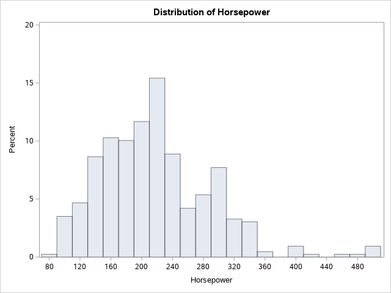

```SAS
PROC UNIVARIATE DATA = SASHELP.CARS NOPRINT;
HISTOGRAM HORSEPOWER
/
NORMAL ( 
    MU = EST
    SIGMA = EST
    COLOR = BLUE
    W = 1
)
BARLABEL = PERCENT
MIDPOINTS = 100 TO 500 BY 20;
RUN;
```

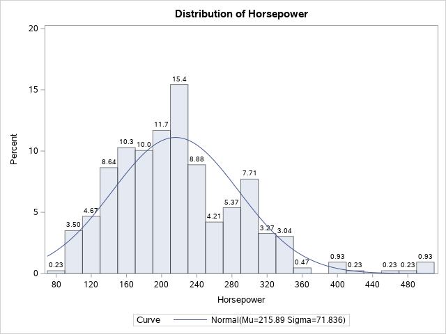

**The SAS System**

The UNIVARIATE Procedure

Fitted Normal Distribution for Horsepower

| Parameters for Normal Distribution |        |          |
| ---------------------------------: | -----: | -------: |
|                          Parameter | Symbol | Estimate |
|                               Mean |     Mu | 215.8855 |
|                            Std Dev |  Sigma | 71.83603 |

| Goodness-of-Fit Tests for Normal Distribution |      |            |           |         |
| --------------------------------------------: | ---: | ---------: | --------- | ------- |
|                                          Test |      |  Statistic |           | p Value |
|                            Kolmogorov-Smirnov |    D | 0.09051574 | Pr > D    | <0.010  |
|                              Cramer-von Mises | W-Sq | 0.58980554 | Pr > W-Sq | <0.005  |
|                              Anderson-Darling | A-Sq | 3.68580519 | Pr > A-Sq | <0.005  |

| Quantiles for Normal Distribution |          |           |
| --------------------------------: | -------: | --------- |
|                                   |          | Quantile  |
|                           Percent | Observed | Estimated |
|                               1.0 |  103.000 | 48.7699   |
|                               5.0 |  115.000 | 97.7258   |
|                              10.0 |  130.000 | 123.8239  |
|                              25.0 |  165.000 | 167.4328  |
|                              50.0 |  210.000 | 215.8855  |
|                              75.0 |  255.000 | 264.3382  |
|                              90.0 |  302.000 | 307.9471  |
|                              95.0 |  340.000 | 334.0453  |
|                              99.0 |  477.000 | 383.0011  |

```SAS
PROC SGPLOT DATA = SASHELP.CARS(WHERE = (MAKE IN ('BMW')));
VBAR LENGTH;
TITLE 'LENGTHS OF BMW';
RUN;
QUIT;
```

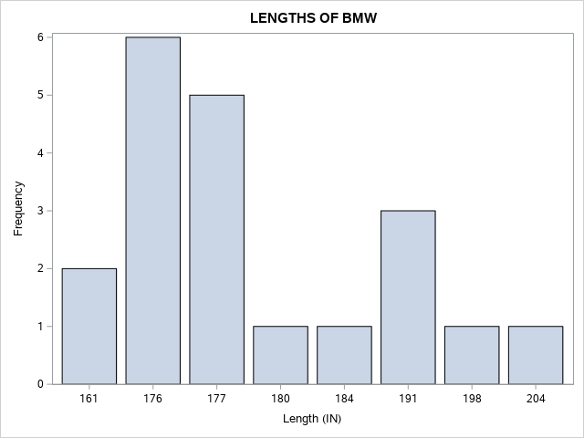

```SAS
PROC SGPLOT DATA = SASHELP.CARS(WHERE = (MAKE IN ('BMW')));
VBAR LENGTH /GROUP = TYPE ;
TITLE 'LENGTHS OF BMW BY TYPES';
RUN;
QUIT;
```

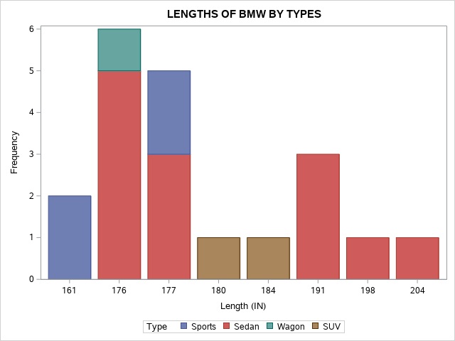

```SAS
PROC SGPLOT DATA = SASHELP.CARS(WHERE = (MAKE IN ('BMW')));
VBAR LENGTH /GROUP = TYPE GROUPDISPLAY = CLUSTER;
TITLE 'CLUSTER OF BMW BY TYPES';
RUN;
QUIT;
```

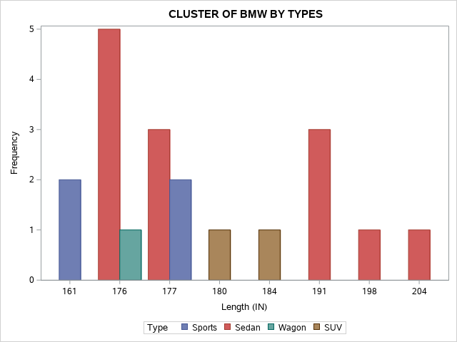

```SAS
PROC TEMPLATE;
  DEFINE STATGRAPH PIE0;
    BEGINGRAPH;
      LAYOUT REGION;
        PIECHART CATEGORY = type /
          DATALABELLOCATION = OUTSIDE
          CATEGORYDIRECTION = CLOCKWISE
          START = 180 NAME = 'pie';
        DISCRETELEGEND 'pie' /
          TITLE = 'BMW Types';
      ENDLAYOUT;
    ENDGRAPH;
  END;
RUN;

PROC SGRENDER 
    DATA = SASHELP.CARS(WHERE = (MAKE IN ('BMW')))
    TEMPLATE = PIE0;
RUN;
```

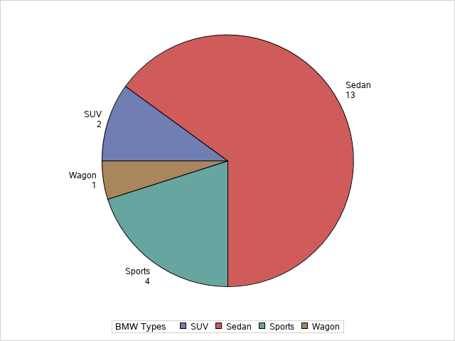

```SAS
PROC TEMPLATE;
  DEFINE STATGRAPH PIE1;
    BEGINGRAPH;
      LAYOUT REGION;
        PIECHART CATEGORY = type /
          DATALABELLOCATION = INSIDE
          DATALABELCONTENT=ALL
          CATEGORYDIRECTION = CLOCKWISE
          DATASKIN= SHEEN 
          START = 180 NAME = 'pie';
        DISCRETELEGEND 'pie' /
          TITLE = 'BMW Types';
      ENDLAYOUT;
    ENDGRAPH;
  END;
RUN;

PROC SGRENDER 
    DATA = SASHELP.CARS(WHERE = (MAKE IN ('BMW')))
    TEMPLATE = PIE1;
RUN;
```

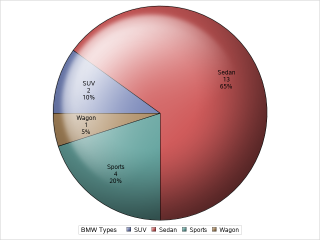

```SAS
PROC TEMPLATE;
  DEFINE STATGRAPH PIE2;
    BEGINGRAPH;
      LAYOUT REGION;
        PIECHART CATEGORY = type / Group = make
          DATALABELLOCATION = INSIDE
          DATALABELCONTENT=ALL
          CATEGORYDIRECTION = CLOCKWISE
          DATASKIN= SHEEN 
          START = 180 NAME = 'pie';
        DISCRETELEGEND 'pie' /
          TITLE = 'Audi/BMW Types';
      ENDLAYOUT;
    ENDGRAPH;
  END;
RUN;

PROC SGRENDER 
    DATA = SASHELP.CARS(WHERE = (MAKE IN ('Audi', 'BMW')))
    TEMPLATE = PIE2;
RUN;
```

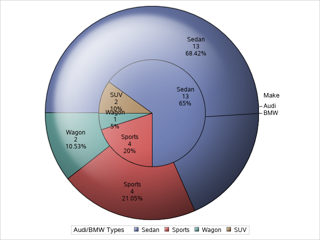

```SAS
PROC SGSCATTER  
    DATA = SASHELP.CARS(WHERE = (MAKE IN ('BMW')));
    PLOT HORSEPOWER * INVOICE 
    / DATALABEL = MAKE GROUP = TYPE GRID;
    TITLE 'HORSEPOWER VS. INVOICE FOR BMW MAKERS BY TYPES';
RUN;
```

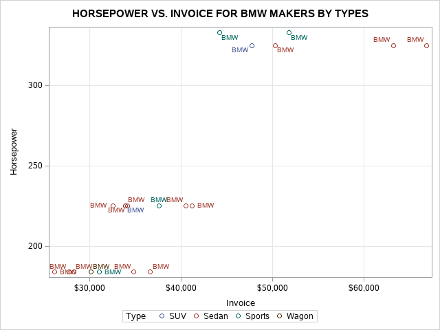

```SAS
PROC SGSCATTER DATA = SASHELP.CARS(WHERE = (MAKE IN ('BMW'))); 
    COMPARE Y = INVOICE  X = (HORSEPOWER LENGTH)  
    /GROUP = TYPE ELLIPSE = (ALPHA = 0.05 TYPE = PREDICTED); 
    TITLE
    'AVERAGE INVOICE VS. HORSEPOWER FOR BMW BY LENGTH'; 
    TITLE2
    '-- WITH 95% PREDICTION ELLIPSE --'
    ; 
    FORMAT
    INVOICE DOLLAR6.0;
RUN;
```

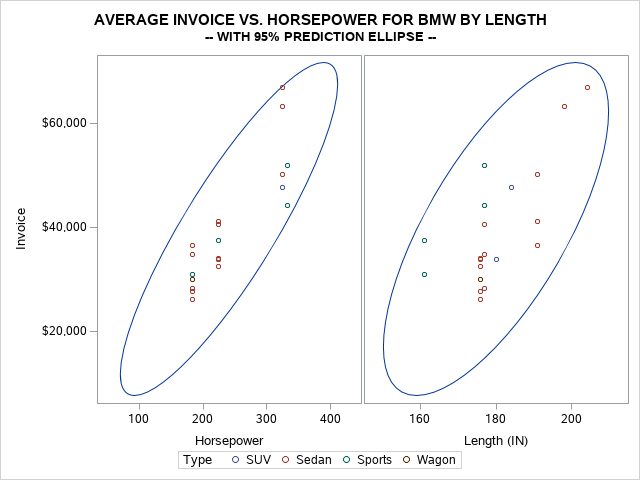

```SAS
PROC SGSCATTER DATA = SASHELP.CARS(WHERE = (MAKE IN ('BMW')));
    MATRIX HORSEPOWER INVOICE LENGTH
    / GROUP = TYPE;
    TITLE 'HORSEPOWER VS. INVOICE VS. LENGTH FOR BMW MAKERS BY TYPES';
RUN; 
```

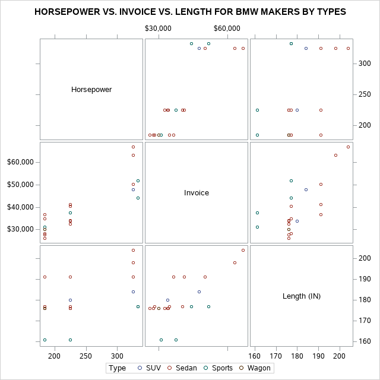

```SAS
PROC SGPLOT DATA = SASHELP.CARS(WHERE = (MAKE IN ('BMW')));
    VBOX HORSEPOWER 
    / CATEGORY = TYPE;
    TITLE 'HORSEPOWER OF BMW BY TYPES';
RUN;
```

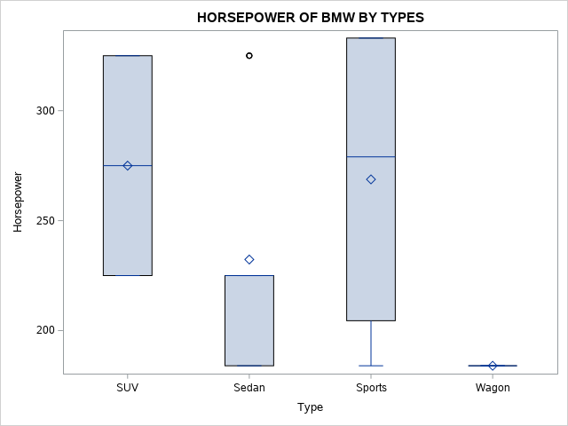

```SAS
PROC SGPANEL DATA = SASHELP.CARS(WHERE = (MAKE IN ('Audi', 'BMW')));
    PANELBY MAKE;
    VBOX HORSEPOWER / CATEGORY = TYPE;
    TITLE 'HORSEPOWER OF Audi/BMW BY TYPES';
RUN; 
```

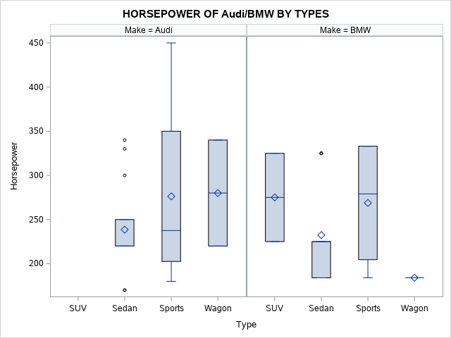

```SAS
PROC SGPANEL DATA = SASHELP.CARS(WHERE = (MAKE IN ('Audi', 'BMW')));
    PANELBY MAKE / COLUMNS = 1 NOVARNAME;
    VBOX HORSEPOWER / CATEGORY = TYPE;
    TITLE 'HORSEPOWER OF Audi/BMW BY TYPES';
RUN; 
```

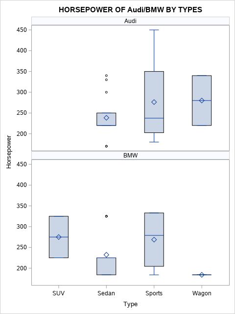

----
>
> [Visualizing Longitudinal Data with Dropouts ](http://blog.sina.com.cn/s/blog_58ea0d1f0101i448.html)
> 
> [tumor data](http://support.sas.com/documentation/cdl/en/statug/66103/HTML/default/viewer.htm#statug_phreg_examples07.htm)
>
> [template](https://www.cnblogs.com/abble/p/11344773.html)

```SAS
data Tumor;
   infile datalines missover;
   input ID Time Dead Dose P1-P15;
   label ID='Subject ID';
   datalines;
 1 47 1  1.0  0  5  6  8 10 10 10 10
 2 71 1  1.0  0  0  0  0  0  0  0  0  1  1  1  1 1 1 1
 3 81 0  1.0  0  1  1  1  1  1  1  1  1  1  1  1 1 1 1
 4 81 0  1.0  0  0  0  0  0  0  0  0  0  0  0  0 0 0 0
 5 81 0  1.0  0  0  0  0  0  0  0  0  0  0  0  0 0 0 0
 6 65 1  1.0  0  0  0  1  1  1  1  1  1  1  1  1 1
 7 71 0  1.0  0  0  0  0  0  0  0  0  0  0  0  0 0 0 0
 8 69 0  1.0  0  0  0  0  0  0  0  0  0  0  0  0 0 0
 9 67 1  1.0  0  0  1  1  2  2  2  2  3  3  3  3 3 3
10 81 0  1.0  0  0  0  0  0  0  0  0  0  0  0  0 0 0 0
11 37 1  1.0  9  9  9
12 81 0  1.0  0  0  0  0  0  0  0  0  0  0  0  0 0 0 0
13 77 0  1.0  0  0  0  0  1  1  1  1  1  1  1  1 1 1 1
14 81 0  1.0  0  0  0  0  0  0  0  0  0  0  0  0 0 0 0
15 81 0  1.0  0  0  0  0  0  0  0  0  0  0  0  0 0 0 0
16 54 0  2.5  0  1  1  1  2  2  2  2  2  2  2  2
17 53 0  2.5  0  0  0  0  0  0  0  0  0  0  0  0
18 38 0  2.5  5 13 14
19 54 0  2.5  2  6  6  6  6  6  6  6  6  6  6  6
20 51 1  2.5 15 15 15 16 16 17 17 17 17 17 17
21 47 1  2.5 13 20 20 20 20 20 20 20
22 27 1  2.5 22
23 41 1  2.5  6 13 13 13
24 49 1  2.5  0  3  3  3  3  3  3  3  3
25 53 0  2.5  0  0  1  1  1  1  1  1  1  1  1  1
26 50 1  2.5  0  0  2  3  4  6  6  6  6  6
27 37 1  2.5  3 15 15
28 49 1  2.5  2  3  3  3  3  4  4  4  4
29 46 1  2.5  4  6  7  9  9  9  9
30 48 0  2.5 15 26 26 26 26 26 26 26
31 54 0 10.0 12 14 15 15 15 15 15 15 15 15 15 15
32 37 1 10.0 12 16 17
33 53 1 10.0  3  6  6  6  6  6  6  6  6  6  6  6
34 45 1 10.0  4 12 15 20 20 20
35 53 0 10.0  6 10 13 13 13 15 15 15 15 15 15 20
36 49 1 10.0  0  2  2  2  2  2  2  2  2
37 39 0 10.0  7  8  8
38 27 1 10.0 17
39 49 1 10.0  0  6  9 14 14 14 14 14 14
40 43 1 10.0 14 18 20 20 20
41 28 0 10.0  8
42 34 1 10.0 11 18
43 45 1 10.0 10 12 16 16 16 16
44 37 1 10.0  0  1  1
45 43 1 10.0  9 19 19 19 19
;

proc print data = tumor;
run;
```

**HORSEPOWER OF Audi/BMW BY TYPES**

|  Obs |   ID | Time | Dead | Dose |   P1 |   P2 |   P3 |   P4 |   P5 |   P6 |   P7 |   P8 |   P9 |  P10 |  P11 |  P12 |  P13 |  P14 |  P15 |
| ---: | ---: | ---: | ---: | ---: | ---: | ---: | ---: | ---: | ---: | ---: | ---: | ---: | ---: | ---: | ---: | ---: | ---: | ---: | ---: |
|    1 |    1 |   47 |    1 |  1.0 |    0 |    5 |    6 |    8 |   10 |   10 |   10 |   10 |    . |    . |    . |    . |    . |    . |    . |
|    2 |    2 |   71 |    1 |  1.0 |    0 |    0 |    0 |    0 |    0 |    0 |    0 |    0 |    1 |    1 |    1 |    1 |    1 |    1 |    1 |
|    3 |    3 |   81 |    0 |  1.0 |    0 |    1 |    1 |    1 |    1 |    1 |    1 |    1 |    1 |    1 |    1 |    1 |    1 |    1 |    1 |
|    4 |    4 |   81 |    0 |  1.0 |    0 |    0 |    0 |    0 |    0 |    0 |    0 |    0 |    0 |    0 |    0 |    0 |    0 |    0 |    0 |
|    5 |    5 |   81 |    0 |  1.0 |    0 |    0 |    0 |    0 |    0 |    0 |    0 |    0 |    0 |    0 |    0 |    0 |    0 |    0 |    0 |
|    6 |    6 |   65 |    1 |  1.0 |    0 |    0 |    0 |    1 |    1 |    1 |    1 |    1 |    1 |    1 |    1 |    1 |    1 |    . |    . |
|    7 |    7 |   71 |    0 |  1.0 |    0 |    0 |    0 |    0 |    0 |    0 |    0 |    0 |    0 |    0 |    0 |    0 |    0 |    0 |    0 |
|    8 |    8 |   69 |    0 |  1.0 |    0 |    0 |    0 |    0 |    0 |    0 |    0 |    0 |    0 |    0 |    0 |    0 |    0 |    0 |    . |
|    9 |    9 |   67 |    1 |  1.0 |    0 |    0 |    1 |    1 |    2 |    2 |    2 |    2 |    3 |    3 |    3 |    3 |    3 |    3 |    . |
|   10 |   10 |   81 |    0 |  1.0 |    0 |    0 |    0 |    0 |    0 |    0 |    0 |    0 |    0 |    0 |    0 |    0 |    0 |    0 |    0 |
|   11 |   11 |   37 |    1 |  1.0 |    9 |    9 |    9 |    . |    . |    . |    . |    . |    . |    . |    . |    . |    . |    . |    . |
|   12 |   12 |   81 |    0 |  1.0 |    0 |    0 |    0 |    0 |    0 |    0 |    0 |    0 |    0 |    0 |    0 |    0 |    0 |    0 |    0 |
|   13 |   13 |   77 |    0 |  1.0 |    0 |    0 |    0 |    0 |    1 |    1 |    1 |    1 |    1 |    1 |    1 |    1 |    1 |    1 |    1 |
|   14 |   14 |   81 |    0 |  1.0 |    0 |    0 |    0 |    0 |    0 |    0 |    0 |    0 |    0 |    0 |    0 |    0 |    0 |    0 |    0 |
|   15 |   15 |   81 |    0 |  1.0 |    0 |    0 |    0 |    0 |    0 |    0 |    0 |    0 |    0 |    0 |    0 |    0 |    0 |    0 |    0 |
|   16 |   16 |   54 |    0 |  2.5 |    0 |    1 |    1 |    1 |    2 |    2 |    2 |    2 |    2 |    2 |    2 |    2 |    . |    . |    . |
|   17 |   17 |   53 |    0 |  2.5 |    0 |    0 |    0 |    0 |    0 |    0 |    0 |    0 |    0 |    0 |    0 |    0 |    . |    . |    . |
|   18 |   18 |   38 |    0 |  2.5 |    5 |   13 |   14 |    . |    . |    . |    . |    . |    . |    . |    . |    . |    . |    . |    . |
|   19 |   19 |   54 |    0 |  2.5 |    2 |    6 |    6 |    6 |    6 |    6 |    6 |    6 |    6 |    6 |    6 |    6 |    . |    . |    . |
|   20 |   20 |   51 |    1 |  2.5 |   15 |   15 |   15 |   16 |   16 |   17 |   17 |   17 |   17 |   17 |   17 |    . |    . |    . |    . |
|   21 |   21 |   47 |    1 |  2.5 |   13 |   20 |   20 |   20 |   20 |   20 |   20 |   20 |    . |    . |    . |    . |    . |    . |    . |
|   22 |   22 |   27 |    1 |  2.5 |   22 |    . |    . |    . |    . |    . |    . |    . |    . |    . |    . |    . |    . |    . |    . |
|   23 |   23 |   41 |    1 |  2.5 |    6 |   13 |   13 |   13 |    . |    . |    . |    . |    . |    . |    . |    . |    . |    . |    . |
|   24 |   24 |   49 |    1 |  2.5 |    0 |    3 |    3 |    3 |    3 |    3 |    3 |    3 |    3 |    . |    . |    . |    . |    . |    . |
|   25 |   25 |   53 |    0 |  2.5 |    0 |    0 |    1 |    1 |    1 |    1 |    1 |    1 |    1 |    1 |    1 |    1 |    . |    . |    . |
|   26 |   26 |   50 |    1 |  2.5 |    0 |    0 |    2 |    3 |    4 |    6 |    6 |    6 |    6 |    6 |    . |    . |    . |    . |    . |
|   27 |   27 |   37 |    1 |  2.5 |    3 |   15 |   15 |    . |    . |    . |    . |    . |    . |    . |    . |    . |    . |    . |    . |
|   28 |   28 |   49 |    1 |  2.5 |    2 |    3 |    3 |    3 |    3 |    4 |    4 |    4 |    4 |    . |    . |    . |    . |    . |    . |
|   29 |   29 |   46 |    1 |  2.5 |    4 |    6 |    7 |    9 |    9 |    9 |    9 |    . |    . |    . |    . |    . |    . |    . |    . |
|   30 |   30 |   48 |    0 |  2.5 |   15 |   26 |   26 |   26 |   26 |   26 |   26 |   26 |    . |    . |    . |    . |    . |    . |    . |
|   31 |   31 |   54 |    0 | 10.0 |   12 |   14 |   15 |   15 |   15 |   15 |   15 |   15 |   15 |   15 |   15 |   15 |    . |    . |    . |
|   32 |   32 |   37 |    1 | 10.0 |   12 |   16 |   17 |    . |    . |    . |    . |    . |    . |    . |    . |    . |    . |    . |    . |
|   33 |   33 |   53 |    1 | 10.0 |    3 |    6 |    6 |    6 |    6 |    6 |    6 |    6 |    6 |    6 |    6 |    6 |    . |    . |    . |
|   34 |   34 |   45 |    1 | 10.0 |    4 |   12 |   15 |   20 |   20 |   20 |    . |    . |    . |    . |    . |    . |    . |    . |    . |
|   35 |   35 |   53 |    0 | 10.0 |    6 |   10 |   13 |   13 |   13 |   15 |   15 |   15 |   15 |   15 |   15 |   20 |    . |    . |    . |
|   36 |   36 |   49 |    1 | 10.0 |    0 |    2 |    2 |    2 |    2 |    2 |    2 |    2 |    2 |    . |    . |    . |    . |    . |    . |
|   37 |   37 |   39 |    0 | 10.0 |    7 |    8 |    8 |    . |    . |    . |    . |    . |    . |    . |    . |    . |    . |    . |    . |
|   38 |   38 |   27 |    1 | 10.0 |   17 |    . |    . |    . |    . |    . |    . |    . |    . |    . |    . |    . |    . |    . |    . |
|   39 |   39 |   49 |    1 | 10.0 |    0 |    6 |    9 |   14 |   14 |   14 |   14 |   14 |   14 |    . |    . |    . |    . |    . |    . |
|   40 |   40 |   43 |    1 | 10.0 |   14 |   18 |   20 |   20 |   20 |    . |    . |    . |    . |    . |    . |    . |    . |    . |    . |
|   41 |   41 |   28 |    0 | 10.0 |    8 |    . |    . |    . |    . |    . |    . |    . |    . |    . |    . |    . |    . |    . |    . |
|   42 |   42 |   34 |    1 | 10.0 |   11 |   18 |    . |    . |    . |    . |    . |    . |    . |    . |    . |    . |    . |    . |    . |
|   43 |   43 |   45 |    1 | 10.0 |   10 |   12 |   16 |   16 |   16 |   16 |    . |    . |    . |    . |    . |    . |    . |    . |    . |
|   44 |   44 |   37 |    1 | 10.0 |    0 |    1 |    1 |    . |    . |    . |    . |    . |    . |    . |    . |    . |    . |    . |    . |
|   45 |   45 |   43 |    1 | 10.0 |    9 |   19 |   19 |   19 |   19 |    . |    . |    . |    . |    . |    . |    . |    . |    . |    . |

```SAS
data tumor1;
set tumor;
array p[10];
do droptime=1 to dim(p);
if missing(p[droptime]) then leave;
end;
droptime =droptime-1;
do MeasureTime =1 to dim(p);
Npap =p[MeasureTime];
output;
end;
keep ID MeasureTime Npap droptime;
run;


proc means data=tumor1 nway noprint;
class DropTime MeasureTime;
var Npap;
output out =meanout mean=mean_Npap;
run;


proc template;
define statgraph scatterplot;
dynamic _X_ _Y_ _VMCG_ _MSIZE_ _LMCG_;
begingraph;
entrytitle "Figure 1. Triangle plot about (non)informative dropout.";
layout overlay;       
scatterplot x=_X_ y=_Y_ /name="sca"  markercolorgradient=_VMCG_       markerattrs=(symbol=squarefilled size=_MSIZE_);
discretelegend "sca";
continuouslegend "sca"/ orient=vertical halign=right title=_LMCG_;
endlayout;
endgraph;
end;
run;

ods graphics on/width=1000 height=1000;
proc sgrender data =meanout template=scatterplot;
dynamic _X_='MeasureTime' _Y_='DropTime' _VMCG_='mean_Npap'
_MSIZE_='30pt' _LMCG_='Npap';
Label MeasureTime="Measurement Time" DropTime="Dropout Time";
run;
```

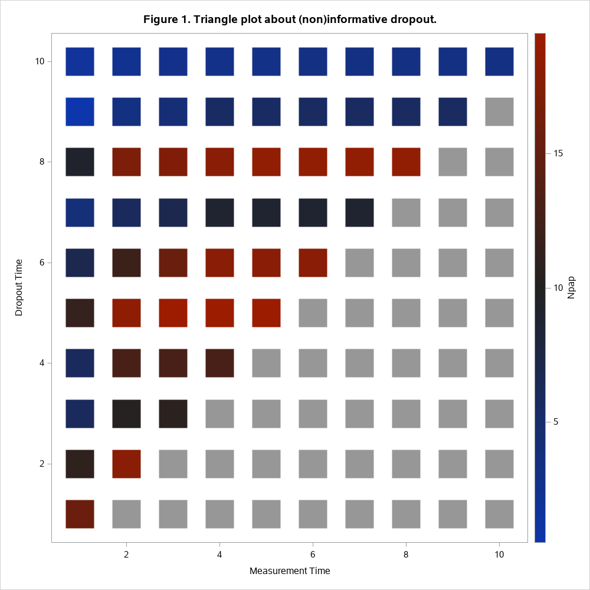

